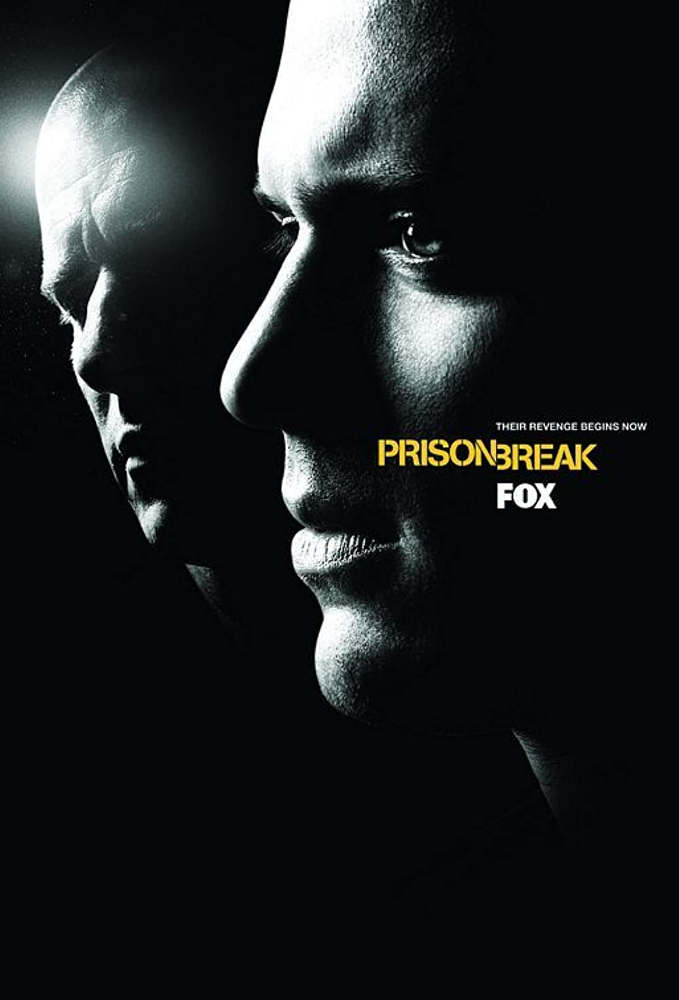
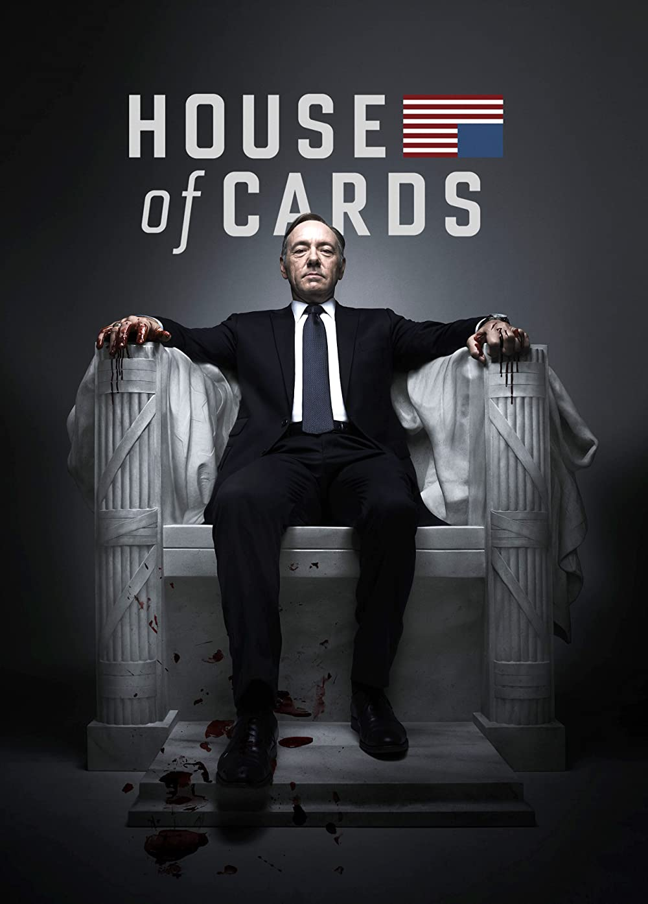
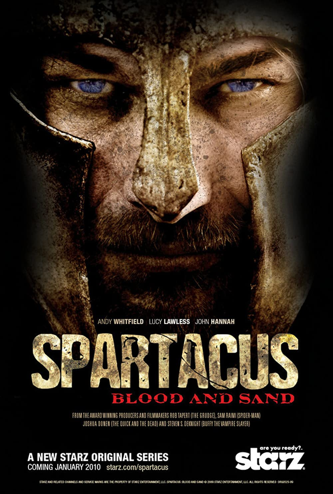

[🇵🇱 Przejdź do polskiej wersji tego wpisu / Go to polish version of this post](https://blog.tomaszdunia.pl/serialowo-1/)

As this is a very personal blog, I decided that it cannot go without a TV corner. I have to admit that I am a huge fan of TV series. It is one of my ways of spending free time, which I have been doing since my middle school days, which is about **15-16 years**! Can you imagine how many episodes of various series I have watched during this time? I couldn't even imagine it until I looked at the statistics of the [TV Time](https://www.tvtime.com/) application, which I use to organize what I have already watched and what I in a queue to watch. The values I saw there slightly scared me, and I would like to point out that I haven't been using this application since the beginning of my adventure with TV series, so it is possible that not all the positions I have watched are summarized there.

Yes, what you see above is a screenshot of my statistics from the TV Time app. **3561 episodes watched** and almost **4 months spent watching**... Did I waste that time? Never! It was time well spent 😉 Alright, but then what did I watch over those 15 years? That's what this series will be about, starting with this post. Today, I approach the topic nostalgically. I will mention rather old and already finished series. But they are special to me, not necessarily because they are masterpieces. In today's post, I will present five of them, but in future installments of this series, I will try to limit it to three positions so as not to create excessively long texts.

## Prison Break

Aside from all the Polish soap operas like Klan and Złotopolscy, it was actually _Prison Break_ that was my first foreign TV series and where my adventure began. At least, that's what it seems like to me. The show premiered in 2005, but back then, the times were such that TV series first gained popularity in the US, then had a global premiere, and at that point, there were two options: download it from eMule/Kazaa and wait for an amateur Polish translation (subtitles), or wait longer until it was aired on Polish TV with a monotonous and boring voiceover. To sum up, what I meant to say is that even if the premiere date on Filmweb is listed as 2005, it doesn't mean that I managed to watch the show that year. Even if I watched it in 2006 or 2007, it was still considered as new series in Poland. I also remember that TV series actually enabled me to exponentially improve my English language skills. No lessons or smart textbooks can teach you English like the necessity of watching a show without Polish subtitles. Have you noticed that since I started talking about _Prison Break_, I haven't written a single word about what the show is about? That just means it's more than just a TV series to me. Besides, I don't think there's a person who doesn't know about it or at least can't guess what it's about from the title 😁 However, from a historical perspective, in short, the show is about a guy who intentionally gets himself locked up in a prison with a plan and a tattooed map on his body in order to free his brother from it. Interestingly, in 2017, the show got a one-season sequel.

## House of Cards

Kevin Spacey played the main role in both this series and the scandal (perhaps I should use the plural form?), which completely buried its ending. It all revolves around numerous accusations of molestation against Spacey (let's skip whether they are true or not), which led to his exclusion from the last season. Apart from all of this, HoC is a story about the ruthless pursuit of power, during which the main character stops at nothing. The story really keeps you on the edge of your seat. But for me, this series draws a thick line between my pirate TV life and the period of fully legal use of VOD content that has been going on until today. It was precisely for HoC that I purchased my first subscription. House of Cards is probably the first Netflix production series and I have the impression that since its premiere, Netflix has gained global popularity, becoming the hegemon of the VOD market. It must be admitted that its presence has greatly changed the world of TV series, surprisingly even in Poland, where we have gained easy access to content from across the ocean.

## Game of Thrones

This is already a classic, because while many feel a strong sense of dissatisfaction or even disgust after finishing this series, it cannot be denied that throughout the entire time it was aired it was on everyone's lips. Recently, it even returned with the prequel House of the Dragon. If I remember correctly, new episodes of GoT were always aired on Mondays. This was during my studies, so I would finish my morning labs and sit down to watch the episode I obtained in a not necessarily legal way, the perfect start to the week. Interestingly, this was one of those cases where the pirate unfortunately had it better, I say this now when I only watch legally, because back then I was thrilled. The whole trick was that the US broadcast took place on Monday morning our time, and the official premiere in Poland was set for Monday evening. During this time, a skilled pirate could easily download the episode, even in high quality. Polish subtitles were usually ready almost immediately. This way, you could illegally watch a given episode at least a few hours earlier... Not fair, but unfortunately these were the realities. And one season of Game of Thrones even leaked on the day of the premiere of the first episode! This generated spoilers that had to be carefully avoided. Game of Thrones is a very spoiler-prone series! There were so many plot twists and controversies. Episodes came out every week, and the hype usually lasted continuously between them.

## Spartacus

_Spartacus Blood and Sand_, or rather in my opinion Blood and Tits 😂 A very brutal and at the same time sexually vulgar series, but telling a quite touching and well-known twin story similar to that of the movie _Gladiator_ with _Russell Crowe_. Relatively simple scenery, cast without major celebrities, yet in my opinion this series was a very good spectacle. I guess stories about brotherhood work on me. Interestingly, after the first season it was necessary to change the actor playing the main character ([_Andrew Whitfield_](https://en.wikipedia.org/wiki/Andy_Whitfield)), as he died after a battle with cancer (if I remember correctly). I was afraid of how the change of the most important actor would affect the series, but ultimately it turned out that only the initial adjustment is difficult, and later you get used to it. This is probably the first time I've encountered such a move. Fortunately, the series was completed in 3 seasons, and later it also received a prequel called _Spartacus Gods of the Arena_.

## Suits

It's a series of the kind that I started watching by accident and got so caught up in the lives of its characters that I couldn't stop watching it. Thematically, it's completely outside my usual tastes, but it should be more up my wife's alley, as she's a lawyer. However, it turned out completely the opposite - I became a fan of Suits, while my wife never even forced herself to watch one episode, despite my numerous attempts to persuade her to do so. Suits is a series that I find very difficult to pinpoint what really captivated me about it. However, I always enjoyed going back to it, and the moment it ended was difficult for me because I felt like a certain era in my life had ended irreversibly.

At the end, a reflective question - have you ever had a moment where watching the finale of a series that you have been watching for a very long time was a very strong emotional experience for you?
