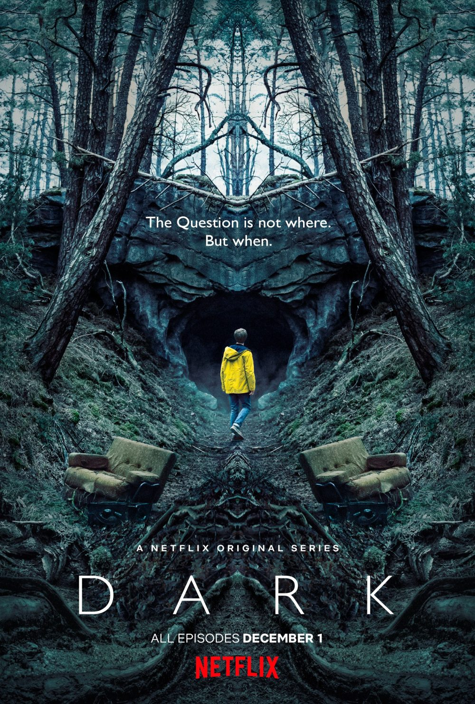

[🇵🇱 Przejdź do polskiej wersji tego wpisu / Go to polish version of this post](https://blog.tomaszdunia.pl/serialowo-2/)

What do the TV shows listed in the title have in common? Their main theme is time travel, which is one of the genres of TV shows and movies that I enjoy watching the most. Time travel is a popular theme in cinematography, so there is no shortage of productions that focus on this motive. Out of all of them, I have chosen a few titles that, in my opinion, are worth watching.

## Dark

I'm not a fan of German productions. I have nothing against Germans; I visit Germany quite often, but when it comes to films, I can't seem to focus completely when I hear a language other than English in the background, and German bothers me the most. However, _Dark_ is such a brilliant show that nothing could stop me from watching it. Three seasons of a story that takes your brain, grinds it up, then reverses the process and grinds it again. It's all so complicated that you need a [website with a diagram](https://dark.netflix.io/) showing who, with whom, what, and when. In addition, you need to provide the exact season and episode you're currently watching to avoid spoilers. The story is so intricate that you need to watch each episode multiple times to catch all the nuances and sometimes even go back to previous ones. If I had to point out how TV shows about time travel should look, I would use _Dark_ as an example. I won't even try to write about what this show is about because you just have to see it to understand.

## Timeless

_Timeless_ is a TV series that has educational value as it refers to historical events that actually took place. Unfortunately, these events are related to the history of the United States, so for someone who is not a citizen of the United States or not interested in their history, it may not be a great advantage. In short, _Timeless_ has a small but well-chosen cast of characters who travel back in time to various periods in history under the leadership of Lucy, a history professor, to prevent a group of people who want to change the course of history from altering the present-day United States. In addition to changing the plot each episode, there is a main storyline that gives the series additional meaning in a broader perspective.

## Travelers

The recipe for a good time travel story is to come up with a fitting concept that makes sense and maintain it throughout the story. In _Travelers_, the concept is sending the consciousness of people from a war-ravaged future into bodies in the 21st century (let's assume we can use the term "present"). But how is this done? By overwriting the consciousness of people living in the present? Well, the idea is that indeed, the consciousness of people is overwritten, but specifically selected individuals who will die in the next few seconds in some way that can be prevented. It is relatively easy to determine a person's death date from the future, as well as how it happened and how to prevent it. In this way, groups of _travelers_ are sent, consisting of five people with specific skills and functions in the team - _leader_, _medic_, _tactician_, _engineer_, and _historian_. The most interesting profession in the context of the series is the _historians_, who are trained from a young age to remember dates and all events related to them that can be used after going back to the 21st century. Additionally, their knowledge from the future becomes outdated when some significant change in the present affects the future, so they exchange their knowledge through an advanced form of communication. I cannot write too much more without spoiling the story. The general plan is to influence the past in such a way that the future does not look as tragic as it does in the time from which the _Travelers_ come.

## Seven Days

Another nostalgic pick. _Misja w czasie_ (meaning "Time Mission" in Polish), which is how the _Seven Days_ TV series was titled in Poland, seems to be the series that sparked my love for time travel themes in cinematography. It was aired on _Polsat_ at the turn of the millennium, which I consider to be my childhood. The plot focuses on a former special forces member who, thanks to a special capsule, can go back a maximum of 7 days in the past to prevent a disaster that occurred. It doesn't sound too ambitious for a time travel series, and there aren't really any deeper musings in this series, but from a nostalgic standpoint, I can't say anything bad about it. I have to admit that I watched it so long ago that I don't remember much, so maybe it's worth refreshing, as it is still a cool production, especially considering the times in which it was made.

## 11.22.63

My most recent discovery is the TV series _11.22.63_ which I just finished watching. Where does the strange name come from? It's the American date notation 🙄, which stands for November 22, 1963, the date of the successful assassination of US President _John F. Kennedy_. So as you can probably guess, the whole story is about the main character traveling back from the present day to the 1960s to prevent the president's murder. At first glance, it sounds unremarkable and clichéd, doesn't it? That's what I thought too, and it's also very American. However, this single-season series is presented in such a way that _JFK_ isn't the most important thing. The reality of those times, the costumes, and above all, the scenery are all superbly portrayed. The cars made the biggest impression on me. I wonder if most of them were just models or if they used real restored vehicles. If so, that's a huge respect! And on top of all this, we have a quite enjoyable and not so clichéd love story.

## It didn't work out again...

Before starting this series of posts, I decided that I would try to limit myself to only three recommendations per post, but once again it turned out to be impossible for me. After a short reflection, I think I will change my mind and not limit myself to three, but I will try to stick to five this time 😁

Finally, I would like to encourage you to recommend me any other productions with this motive. I certainly haven't seen all of the productions, and I'm always eager to watch another movie or TV series about time travel.
