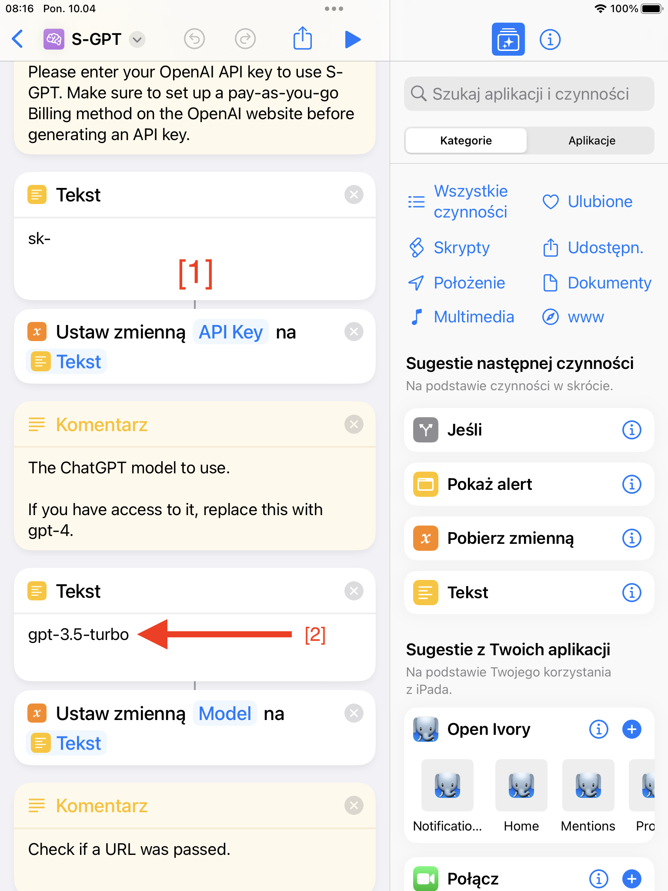
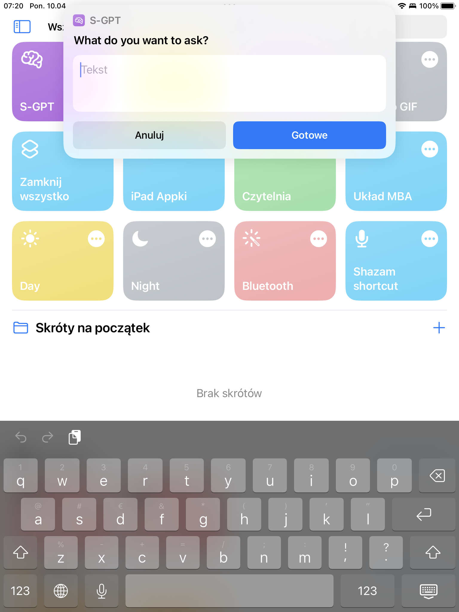
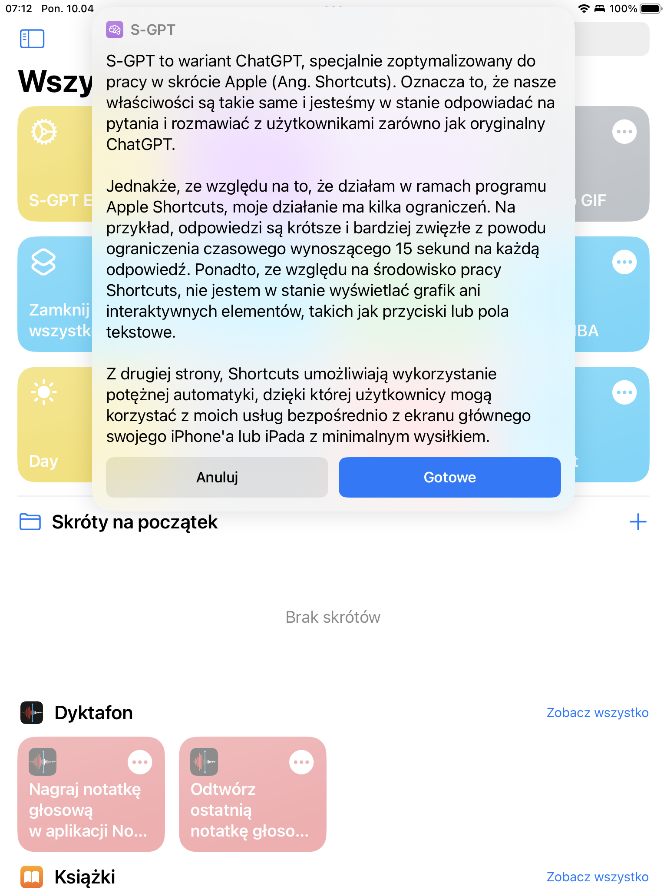

[🇬🇧 Go to english version of this post / Przejdź do angielskiej wersji tego wpisu](https://blog.tomaszdunia.pl/chatgpt-shortcut-eng/)

Dzisiaj kolejny wpis z cyklu krótkich a.k.a. szortów. Jego powstanie zostało spowodowane tym, że natrafiłem na coś bardzo ciekawego! Otóż, jakaś mądra głowa stworzyła _Skrót_ na _iOS_ (_Shortcuts_), w którym zaimplementowała system komunikacji z _ChatGPT_ poprzez _API_. W ten sposób zawsze pod ręką, za naciśnięciem jednego przycisku, można mieć możliwość zadania szybkiego pytania sztucznej inteligencji.

## Szybka instrukcja instalacji

1. Pobierz i zainstaluj _Skrót_ pomocniczy _S-GPT Encoder_: [https://www.icloud.com/shortcuts/b66b86615b0b478bad95948616e4f48a](https://www.icloud.com/shortcuts/b66b86615b0b478bad95948616e4f48a)

3. Załóż konto na stronie _OpenAI_ i uzyskaj darmowy klucz _API_ (za darmowo dostaje się na start $5 co wystarczy na bardzo długo przy niezbyt intensywnym używaniu): [https://auth0.openai.com/u/signup/](https://auth0.openai.com/u/signup/)

5. Pobierz i zainstaluj Skrót docelowy _S-GPT_: [https://www.icloud.com/shortcuts/882c9a2870c0431098905445a5f1511e](https://www.icloud.com/shortcuts/882c9a2870c0431098905445a5f1511e)

7. Przy jego pierwszym uruchomieniu pyta o podanie klucza _API_ od _OpenAI_. Można to zrobić również później we właściwościach _Skrótu_ \[1\].

9. Po wpisaniu pierwszego _prompt’a_ zostaniemy jeszcze poproszeni o zgodę na użycie drugiego _Skrótu_ (tego pomocniczego) oraz na komunikację z serwerem _OpenAI_. W obu przypadkach dla wygody polecam nacisnąć Zawsze zezwalaj.

11. Jak ktoś ma wykupiony dostęp do GPT-4 to można zmienić model we właściwościach _Skrótu_ \[2\].

## Jak to wygląda?

_Źródło: [MacStories.net](https://www.macstories.net/ios/introducing-s-gpt-a-shortcut-to-connect-openais-chatgpt-with-native-features-of-apples-operating-systems/)_
