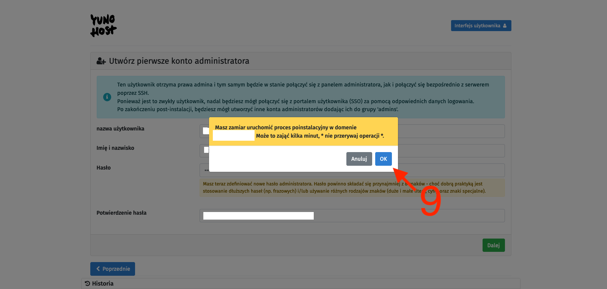
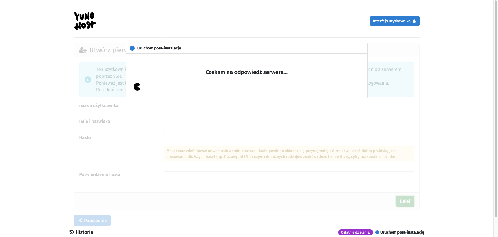

[🇵🇱 Przejdź do polskiej wersji tego wpisu / Go to polish version of this post](https://blog.tomaszdunia.pl/yunohost-oracle/)

In [my previous post](https://blog.tomaszdunia.pl/oracle-free-tier-eng/), I described how to get free access to a pretty good _VPS_ - _Oracle Cloud Free Tier_. Today, I'll present one of my proposals for what can be done with it, specifically showing how to **turn such a server into a center for running self-hosted solutions in a simple way**. We will install on it a tool, or rather a system, called [_YunoHost_](https://yunohost.org/#/), which is used to run services and stands out for its very user-friendly graphical interface that **allows even non-technical people to dive into the world of self-hosting**. _YunoHost_ is open-source software that, under a clear visual layout, has very well-written code that **takes care of the proper technical configuration and security of the services that will be run on it**.

_**EDIT:**_ One of the readers rightly pointed out that not everyone wants to install _YunoHost_ in the _Oracle_ cloud and are here to learn how to do it, for example, on a machine that already has the _Debian_ operating system installed. I recommend these people skip straight to the _[YunoHost Installation](#installyh)_ section.

## Preparation

As I mentioned in the introduction, in the further part of this post, we will need a server in _Oracle Cloud_, which I wrote about in the post [Free VPS with 4 OCPU, 24GB RAM and 200GB disk](https://blog.tomaszdunia.pl/oracle-free-tier-eng). Writing this tutorial, I assume that you, dear Reader, have already created an account on _Oracle Cloud_, launched an _instance_ on it as I described, opened ports _80_ and _443_, enabled IPv6 support, and know how to connect via _SSH_. As always, I recommend using the convenient and free (for what we need) tool _[Termius](https://termius.com/)_.

**Meeting the above conditions**, we can get to work!

## Installing Debian on the Oracle instance

If your created _instance_ is 100% as I described, it means that you have installed the _Ubuntu_ system on it. **_YunoHost_ only works on _Debian_**, which is not on the list of available systems from _Oracle_. It's not a big problem, just an additional step to convert our _Ubuntu_ to _Debian_. We will use a ready-made script available on [GitHub at this link](https://github.com/bohanyang/debi).

_UPDATE 2023-11-05: I have determined that it is important to add in this place that the above script will not work on every VPS! It works correctly on Oracle, but there has been a case where a remote server (not on Oracle) was completely killed using this script (the server did not recover after a restart, and it had to be rebuilt from scratch). Please keep this in mind._

Let's connect to our _VPS_ via _SSH_. Then let's download the aforementioned script:

```bash
curl -fLO https://raw.githubusercontent.com/bohanyang/debi/master/debi.sh
```

Let's give it permissions to execute:

```bash
chmod a+rx debi.sh
```

Now we need to perform an important step that is necessary for the proper execution of later actions. We need to share our _SSH_ public key, which we use to log in to this server, and which will be able to be downloaded and used by the _installer_. We need to provide the _installer_ with the key that will be placed on the newly installed _Debian_ system. Without this, after completing the installation and conversion from _Ubuntu_ to _Debian_, **we would lose access to our server**! There are many ways to do this, but I will present one that requires only an account on _GitHub_.

Instructions on how to add an _SSH_ public key to your server on _GitHub_:

- If you don't have an account on _GitHub_ yet, you need to [create one](https://github.com/signup).

- After logging in, click on your avatar in the upper right corner and select _Settings_ from the dropdown menu.

- In the _Access_ section on the left, select _SSH and GPG keys_, and then on the right, click the green _New SSH key_ button.

- In the window that appears, enter any name you want to identify this key in the _Title_ field, leave _Authentication Key_ as the _Key type_, and in the _Key_ text field, enter your public _SSH_ key.

- **Important**: Make sure to upload your **public, NOT private** key! The public key can be openly shared with anyone on the internet and poses no security risk to your server. However, the private key should be kept confidential and never shared anywhere, as it is the key that provides access to your server.

- Confirm by clicking the green _Add SSH key_ button.

For clarity, I am presenting below the format of a **sample** public key:

```bash
ssh-rsa AAAAB3NzaC1yc2EAAAADAQABAAAAgQCvYkO7T45XKg95Jhj69xvzO+E74hdzO+KTeNLOsA2RwzAEeKkZCLGT1l3tWNZ57BuK0Umt5qbHOye/gTOAsY+kekIsyN27bzTlKx4O7GfmYIYNsByX0nj76JBCfcxazUwLCxIu6TC8Q+/1KGpwqfBV8rwLD0MEbFVm5ruSaEFDWw== blogtomaszdunia
```

The SSH key that has been shared will be available at:

> https://github.com/<Your\_GitHub\_login>.keys

Now that we have shared our public SSH key, we can proceed with the installation of Debian on our server. We run the script:

```bash
sudo ./debi.sh --version 11 --authorized-keys-url https://github.com/<Your_GitHub_login>.keys
```

Note that **you need to modify the content of this command** by changing the phrase _<Your\_GitHub\_login>_ to the appropriate value corresponding to your _GitHub_ account name.

Now that everything is ready, we can start the installation by restarting the machine with the following command:

```bash
sudo shutdown -r now
```

We will of course be disconnected from the server. The process may take a few minutes, so be patient if you can't connect to it immediately. In the meantime, we will also need to change the login details for _SSH_, as we will now be logging in to a completely different system. The username we will log in with will change. The old user was named _ubuntu_, and the new one is _debian_.

PS: If you feel the need to do so, after completing the installation, you can remove your public _SSH_ key from _GitHub_.

## YunoHost Installation

Once the configuration of _Debian_ is completed, we can connect to the server. From this moment on, the instructions are universal for any device with _Debian_ installed. First of all, update the system and its packages:

```bash
sudo apt update
sudo apt upgrade -y
```

Then, install the necessary components:

```bash
sudo apt install htop curl unzip tmux -y
```

Next, we will use the _tmux_ (_Terminal Multiplexer_) tool, which in short allows for creating and managing multiple virtual terminals. Start a _tmux_ session:

```bash
tmux new -s yuno
```

We switch to the _root_ account:

```bash
sudo -i
```

We download the _YunoHost_ installation script and start the installation:

```bash
curl https://install.yunohost.org | bash
```

The installation process is simple and there is practically nothing to do during it, so I won't describe it in detail. After it is finished, we will receive a message that further configuration will take place through the browser by going to the following address:

> https://<server\_ip>/

This is how we do it, meaning we open the browser, enter the appropriate address, and confirm. We should see a warning that the connection may not be secure. This is a familiar behavior of the browser, which is dictated by the fact that we do not have an _SSL certificate_ installed for this domain. At this stage, it is not important. We click through this warning, looking for a button that says _I accept the risk and want to continue_ or something similar, the exact wording depends on the browser you are using.


    

    

    

    

    

    

We will see the YunoHost welcome screen, which congratulates us on a successful installation and encourages us to further configure it. So we click the _Start_ button \[1\]. In the main domain settings, we define the alias under which this administrative panel (and user panel) will be available, so we set up the _alias_ that will allow us to avoid using the server's IP address as a link to our YunoHost. There are two options: you can attach your external domain (or subdomain) here or use subdomains provided by YunoHost. They may end with:

- _nohost.me_

- _noho.st_

- _ynh.fr_

To avoid complications, we will use the second option, so we select the _I don't own a domain..._ option \[2\], type in the chosen character string in the _Domain name_ text field \[3\], and confirm with the _Next_ button \[4\]. On the next page, we create an administrator account. We fill in the fields: _username_ \[5\], _Full name_ \[6\], and enter the password twice \[7\]. We confirm with the _Next_ button \[8\]. I probably don't need to remind anyone here that the **password should be strong enough** as it is the only protection for our administrative panel against unauthorized access, and this whole infrastructure is available on the open Internet. Finally, we will be asked to confirm with the _OK_ button \[9\]. After all this, we just have to wait for the process to finish, and we will be taken to the main control panel.

**It is important that from now on, you should connect to the server using the credentials provided during the administrator account creation**. Therefore, do not log in as the user _debian_ but as the newly created user and use the new password instead of the _SSH_ key. After the first login, it is good to return to logging in using _SSH_ keys. I described how to do it [here](https://blog.tomaszdunia.pl/serwer-domowy-podstawowa-konfiguracja-eng/#sshkeys). It is also important to disable password authentication through the _YunoHost_ web interface by going to _(Main control panel)_ -> _Tools_ -> _YunoHost settings_ -> _SSH_ section -> _Password authentication_ -> change it to _No_, **not** by editing the _sshd\_config_ file as described in [this post](https://blog.tomaszdunia.pl/serwer-domowy-podstawowa-konfiguracja-eng/). Of course, both methods will work the same, but by editing the file from the terminal, _YunoHost_ will later report it as an error that it has detected its modification, which can cause configuration conflicts.

## Basic configuration - preparing to work

After entering the main control panel of _YunoHost_, I recommend that you first go to _System update_. The system will be immediately scanned for packages that can be updated. After scanning is completed, confirm by clicking the green _Update all packages_ button at the bottom. After starting the first services, it will also be possible to update them from this menu. After seeing two messages - _All system packages are up to date!_ and _All programs are up to date!_ - return to the main panel.

Next, the place we should check is _Diagnostics_. It is a smart _YunoHost_ tool whose task is to scan our configuration and check if everything is set correctly. After the scan is complete, we will see four types of markers:

- **_Blue_** - informational, presenting important information but not requiring action,

- **_Green_** - confirming that a certain parameter is set correctly,

- **_Yellow_** - indicating that something is not set correctly, but it is not a critical function,

- **_Red_** - critical, indicating that something important is set incorrectly and thus something may not work properly.

It is reasonable to address the issues marked in red first. In my case, the diagnostic tool reported a problem that I have correctly opened ports _22_, _80_, and _443_, but **opening ports _25_, _587_, _993_, _5222_, and _5269_ is also required for proper operation**. The other red markers were in the _Email_ section, but we will not worry about them now because they are caused by the fact that port _25_ is currently closed.

We were pointed out which ports to open, so let's do it. I have described how to do it in _Oracle Cloud_ quite extensively [here](https://blog.tomaszdunia.pl/oracle-free-tier-eng/#ports) (using the example of ports _80_ and _443_). The only difference is that we need to make the changes only from the _Oracle_ interface (add appropriate _Ingress Rules_), because _YunoHost_ will take care of everything from the server side. Remember to also open ports in the IPv6 addressing range. After making the changes, we run the diagnostic process again.

In my case, there were still two red markers related to mail handling. Both indicate a problem with sending mail, because despite opening port _25_, it seems closed, and there is also a problem with _reverse DNS_. This is probably due to the fact that **some cloud service providers block the ability to send mail** from their offered servers, and it seems that _Oracle_ belongs to this group. It can be bypassed by using an appropriate relay, but we will not deal with it today.

Since we have the biggest problems under control, let's move down a level and pay attention to the yellow markers. In my case, the first problem reported in yellow was the issue of **enabling the _backports_ repositories** in the package manager. _Backports_ repositories are special repositories that contain newer software versions originally developed for newer versions of _Linux_ distributions. They are used to provide users of older _Linux_ distributions with access to newer software without the need to update the entire operating system to a newer version. Installing software from **the _backports_ repository can lead to instability or conflicts**, so _YunoHost_ suggests that we do not use them, and we will follow this advice and **disable them from the package manager list**.

First of all, let's determine which repositories we are dealing with:

```bash
sudo grep -nr backport /etc/apt/sources.list* 
```

In response to this command, I received the following result:

```bash
/etc/apt/sources.list:10:# see https://www.debian.org/doc/manuals/debian-reference/ch02.en.html#_updates_and_backports
/etc/apt/sources.list:14:# bullseye-backports, previously on backports.debian.org
/etc/apt/sources.list:15:deb http://deb.debian.org/debian bullseye-backports main
/etc/apt/sources.list:16:deb-src http://deb.debian.org/debian bullseye-backports main
```

As we can see, the keyword _backport_, which we are looking for, appears four times in the file _/etc/apt/sources.list_ in lines 10, 14, 15, and 16, of which the first two are commented out, so to speak, disabled, but without removing them from the list. We need to do the same with lines 15 and 16 of this file. So let's go to the package manager repository list file and add the _#_ symbol where needed:

```bash
sudo nano /etc/apt/sources.list
```

Save the file and exit it.

For security purposes, let's scan the system again using a diagnostic tool. In my case, it looks like no more issues were found, so the system seems ready for further actions.

## Base Backup

Basic configuration completed. At this stage, it's a good practice to make a **_backup_ of a clean system**, which can be easily restored if needed. I always make such a backup, and in addition to periodic _backups_, I also make extra copies before launching each new service (application).

Backups are performed in the _(Main control panel)_ -> _Backup_ -> _Local archives (local)_ -> green button on the right _+New backup_. The backup can be downloaded from the graphical web interface or from the terminal, e.g., through some automation. The backups are stored on the server under the path - _/home/yunohost.backup/archives/<backup\_creation\_date>.tar_.

## What's next?

I will talk about what can be done next using _YunoHost_ on another occasion. The purpose of this post was only to show how to install _YunoHost_ and I think it is a good basis for future posts, in which I will describe in more detail how to run various services in such a configured environment. The list of applications (services) that can be run using _YunoHost_ is available [here](https://yunohost.org/en/apps) and it must be admitted that it is extensive. Some of the more interesting options include:

- **_code-server_** - self-hosted version of Visual Studio Code editor,

- **_Discourse_** - discussion forum,

- **_Domoticz_** - smart home system,

- **_FreshRSS_** - RSS aggregator,

- **_Gitea_** - source code management,

- **_Grafana_** - analytical tool,

- **_Home Assistant_** - smart home system,

- **_n8n_** - automation tool,

- **_Mastodon_** - social network,

- **_Nextcloud_** - file sharing and collaboration platform,

- **_Nitter_** - alternative front-end for Twitter,

- **_PeerTube_** - self-hosted version of YouTube,

- **_phpMyAdmin_** - MySQL database management,

- **_Pi-hole_** - DNS server,

- **_Pixelfed_** - self-hosted version of Instagram,

- **_Roundcube_** - email client,

- **_Transmission_** - torrent (P2P) client,

- **_Vaultwarden_** - self-hosted version of Bitwarden password manager,

- **_Wallabag_** - read-it-later content aggregator,

- **_WireGuard_** - VPN server,

- **_Wordpress_** - blogging platform,

- **_WriteFreely_** - blogging platform like Wordpress but in the Fediverse.

And these are just a few quick selections because there is a lot more and I probably missed a few truly interesting and/or unknown (to me) services. There are also a lot of interesting positions on the _waitlist_ for implementation.
