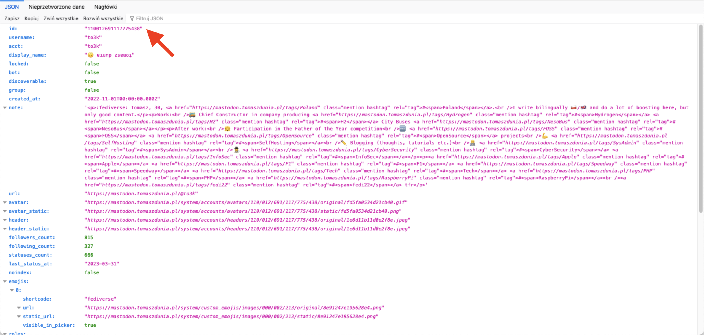

[🇵🇱 Przejdź do polskiej wersji tego wpisu / Go to polish version of this post](https://blog.tomaszdunia.pl/mastodon-api-followers-following/)

In this post, we will dive into some technical stuff. Obtaining a list of followers and/or following accounts for a given _Mastodon_ account is not as obvious as it may seem. However, it can be done using the official _API_, and that's exactly what I will show you in this post. Interestingly, the topic described below can be used as an [OSINT](https://en.wikipedia.org/wiki/Open-source_intelligence) tool. We emphasize this because thanks to ‪[@avolha@infosec.exchange‬](https://infosec.exchange/@avolha), a link to [my post about Docker](https://blog.tomaszdunia.pl/docker-eng/) made it to the compilation [Weekend Reading: Episode 512 \[2023-03-25\]](https://zaufanatrzeciastrona.pl/post/weekendowa-lektura-odcinek-512-2023-03-25-bierzcie-i-czytajcie/), which is primarily aimed at security experts (professionals dealing with cybersecurity), and the OSINT-related topic should be of interest to people working in this field.

## Let's take a look at the documentation

Like every self-respecting _geekonerd_, we will first go to the _Mastodon_ _API_ documentation and see what interesting information we can find there about the topic that currently interests us. The chapter on retrieving the list of followers can be found [at this link](https://docs.joinmastodon.org/methods/accounts/#followers), while the chapter about following accounts is located [just below it](https://docs.joinmastodon.org/methods/accounts/#following). Some interesting information I found includes:

- since version _4.0.0_, authentication with an _API_ token is not required for requests regarding followers/following, which is great because a simple _HTTP_ request is enough, and we can skip the step of creating an application altogether,

- to make the request, we need the _ID_ of the account we're asking about, so we have to take an additional step and determine the aforementioned _ID_ based on the user's profile URL or handle (we'll do this using another _API_ function),

- the default number of results we can obtain is _40_, but we can increase it to _80_ by setting the _limit=80_ parameter. Unfortunately, this limit can be quite inconvenient, as if an account has more than _80_ followers/following, we'll need to make more than one request to the _API_ and conduct the appropriate pagination of requests (something like dividing into pages),

- to use pagination, we need the _max\_id_, _since\_id_, and _min\_id_ parameters. It's important to note that the phrase "id" contained in the names of these parameters doesn't refer to the _ID_ of the account I mentioned earlier, but rather to a value known only to the backend and database of Mastodon, so using them is somewhat like groping in the dark. However, there is a way to simplify this process, which I'll write about in a moment,

- as a response from the server, we'll receive a list of followed/following accounts, which will also include quite extensive information about those accounts. The full list can be found at [this link](https://docs.joinmastodon.org/entities/Account/), but the most interesting ones are:
    - account ID (e.g., _110012691117775438_)
    
    - acct (e.g. _to3k@tomaszdunia.pl_)
    
    - display\_name (e.g. _🙃 ɐıunp zsɐɯoʇ_)
    
    - note (profile bio)
    
    - url (e.g. _https://mastodon.tomaszdunia.pl/@to3k_)
    
    - avatar (link to avatar or profile picture)
    
    - followers\_count (number of followers for this account)
    
    - following\_count (number of accounts followed by this account, let's call them followings)
    
    - statuses\_count (number of toots a.k.a. posts)

## Basic Query

Let's take my profile as a working example. The link to it is - [_https://mastodon.tomaszdunia.pl/@to3k_](https://mastodon.tomaszdunia.pl/@to3k). The API query to get a list of followers should look like this:

> https://\[instance\_address\]/api/v1/accounts/\[user\_id\]/followers

_Instance address_ in my case would be _mastodon.tomaszdunia.pl_. And how do I know my _user ID_? We will use another API function for this, which allows searching for users (and most importantly, their basic data, including their _ID_) by _name_:

> https://\[instance\_address\]/api/v1/accounts/lookup?acct=\[username\]

So let's construct the appropriate URL - [https://mastodon.tomaszdunia.pl/api/v1/accounts/lookup?acct=to3k](https://mastodon.tomaszdunia.pl/api/v1/accounts/lookup?acct=to3k). After running it in the browser, we will receive a _JSON_ object as a response from the server (I mentioned this format in [these posts](https://blog.tomaszdunia.pl/tag/json/)). In the Firefox browser, which is my primary development tool, it looks like this:



I indicated the searched ID with a red arrow on the above screenshot. We take this _ID_ and create a link that is a request for a list of followers - [https://mastodon.tomaszdunia.pl/api/v1/accounts/110012691117775438/followers](https://mastodon.tomaszdunia.pl/api/v1/accounts/110012691117775438/followers). In this way, we obtained a _JSON_ object that is an array with information about 40 accounts that follow me on _Mastodon_. Let's modify this link by adding the _limit_ parameter at the end to get twice as many results (the maximum value we can get is _80_) - [https://mastodon.tomaszdunia.pl/api/v1/accounts/110012691117775438/followers?limit=80](https://mastodon.tomaszdunia.pl/api/v1/accounts/110012691117775438/followers?limit=80). What if someone has more than 80 followers and wants to get the whole list? For this, we need to use _pagination_, but more about that later in the post.

Oh, and the list of followed accounts. The matter looks very similar, with the only difference being that we need to replace the phrase _followers_ in the link with _following_ - [https://mastodon.tomaszdunia.pl/api/v1/accounts/110012691117775438/following?limit=80](https://mastodon.tomaszdunia.pl/api/v1/accounts/110012691117775438/following?limit=80).

## What's up with pagination?

This phrase comes from the English word _pagination_ and in this context refers to the fact that when we have a limit of results (_80_) obtained from the server at once, we need to know how to formulate the next API query to receive a different (non-duplicated) result and thus extend our list until we download all its elements (complete list of followers/following). It's like browsing a table divided into pages consisting of 80 elements and switching between them. As I mentioned earlier, to handle the issue of _pagination_, we use parameters such as _max\_id_, _since\_id_, and _min\_id_. At first glance, these parameters refer to user _IDs_, but in reality, they do not. These specific _IDs_ are references to the server's internal database, the contents of which are known only to the _backend_. So, how should we use these parameters? Let's start from the beginning.

Let's assume I have 800 followers. Using the link - [https://mastodon.tomaszdunia.pl/api/v1/accounts/110012691117775438/followers?limit=80](https://mastodon.tomaszdunia.pl/api/v1/accounts/110012691117775438/followers?limit=80) - which we constructed earlier, we get in response from the server a list of 80 accounts that follow me on _Mastodon_. These accounts are sorted chronologically, starting from the most recent follower (the person who started following me last). So, we already have 1/10 of the list of my followers. How can we then move to the next page and learn about the followers from 81 to 160? We need to determine what the _URL_ of the next page will be, and we get this information in the header of the _API_ response. Specifically, it is contained in a parameter called _link_. In Firefox, simply switch from _JSON_ to _Headers_ and we will get something similar to this:


Let's get the value of this header parameter:

> <https://mastodon.tomaszdunia.pl/api/v1/accounts/110012691117775438/following?limit=80&max\_id=700\>; rel="next", <https://mastodon.tomaszdunia.pl/api/v1/accounts/110012691117775438/following?limit=80&since\_id=1183\>; rel="prev"

The _URL_ located before _rel="next"_ highlighted in green is the link to the next page of followers we were looking for. After using it, we receive another batch of 80 accounts that follow me.

We repeat this process 8 more times to get information about all 800 followers. The entire intricate _pagination_ has just become obvious, right? 😎

## PHP script

You can do this manually once to understand the whole mechanism. However, we need a script to automate it because we're not savages 😂 Below is the PHP script, with each line explained (as always) through comments within the code.

```php
<?php
    // Get a GET variable
    $url = trim(addslashes(strip_tags($_GET['url'])));
?>

<!-- Form to get user profile address from the user -->
<form action="" method="GET" name="form">
    <input type="text" name="url" placeholder="Profile URL..." value="<?php echo $url; ?>" size="100"><br><br>
    <button type="submit">Get Followers/Following</button>
</form>

<?php
    if(empty($url))
    {
        // If address is not provided end the script
        exit;
    }
    else
    {
        // If variable with address is not empty...
        // Explode address to domain (instance) and username
        $explode_url = explode("@", $url);
        $mastodon_domain = $explode_url[0];
        $mastodon_username = $explode_url[1];
        // Regexp pattern to validate username
        $check = '/^[a-zA-Z0-9_]+/';

        if(filter_var($mastodon_domain, FILTER_VALIDATE_URL) AND preg_match($check, $mastodon_username))
        {
            // If domain and username are validated correctly
            $profile_url = $url;
        }
        else
        {
            // If domain and username did not pass validation, display an error and end the script
            echo "Forbidden value of GET variable";
            exit;
        }
    }

    // ESTABLISHING THE USER ID
    // Constructs the address for communication with the API
    $api_url = $mastodon_domain."/api/v1/accounts/lookup?acct=".$mastodon_username;
    // Constructs the cURL request
    $curl = curl_init($api_url);
    curl_setopt($curl, CURLOPT_URL, $api_url);
    curl_setopt($curl, CURLOPT_RETURNTRANSFER, 1);
    curl_setopt($curl, CURLOPT_USERAGENT, 'Mozilla/5.0 (Windows NT 10.0; Win64; x64) AppleWebKit/537.36 (KHTML, like Gecko) Chrome/88.0.4324.182 Safari/537.36');
    curl_setopt($curl, CURLOPT_TIMEOUT, 30);
    curl_setopt($curl, CURLOPT_HEADER, 0);
    // Sends the cURL request and saves the result to a variable
    $json = curl_exec($curl);
    // Converts the result from JSON format to a regular array
    $api_result = json_decode($json, true);
    // Extracts the user ID from the result and saves it to a variable
    $mastodon_id = $api_result['id'];

    if(empty($mastodon_id))
    {
        // If variable with the user ID is empty, display an error and end the script
        echo "Error while getting account ID, failed to connect to API";
        exit;
    }

    // FUNCTION TO EXTRACT INFORMATION FROM API SERVER RESPONSE HEADER
    function HeaderLink($curl, $header_line) {
        if(str_contains($header_line, "link:"))
        {
            $GLOBALS['link'] = $header_line;
        }
        return strlen($header_line);
    }

    // GET THE LIST OF FOLLOWERS
    // Counter of found followers
    $followers_counter = 0;
    // Array to store found followers' data
    $followers = array();
    // Array to store only the IDs of the found followers (necessary to avoid duplicates)
    $followers_ids = array();
    
    // Constructs the address for communication with the API
    $api_url = $mastodon_domain."/api/v1/accounts/".$mastodon_id."/followers?limit=80";
    // Constructs the cURL request
    $curl = curl_init($api_url);
    curl_setopt($curl, CURLOPT_URL, $api_url);
    curl_setopt($curl, CURLOPT_RETURNTRANSFER, 1);
    curl_setopt($curl, CURLOPT_USERAGENT, 'Mozilla/5.0 (Windows NT 10.0; Win64; x64) AppleWebKit/537.36 (KHTML, like Gecko) Chrome/88.0.4324.182 Safari/537.36');
    curl_setopt($curl, CURLOPT_TIMEOUT, 30);
    curl_setopt($curl, CURLOPT_HEADER, 0);
    // Refers to the function that extracts information from the API server response header
    curl_setopt($curl, CURLOPT_HEADERFUNCTION, "HeaderLink");
    // Sends the cURL request and saves the result to a variable
    $json = curl_exec($curl);
    // Converts the result from JSON format to a regular array
    $api_result = json_decode($json, true);
    
    // Goes through every element in array and performs certain actions...
    foreach($api_result as $follow)
    {
        // Checks if this element hasn't been processed yet (prevent duplicating)
        if(!in_array($follow['id'], $followers_ids))
        {
            // Adds element's ID to array with IDs
            $followers_ids[] = $follow['id'];
            // Adds new element to array with found followers
            $followers[] = array(
                "id" => $follow['id'], 
                "acct" => $follow['acct'],  
                "display_name" => $follow['display_name'],  
                "url" => $follow['url'],  
                "avatar" => $follow['avatar'],  
                "followers_count" => $follow['followers_count'],  
                "following_count" => $follow['following_count'],  
                "statuses_count" => $follow['statuses_count']
            );
            // Increments counter of found followers
            $followers_counter++;
        }
    }
    // Establishes address of the next page with followers
    preg_match("(link: <(.+?)>; rel=\"next\", <.+?>; rel=\"prev\")is", $GLOBALS['link'], $temp);
    $api_url = $temp[1];

    // Loop, which do the same as above until address of the next page with followers can be established
    while(!empty($api_url))
    {
        $curl = curl_init($api_url);
        curl_setopt($curl, CURLOPT_URL, $api_url);
        curl_setopt($curl, CURLOPT_RETURNTRANSFER, 1);
        curl_setopt($curl, CURLOPT_USERAGENT, 'Mozilla/5.0 (Windows NT 10.0; Win64; x64) AppleWebKit/537.36 (KHTML, like Gecko) Chrome/88.0.4324.182 Safari/537.36');
        curl_setopt($curl, CURLOPT_TIMEOUT, 30);
        curl_setopt($curl, CURLOPT_HEADER, 0);
        curl_setopt($curl, CURLOPT_HEADERFUNCTION, "HeaderLink");
        $json = curl_exec($curl);
        $api_result = json_decode($json, true);

        foreach($api_result as $follow)
        {
            if(!in_array($follower['id'], $followers_ids))
            {
                $followers_ids[] = $follow['id'];
                $followers[] = array(
                    "id" => $follow['id'], 
                    "acct" => $follow['acct'],  
                    "display_name" => $follow['display_name'],  
                    "url" => $follow['url'],  
                    "avatar" => $follow['avatar'],  
                    "followers_count" => $follow['followers_count'],  
                    "following_count" => $follow['following_count'],  
                    "statuses_count" => $follow['statuses_count']
                );
                $followers_counter++;
            }
        }
        preg_match("(link: <(.+?)>; rel=\"next\", <.+?>; rel=\"prev\")is", $GLOBALS['link'], $temp);
        $api_url = $temp[1];
    }

    // GET THE LIST OF FOLLOWING
    // Counter of found followings
    $following_counter = 0;
    // Array to store found followings' data
    $following = array();
    // Array to store only the IDs of the found followings (necessary to avoid duplicates)
    $following_ids = array();
    
    // Constructs the address for communication with the API
    $api_url = $mastodon_domain."/api/v1/accounts/".$mastodon_id."/following?limit=80";
    // Constructs the cURL request
    $curl = curl_init($api_url);
    curl_setopt($curl, CURLOPT_URL, $api_url);
    curl_setopt($curl, CURLOPT_RETURNTRANSFER, 1);
    curl_setopt($curl, CURLOPT_USERAGENT, 'Mozilla/5.0 (Windows NT 10.0; Win64; x64) AppleWebKit/537.36 (KHTML, like Gecko) Chrome/88.0.4324.182 Safari/537.36');
    curl_setopt($curl, CURLOPT_TIMEOUT, 30);
    curl_setopt($curl, CURLOPT_HEADER, 0);
    // Refers to the function that extracts information from the API server response header
    curl_setopt($curl, CURLOPT_HEADERFUNCTION, "HeaderLink");
    // Sends the cURL request and saves the result to a variable
    $json = curl_exec($curl);
    // Converts the result from JSON format to a regular array
    $api_result = json_decode($json, true);
    
    // Goes through every element in array and performs certain actions...
    foreach($api_result as $follow)
    {
        // Checks if this element hasn't been processed yet (prevent duplicating)
        if(!in_array($follow['id'], $following_ids))
        {
            // Adds element's ID to array with IDs
            $following_ids[] = $follow['id'];
            // Adds new element to array with found followings
            $following[] = array(
                "id" => $follow['id'], 
                "acct" => $follow['acct'],  
                "display_name" => $follow['display_name'],  
                "url" => $follow['url'],  
                "avatar" => $follow['avatar'],  
                "followers_count" => $follow['followers_count'],  
                "following_count" => $follow['following_count'],  
                "statuses_count" => $follow['statuses_count']
            );
            // Increments counter of found followings
            $following_counter++;
        }
    }
    // Establishes address of the next page with followings
    preg_match("(link: <(.+?)>; rel=\"next\", <.+?>; rel=\"prev\")is", $GLOBALS['link'], $temp);
    $api_url = $temp[1];

    // Loop, which do the same as above until address of the next page with followings can be established
    while(!empty($api_url))
    {
        $curl = curl_init($api_url);
        curl_setopt($curl, CURLOPT_URL, $api_url);
        curl_setopt($curl, CURLOPT_RETURNTRANSFER, 1);
        curl_setopt($curl, CURLOPT_USERAGENT, 'Mozilla/5.0 (Windows NT 10.0; Win64; x64) AppleWebKit/537.36 (KHTML, like Gecko) Chrome/88.0.4324.182 Safari/537.36');
        curl_setopt($curl, CURLOPT_TIMEOUT, 30);
        curl_setopt($curl, CURLOPT_HEADER, 0);
        curl_setopt($curl, CURLOPT_HEADERFUNCTION, "HeaderLink");
        $json = curl_exec($curl);
        $api_result = json_decode($json, true);

        foreach($api_result as $follow)
        {
            if(!in_array($follow['id'], $following_ids))
            {
                $following_ids[] = $follow['id'];
                $following[] = array(
                    "id" => $follow['id'], 
                    "acct" => $follow['acct'],  
                    "display_name" => $follow['display_name'],  
                    "url" => $follow['url'],  
                    "avatar" => $follow['avatar'],  
                    "followers_count" => $follow['followers_count'],  
                    "following_count" => $follow['following_count'],  
                    "statuses_count" => $follow['statuses_count']
                );
                $following_counter++;
            }
        }
        preg_match("(link: <(.+?)>; rel=\"next\", <.+?>; rel=\"prev\")is", $GLOBALS['link'], $temp);
        $api_url = $temp[1];
    }
?>
<!-- SHOWING THE RESULTS -->
<h1>Followers</h1>
<b>Number of followers found:</b> <?php echo $followers_counter; ?><br><br>
<table>
    <tr>
        <th>Lp.</th>
        <th>Avatar</th>
        <th>ID</th>
        <th>Handle</th>
        <th>Name</th>
        <th>Followers</th>
        <th>Following</th>
        <th>Toots</th>
        <th>URL</th>
    </tr>
<?php
    $i = 1;
    foreach($followers as $follow)
    {
        echo "<tr>";
        echo "<td>".$i."</td>";
        echo "<td></td>";
        echo "<td>".$follow['id']."</td>";
        echo "<td>".$follow['acct']."</td>";
        echo "<td>".$follow['display_name']."</td>";
        echo "<td>".$follow['followers_count']."</td>";
        echo "<td>".$follow['following_count']."</td>";
        echo "<td>".$follow['statuses_count']."</td>";
        echo "<td><a href=\"".$follow['url']."\">".$follow['url']."</a></td>";
        echo "</tr>";

        $i++;
    }
?>
</table>

<h1>Following</h1>
<b>Number of following found:</b> <?php echo $following_counter; ?><br><br>
<table>
    <tr>
        <th>Lp.</th>
        <th>Avatar</th>
        <th>ID</th>
        <th>Handle</th>
        <th>Name</th>
        <th>Followers</th>
        <th>Following</th>
        <th>Toots</th>
        <th>URL</th>
    </tr>
<?php
    $i = 1;
    foreach($following as $follow)
    {
        echo "<tr>";
        echo "<td>".$i."</td>";
        echo "<td></td>";
        echo "<td>".$follow['id']."</td>";
        echo "<td>".$follow['acct']."</td>";
        echo "<td>".$follow['display_name']."</td>";
        echo "<td>".$follow['followers_count']."</td>";
        echo "<td>".$follow['following_count']."</td>";
        echo "<td>".$follow['statuses_count']."</td>";
        echo "<td><a href=\"".$follow['url']."\">".$follow['url']."</a></td>";
        echo "</tr>";

        $i++;
    }
?>
</table>
```

The script's output:


The script is also available on [my GitHub](https://github.com/to3k/mastodon-api/blob/main/masto-get-followers-following.php).
