[🇬🇧 Go to english version of this post / Przejdź do angielskiej wersji tego wpisu](https://blog.tomaszdunia.pl/yunohost-writefreely-eng/)

Zaczęło się od tego, że napisałem wyjątkowo dobrze odebrany wpis o tym [jak pozyskać za darmo dość ciekawy serwer w chmurze _Oracle_](https://blog.tomaszdunia.pl/oracle-free-tier/). Potem napisałem poradnik [jak zainstalować na nim środowisko _YunoHost_](https://blog.tomaszdunia.pl/yunohost-oracle/), ułatwiające uruchamianie swoich własnych aplikacji/usług. Później korzystając z tego wszystkiego [uruchomiłem polską instancję _WriteFreely_ (Polska)](https://blog.tomaszdunia.pl/writefreely-polska/), która jest platformą do blogowania mocno osadzoną w _Fediverse_. A w tym wpisie opiszę krok po kroku jak to zrobiłem, a co za tym idzie, jak i Ty, drogi Czytelniku, możesz uruchomić taką instancję samemu!

## Dodajemy domenę i instalujemy aplikację w YunoHost

W pierwszej kolejności potrzebujemy domeny, na której będzie działała instancja _WriteFreely_, którą za moment uruchomimy. Dostawca domeny może być dowolny, a jedynym wymogiem jest to, abyśmy mogli dla niej ustawić przynajmniej rekordy DNS, tj. wskazać serwer, który powie jej, gdzie chcemy, aby osoby na nią wchodzący były odsyłane. Mile widziana będzie także możliwość ustawienia rekordów _A_, _AAAA_, _MX_, _TXT_ i _CAA_, ale jeżeli Twój dostawca domen nie oferuje takiej możliwości to i z tym sobie poradzimy. Gdy mamy już domenę to przechodzimy do działania.

    

    

    

    
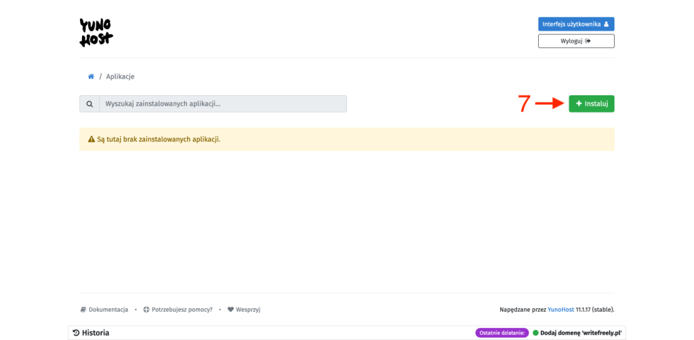
    

    
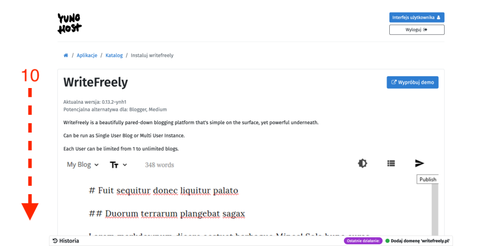
    

    

    

1. Wchodzimy do panelu administracyjnego naszego _YunoHost_.

3. Z menu głównego wybieramy zakładkę _Domeny_ \[1\].

5. Odnajdujemy w prawym górnym rogu przycisk _\+ Dodaj domenę_ \[2\] i wciskamy go.

7. Wybieramy opcję _Posiadam swoją domenę..._ \[3\] i w polu tekstowym _Nazwa domeny_ \[4\] wpisujemy jej adres, po czym zatwierdzamy przyciskiem _Dodaj_ \[5\].

9. Wracamy do menu głównego i tym razem wchodzimy w zakładkę _Aplikacje_ \[6\].

11. Odnajdujemy w prawym górnym rogu przycisk _\+ Instaluj_ \[7\] i wciskamy go.

13. W pole tekstowy wyszukiwarki \[8\] wpisujemy _writefreely._ Dostępne aplikacje zostaną odfiltrowane i ograniczone do jednej pozycji, której nazwa jest zgodna z wyszukiwaną przez nas frazą. Oczywiście klikamy na nią \[9\].

15. Naszym oczom ukaże się strona krótko opisująca czym jest _WriteFreely_. Można nawet skorzystać z przycisku _Wypróbuj demo_ i zapoznać się z wersją demonstracyjną tej platformy. My jednak zjeżdżamy na dół, gdzie mamy kilka rzeczy do ustawienia.

17. W pole tekstowe _Etykieta dla WriteFreely_ \[10\] wpisujemy to pod jaką nazwą chcemy widzieć tą aplikację na liście aplikacji w naszym _YunoHost_. Można to później zmienić, więc bez stresu.

19. Z rozwijanej listy poniżej \[11\] wybieramy wcześniej skonfigurowaną domenę.

21. Dalej mamy pole wyboru z rodzaju _Tak_/_Nie_ \[12\], gdzie wybranie _Tak_ oznacza, że do uzyskania dostępu do strony nie będzie potrzebne konto na naszym serwerze z _YunoHost_. To co tutaj wybierzemy zależy od tego jakiego typu usługę uruchamiamy. Jeżeli chcemy, aby nasza instancja _WriteFreely_ była dostępna publicznie to oczywiście zaznaczamy _Tak_, natomiast jeżeli tworzymy instancję do użytku jedynie przez np. naszych znajomych to właściwa jest opcja _Nie_.

23. Kolejna lista rozwijana \[13\] służy do wskazania, który z użytkowników _YunoHost_ ma być administratorem tej aplikacji, a pole tekstowe \[14\] pod nim do ustawienia hasła dostępowego do tej aplikacji dla tego użytkownika (jej administratora).

25. Na samym końcu musimy jeszcze odpowiedzieć na pytanie \[15\] czy chcemy stworzyć instancję jedynie dla siebie (_Single User Blog_, z ang. _blog jednego użytkownika_) czy też zamierzamy umożliwić rejestrację innym. _Tak_ oznacza instancję tylko dla nas, a _Nie_ oznacza instancję otwartą dla innych.

27. To wszystko potwierdzamy przyciskiem _Instaluj_ \[16\].

## Dodanie i konfiguracja domeny w Cloudflare

_AKTUALIZACJA 22-11-2023: Przed przeczytaniem tego rozdziału polecam zapoznać się z [wpisem, który napisałem](https://blog.tomaszdunia.pl/migracja-writefreelypl-freedns42/) po publikacji tego wpisu._

Wiem, że znajdą się tacy, którzy będą bardzo mocno hejtować to, że rekomenduję użycie _[Cloudflare](https://cloudflare.com)_, w którym upatrują się kolejnego rozwiązania korpo oferującego pozornie darmowe rozwiązanie, a tak naprawdę posiadającego niemalże monopol w zakresie tego co oferuje. Może i tak jest, ale ja niczego tutaj nie narzucam. Po prostu pokażę uniwersalny sposób na ustawienie prawidłowo rekordów _DNS_, bo po pierwsze nie wszyscy dostawcy domen oferują możliwość zastosowania tak specyficznych ustawień dla domeny, a po drugie nie sposób byłoby napisać instrukcję dla każdego takiego dostawcy, bo jest ich mnóstwo. W skrócie, poniżej pokażę jak zrobić to przy użyciu _Cloudflare_, a Ty, drogi Czytelniku, zdecydujesz czy chcesz robić to tak samo czy też spróbować własnych sił i ustawić to bez użycia _Cloudflare_.

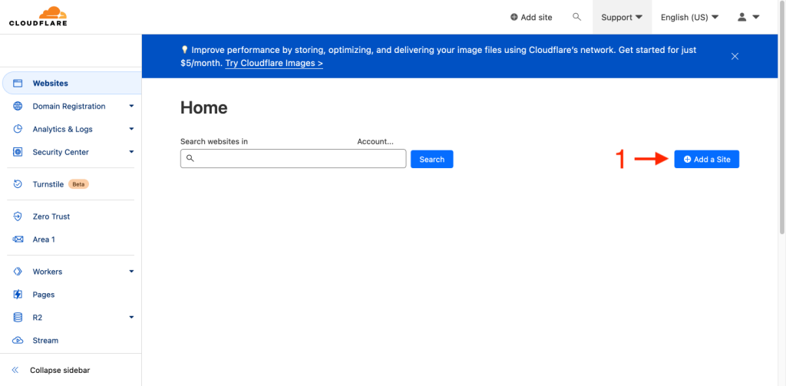
    

    
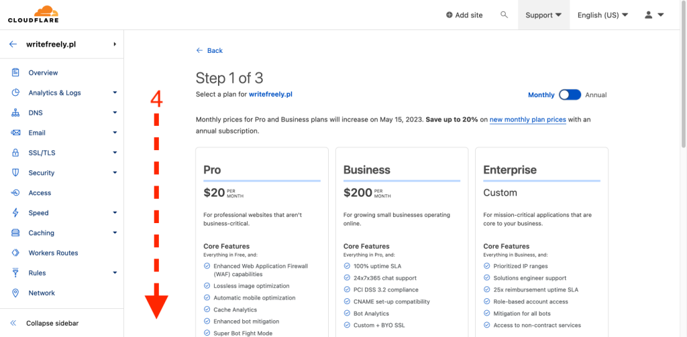
    
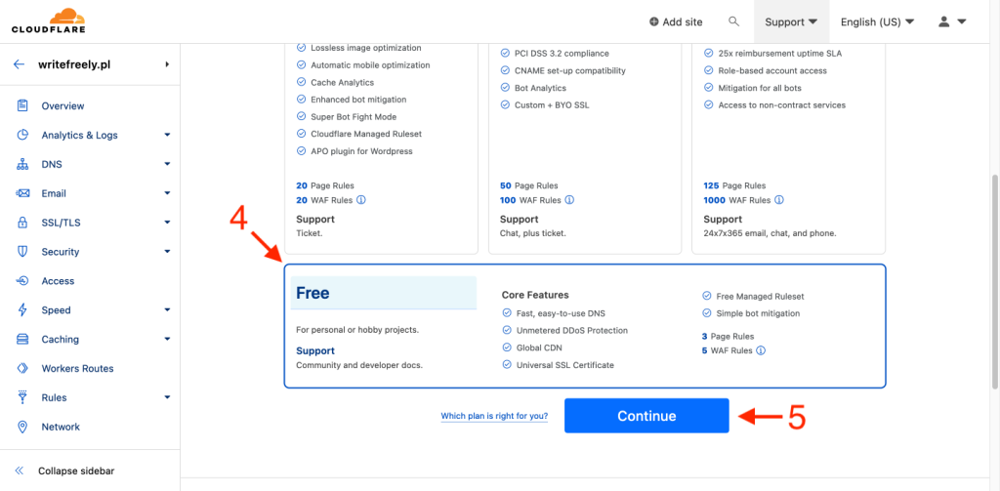
    
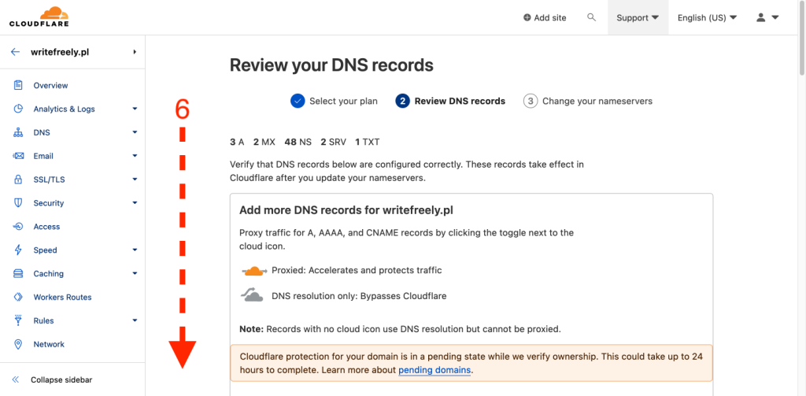
    
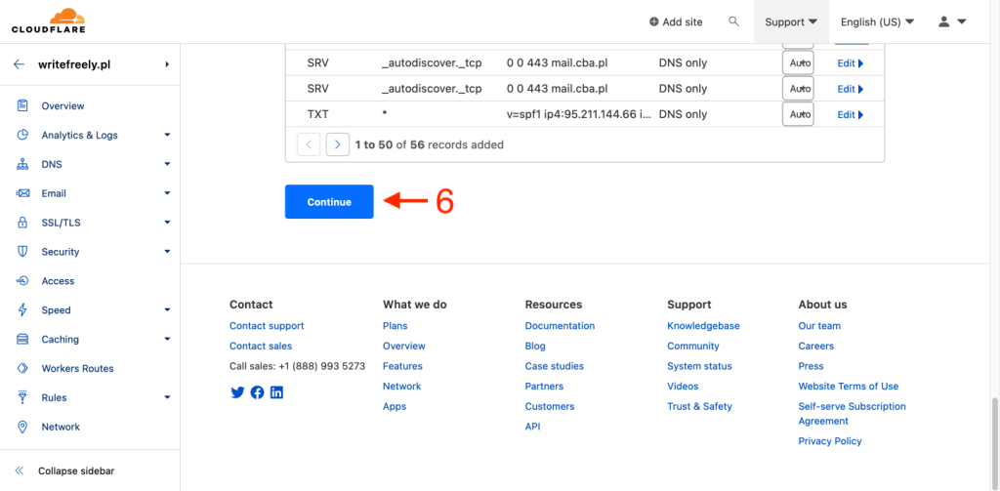
    

    
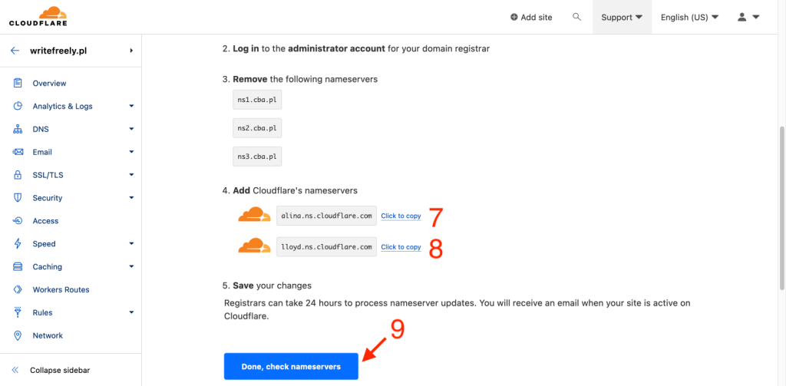
    

    
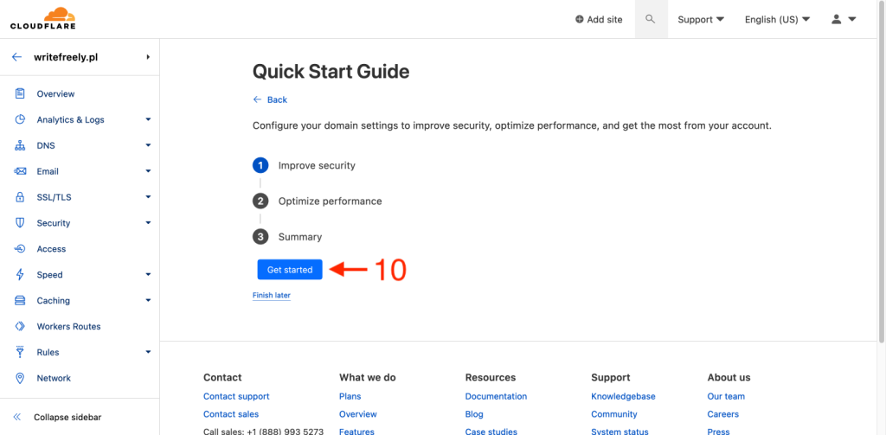
    

    

    
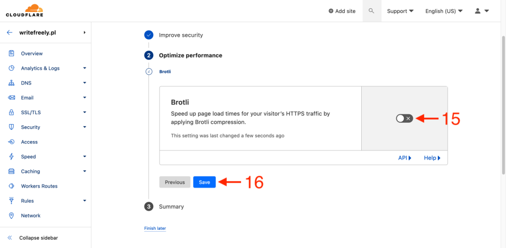
    

    
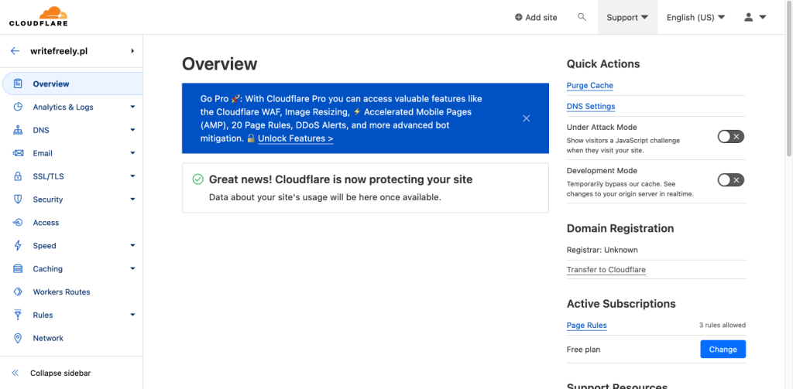
    

1. Rozpoczynamy od rejestracji nowego konta _[Cloudflare](https://dash.cloudflare.com/sign-up?lang=en-US)_ lub jeżeli już takie posiadamy to do zalogowania się do niego.

3. W zakładce _Websites_ znajdujemy w prawym górnym rogu przycisk _\+ Add a Site_ \[1\].

5. W polu tekstowym \[2\] podajemy domenę, którą chcemy dodać i potwierdzamy przyciskiem _Add site_ \[3\].

7. Na następnej stronie musimy wybrać z jakiego planu chcemy skorzystać, po zjechaniu na sam dół jest do wyboru plan darmowy (_Free_) \[4\]. Wybieramy go i potwierdzamy przyciskiem _Continue_ \[5\].

9. Zostaniemy przeniesieni do strony, na której zaprezentowane zostaną obecne (wykryte) ustawienia rekordów DNS tej domeny. Proponuję na tym etapie skasować wszystkie pozycje, bo dodamy je później, i przejść dalej przy użyciu przycisku _Continue_ \[6\].

11. Ostatnim z trzech najważniejszych kroków jest zmiana rekordów DNS domeny na te od _Cloudflare_. Tutaj dochodzimy do sedna tego jak działa _Cloudflare_, które jest swego rodzaju proxy pomiędzy domeną, a serwerem który ją obsługuję. Wszystko polega na tym, że ruch z domeny przekierowujemy do _Cloudflare_, które odpowiednio go filtruje (jeżeli jest taka potrzeba) i przekazuje dalej w taki sposób jaki wskazaliśmy w ustawieniach. _Cloudflare_ daje bogaty wachlarz możliwości, a obsługa domen najwyższego poziomu (nie będących subdomenami innej domeny) jest darmowe w zakresie podstawowych funkcji. Wracając do tematu, na tej stronie _Cloudflare_ informuje nas jakie ustawienia wykrył (w moim przypadku było to wskazywanie domeny na _ns1.cba.pl_, _ns2.cba.pl_ i _ns3.cba.pl_) i proponuje na jakie należy je zmienić, aby w to wszystko włączyć mechanizm _Cloudflare_. W tym celu bierzemy dwa podane NSy (skrót od Name Servers) \[7\]\[8\] i wrzucamy je do ustawień domeny w panelu zarządzania u naszego dostawcy domen (na zrzucie ekranu pokazałem jak to wygląda w moim przypadku). W przypadki _Cloudflare_ zawsze jest to para, ale może występować w konfiguracjach z różnymi pierwszymi członami.

13. Po wprowadzeniu zmian potwierdzamy przyciskiem _Done, check nameservers_ \[9\].

15. Teraz pozostaje nam już czekać aż zmiany w rekordach DNS naszej domeny zostaną rozpropagowane. _Cloudflare_ będzie dla nas monitorował ten proces i gdy zmiany zostaną wprowadzone to dostaniemy o tym powiadomieni poprzez e-mail. W skrajnych przypadkach może to trwać nawet 24 godziny.

17. W międzyczasie dostajemy jeszcze propozycję szybkiej konfiguracji podstawowych ustawień. Rozpoczynamy ten proces od naciśnięcia przycisku _Get started_ \[10\]:
     - _Automatic HTTPS Rewrites_ \[11\] - funkcja przepisywania wszystkich odnośników _HTTP_ na _HTTPS_, polecam włączyć i przejść dalej przyciskiem _Save_ \[12\],
     
     - _Always Use HTTPS_ \[13\] - wymuszenie używania jedynie _HTTPS_, tj. automatyczne przekierowanie całego nieszyfrowanego ruchu _HTTP_ na kanał szyfrowany, polecam włączyć i przejść dalej przyciskiem _Save_ \[14\],
     
     - _Brotli_ \[15\] - funkcja optymalizująca czasy wczytania strony poprzez stosowanie kompresji, potrafi powodować nieprawidłowe działanie uruchomionych usług, więc domyślnie polecam wyłączyć tę funkcję i ewentualnie później ją włączyć i sprawdzić czy będzie jakiś konflikt, przechodzimy dalej przyciskiem _Save_ \[16\]

19. Cały proces zakańczamy przyciskiem _Finish_ \[17\].

## Przekierowanie domeny na serwer z YunoHost

Po otrzymaniu mailowego potwierdzenia od _Cloudflare_, że nasza domena została już prawidłowo podpięta, możemy przejść do konfiguracji rekordów DNS. W pierwszej kolejności musimy ustalić co należy ustawić. W tym celu przechodzimy do _YunoHost_ i wchodzimy do narzędzia diagnostycznego (tak jak to robiliśmy w [tym wpisie](https://blog.tomaszdunia.pl/yunohost-oracle/)). _YunoHost_ informuje nas, że najważniejsze, niezbędne do działania, jest ustawienie rekordu _A_(_@_) \[1\], natomiast pozostałe są jedynie rekomendowane - _MX_ \[2\], _TXT_ \[3\]\[4\]\[5\], _A_(_\*_) \[6\], _CAA_ \[7\].

    
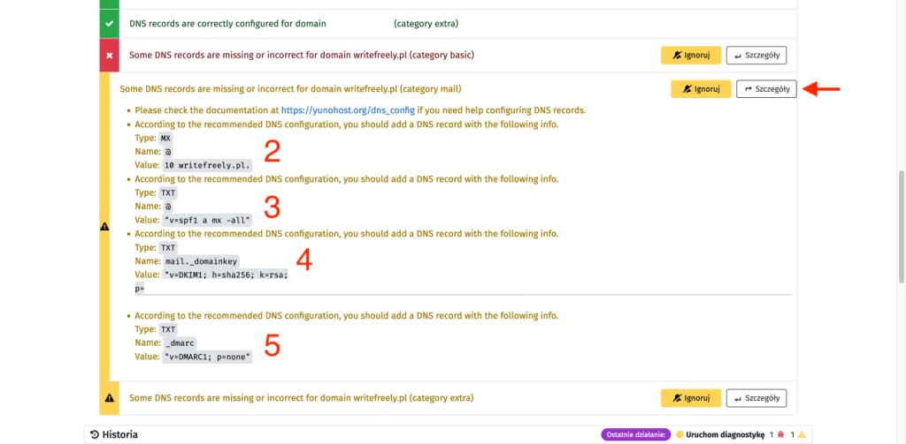
    
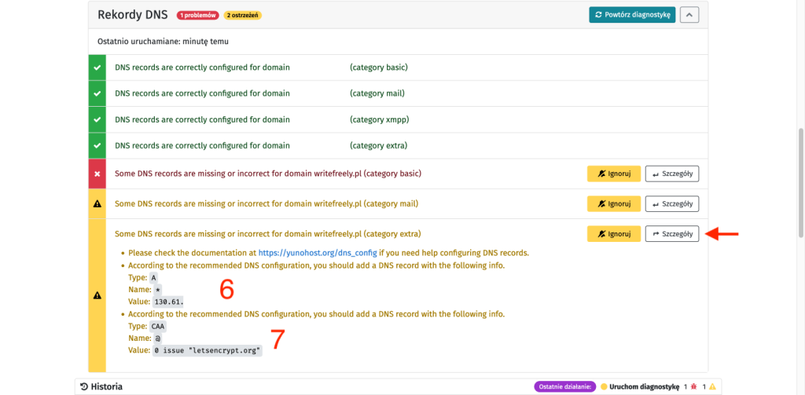
    

Poprawnie ustawione rekordy DNS domeny dla instancji _WriteFreely_ uruchomionej na serwerze z _YunoHost_ wyglądają następująco:

Zauważ, że istnieje możliwość ustawienia dla rekordów _A_ _Proxy status_ na _DNS only_, co oznacza, że ruch nie jest w żadne sposób filtrowany przez _Cloudflare_, a jedynie przekazywany zgodnie z ustawieniami.

## Certyfikat SSL (HTTPS)

Na koniec pozostaje nam jeszcze ustawić certyfikat _SSL_, wymagany do ustanowienia bezpiecznego połączenia _HTTPS_. _YunoHost_ ma domyślnie wbudowany _Let's Encrypt_, czyli narzędzie, które umożliwia bezpłatne i automatyczne wydawanie certyfikatów _SSL_/_TLS_. Aby z niego skorzystać wystarczy wejść w ustawienia konkretnej domeny, następnie do zakładki _Certificate_ i odszukać na dole zielony przycisk _Install Let's Encrypt Certificate_.

## Gotowe!

Wszystko gotowe, więc teraz można przejść do w/w domeny i zacząć korzystać z naszej świeżo uruchomionej instancji _WriteFreely_. Możliwość jej konfiguracji uzyskuje się poprzez logowania na konto administratora, który ma dodatkowe opcje niedostępne dla innych użytkowników.
