[🇵🇱 Przejdź do polskiej wersji tego wpisu / Go to polish version of this post](https://blog.tomaszdunia.pl/droidian/)

In the [previous post](https://blog.tomaszdunia.pl/ubuntu-touch-eng/), I described how to install the _Ubuntu Touch_ system on the _Google Pixel 3a XL_ smartphone, replacing the factory _Android_. Based on the initial impressions, it could be concluded that this system is not suitable for anything more than just a curiosity. It works and looks fine, but it lacks software. Additionally, it is not as open as it may seem, because despite being Linux, it is quite limited as an environment, meaning there is not much that can be done even from the terminal. Therefore, I began searching for the perfect system for my _Pixel_ that would replace _Android_ while remaining open and free. I quickly came across the [Droidian project](https://droidian.org/), which is based on _Mobian_, a **_Debian_ port for mobile devices**. It turned out to be a **fully-fledged Linux distribution** with capabilities almost comparable to those for _desktops_, but it can be **run on a 6-inch device**! It may not be as visually polished as _Ubuntu Touch_ (there is a significant problem with scaling applications since they are desktop applications), and **basic phone functions may not work reliably, and some of them do not work at all** (e.g., automatic rotation, automatic screen brightness, or even fingerprint reader). However, it definitely solves my key issues with _Ubuntu Touch_, namely that the **software repository is much more extensive**, and even if something is not available, there is a good chance of **installing it from the _terminal_** (e.g., as _root_), provided that the software works on a standard _Debian_. Due to the above, **this post will serve as a guide on how to install the _Droidian_ operating system** on the _Google Pixel 3a XL_ smartphone.

## Preparing for Droidian flashing

About 95% of the actions required to flash _Droidian_ on the _Pixel 3a XL_ are identical to what we did in the post about _[Ubuntu Touch](https://blog.tomaszdunia.pl/ubuntu-touch-eng/)_. Therefore, in this post, I will only list them in the order of execution, refer to them, and move on to the part that differs for these two systems.

Actions to be performed before flashing _Droidian_:

1. [Purchase the appropriate smartphone](https://blog.tomaszdunia.pl/ubuntu-touch-eng/#pixel),

3. [Prepare the computer](https://blog.tomaszdunia.pl/ubuntu-touch-eng/#pc),

5. [Unlock the bootloader](https://blog.tomaszdunia.pl/ubuntu-touch-eng/#bootloader),

7. [Restore the required version of the _Android_ system](https://blog.tomaszdunia.pl/ubuntu-touch-eng/#android9).

## Flashing Droidian

Interestingly, _Droidian_ can be installed using the same program as _Ubuntu Touch_ - _UBports Installer_. Just like in the case of _Ubuntu Touch_, I will show the process using screenshots below.

- 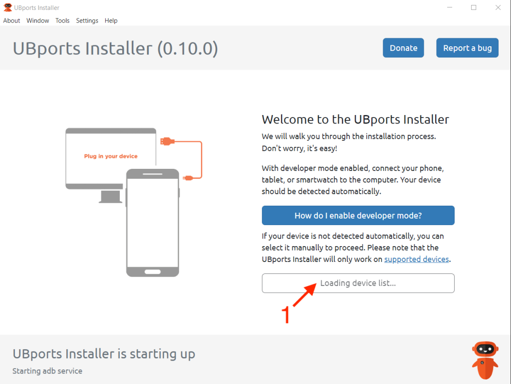
    
- 
    
- 
    
- 
    
- 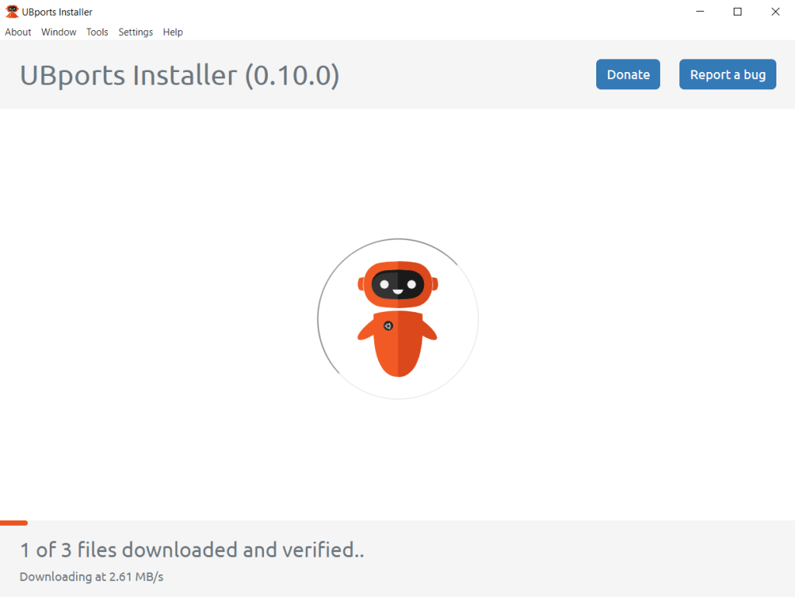
    
- 
    
- 
    
- 
    
- 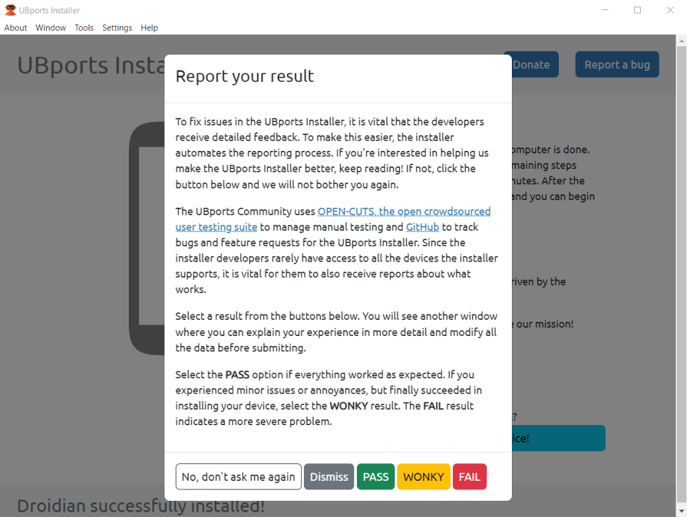
    
- 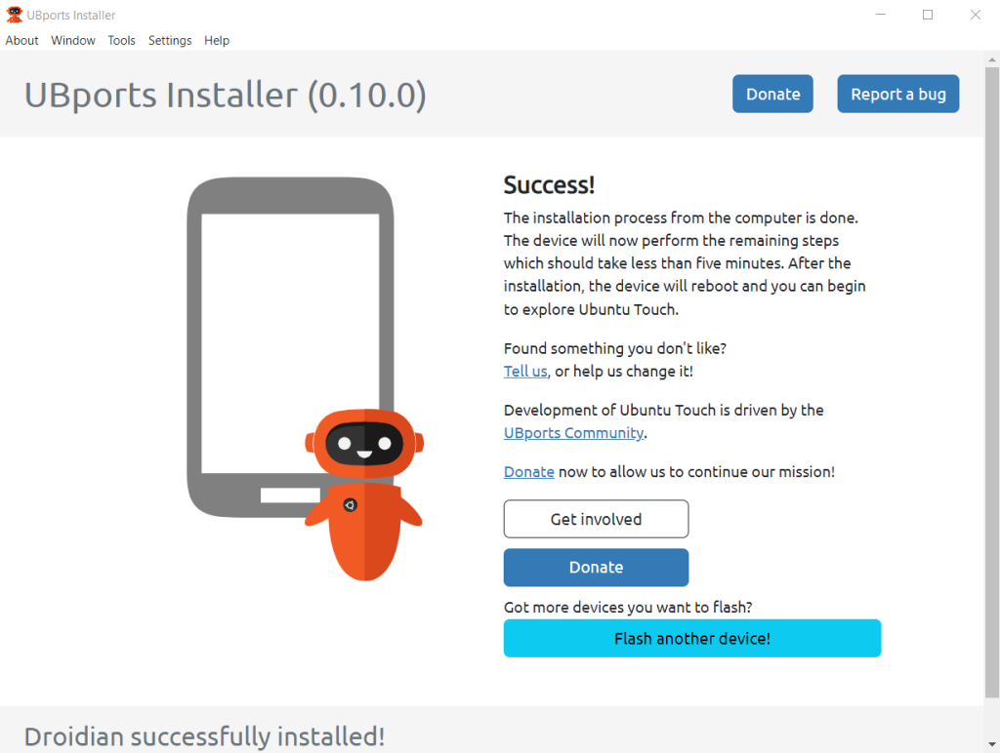
    

## Droidian - first impressions

I have to admit that when writing my first impressions about _Ubuntu Touch_, which I included in my [previous post](https://blog.tomaszdunia.pl/ubuntu-touch/), I was slightly disappointed with how the system turned out. In the case of _Droidian_, from the very beginning, I had a completely different experience. It may not be perfect and has many issues, but it gives me what I was looking for - it turned my pocket-sized smartphone into a full-fledged computer running a _desktop_ distribution of _Linux_ (_Debian_). Some people asked in the previous post why I spoke so negatively about _Ubuntu Touch_. The thing is, I wasn't looking for a slightly more exotic system that would allow me to use my _Pixel_ as a basic phone, i.e., making calls, sending texts, doing some browsing, and maybe using maps or playing audio. As I mentioned earlier, I was looking for something that would turn my phone into a highly portable computer, and _Droidian_ is exactly that solution.

Let's start with the basics. _Droidian_ comes with several pre-installed applications. However, I quickly got rid of most of them because I had a completely different use in mind for this device. For example, I removed the calling and SMS apps because my _Pixel_ has a _SIM_ card that can only use the _GSM_ data transmission service, so having those apps didn't make sense in my case. Nevertheless, if someone intends to use _Droidian_ as their daily solution, it's worth noting that it's possible. Additionally, just like in the case of _Ubuntu_, functions such as _Wi-Fi_, data transmission, _Bluetooth_, _GPS_, and even a flashlight work. I believe that just a few days ago, some patches were released to add the automatic screen brightness and automatic screen orientation (vertical and horizontal orientation), which were previously unavailable. However, there are a few things that worked on _Ubuntu Touch_ but don't work on _Droidian_. For example, the fingerprint reader and the camera. I admit that the fingerprint reader could be useful to me, but it's not like there's no prospect of adding this feature, as it seems that the fingerprint reader can physically work normally, but there is simply no software support for this feature at the moment, and it could appear at any time because it's evident that _Droidian_ (or rather _Mobian_, of which _Droidian_ is a fork) is constantly being actively developed.

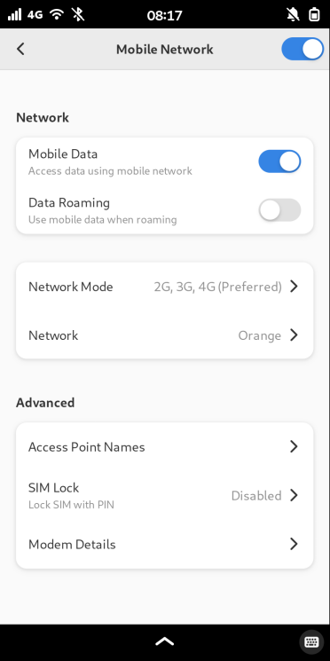

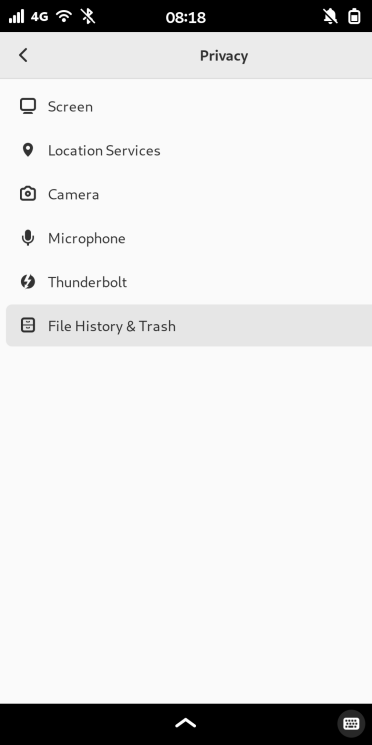

In my opinion, the main advantages of _Droidian_ are the desktop version of _Firefox_ and the unrestricted _Linux Terminal_. Most people probably wonder how to use a browser designed for a completely different screen size. It can be quite challenging at times because scaling is often a significant issue. However, it can be partially overcome by changing the interface _Zoom_ to 50%. As for the _Terminal_, the experience is similar to a freshly installed _minimal Debian_. You need to perform basic tasks like changing the password (default is _1234_), the first update, configuring APT repositories, and installing _Flatpak_ and _Snap_. But afterwards, the system is ready to use.

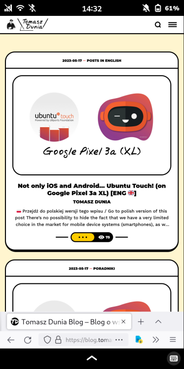

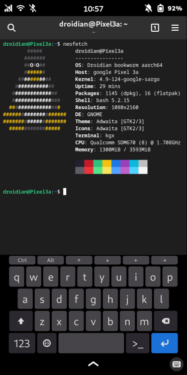

I had no problem installing applications like _Bitwarden_ (password manager), _Thunderbird_ (email client), _Fractal_ (Matrix client), _Pure Maps_ (maps), _Nextcloud_ (network drive), _gEdit_ (text editor), or even _Spot_ (Spotify client). All of the mentioned applications work exceptionally well.

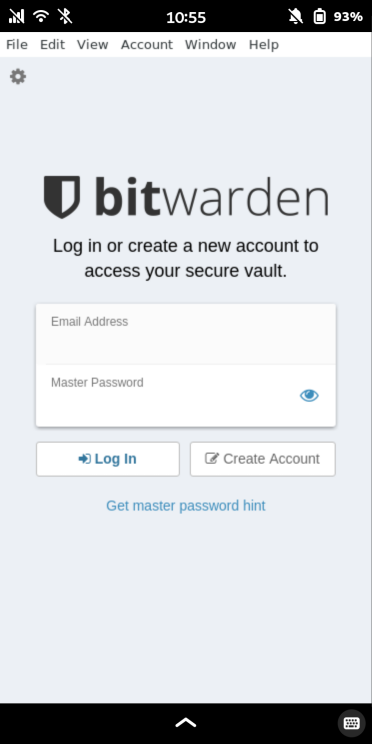

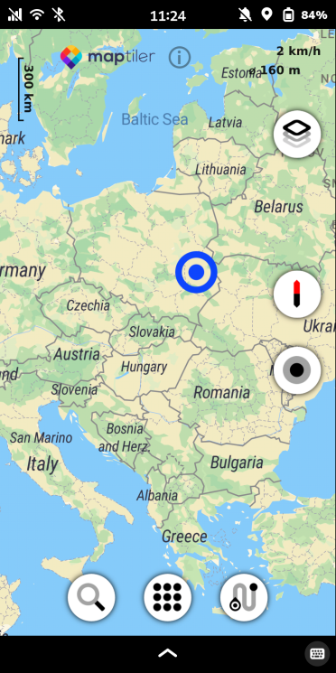

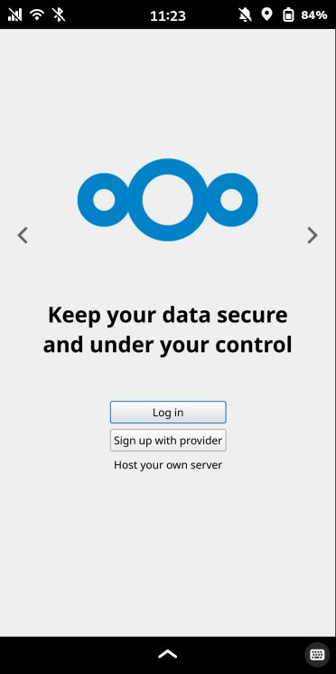

There are also some applications that have defeated me a bit. What hurts the most is that I haven't been able to successfully install any _Signal_ client (messenger). There is something called _Axolotl_ which I managed to run at some point, but then there was an update and it no longer starts. As a second example, I will mention _KeePassXC_ (password manager), although the situation here is different in that there is no problem with installation or launching, but only with the fact that the application does not scale in any way, so using it in portrait or landscape mode is rather impossible. Finally, _Filezilla_ (FTP client), which has the same issue as _KeePassXC_ after the first launch, but in this case, we can solve it by adjusting the settings in the View tab, where we need to disable all unnecessary interface elements, and then using it in landscape orientation is possible.

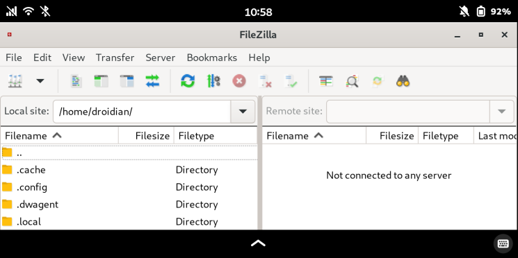

This is not to say that I take all failures negatively. On the contrary, it's great fun! On the internet, you can find a huge number of forks and ports of various applications that developers try to adapt for _Mobian_. Anyone who enjoys tinkering with _Linux_ systems will surely excel in this. The official list of applications (better or worse adapted) can be found [here](https://wiki.mobian.org/doku.php?id=apps).

## For everyday use?

It's hard to say yes or no because it all depends on the usage and, above all, the requirements of the specific user. For me, it's the perfect solution because, as I mentioned, I have a full-fledged Linux computer in my pocket. You can even use _Docker_ on it! But I use this phone as an additional toy. Looking more realistic, you can make calls and send SMS, there's Spotify, and there are some maps. What more could you want from a phone? Well, a camera would be useful, which is essentially nonexistent here, but even if there were one, the quality would be comparable to that of _Ubuntu Touch_, meaning it would be terrible. Another topic is using the phone for payments, which, in my opinion, is one of the key functions. I can't imagine a situation where it would be possible to use a _Pixel_ with _Droidian_ installed for making payments. No bank would allow that, although there may be some workaround that I'm not aware of. Besides all this, I have no idea what couldn't be done with such a setup because almost everything can be accomplished, for example, based on self-hosted solutions that will run directly on this device.
