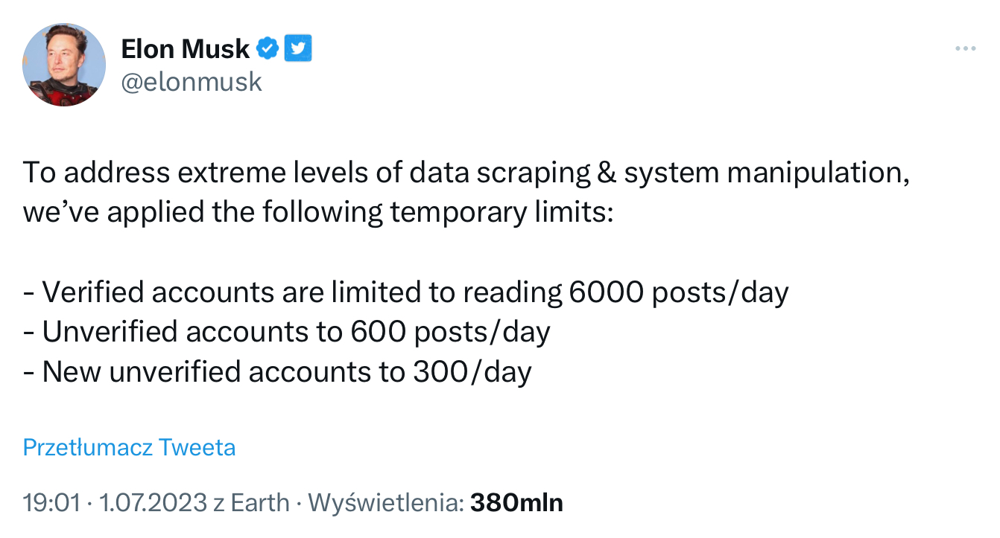

[🇬🇧 Go to english version of this post / Przejdź do angielskiej wersji tego wpisu](https://blog.tomaszdunia.pl/twitter-limit-eng/)

Pamiętacie moje narzędzie o nazwie [_Twittodon_](https://pl.twittodon.com)? Pisałem o nim [tutaj](https://blog.tomaszdunia.pl/twittodon/). Było to narzędzie do weryfikacji połączenia pomiędzy kontami na _Mastodonie_ i _Twitterze_. Użyłem czasu przeszłego, bo od wczoraj niestety nie działa prawidłowo i jest spora szansa, że już nigdy nie będzie. Wszystko to za sprawą kolejnych poważnych kroków podjętych przez _Twittera_.

Zaczęło się lekko ponad pół roku temu, gdy niedługo po zakupie przez _Elona Muska_ zaczęto znacznie ograniczać dostęp do _API Twittera_. Wiele nieoficjalnych klientów przestało wtedy istnieć. Rozpoczęła się naprawdę spora migracja ludzi na _Mastodona_, tudzież do _Fediverse’u_. _Twittodon_ zyskał wtedy ogromną popularność, a brak dostępu do _API_ nie było przeszkodą, bo zasada działania polegała na wykorzystaniu narzędzia [_Nitter_](https://github.com/zedeus/nitter), które poprzez scrapowanie _Twittera_ pozwalało na dostęp do jego treści bez wykorzystywania _API_.

Jednakże wczoraj została wdrożona nowa polityka _Twittera_, która wprowadziła konieczność posiadania konta, aby uzyskać dostęp do tweetów i profili. To sprawiło, że _Nitter_ stał się bezużyteczny, a wraz z nim wiele innych rozwiązań deweloperskich, które pozostały jeszcze działające nawet pomimo braku dostępu do _API_. Jednym z takich rozwiązań jest niestety wlaśnie _Twittodon._

To jeszcze nie koniec, bo kolejnym krokiem planowanym przez _Elona_ jest wprowadzenie dodatkowo limitów, które będą definiowały ile tweetów będzie można przeczytać dziennie.

Zgodnie z tweetem _Elona_ ma być to 6000 tweetów na dobę dla kont zweryfikowanych, czyli tych płacących abonament _Twitter Blue_, 600 tweetów dla kont niezweryfikowanych oraz 300 tweetów dla nowych kont. Żaden szanujący się deweloper nie będzie płacił $8 miesięcznie za posiadanie dostępu do tego śmiesznie małego limitu 6000 tweetów. Natomiast limit 600 jest za mały nawet dla przeciętnego użytkownika.

Zobaczymy jak dalej się to wszystko rozwinie, ale nie spodziewam się jakichś zmian na lepsze. Na ten moment _Twittodon_ nie działa w zakresie dodawania nowych połączeń, ale już istniejąca baza jest cały czas dostępna i przynajmniej na razie tak pozostanie.

_AKTUALIZACJA 12.06.2023_: [_Nitter_ wrócił do żywych](https://github.com/zedeus/nitter/pull/927), a razem z nim _[Twittodon](https://pl.twittodon.com)_, więc zapraszam do stworzenia zweryfikowanego połączenia swoich kont na _Twitterze_ i _Mastodonie_ póki jeszcze się da!
