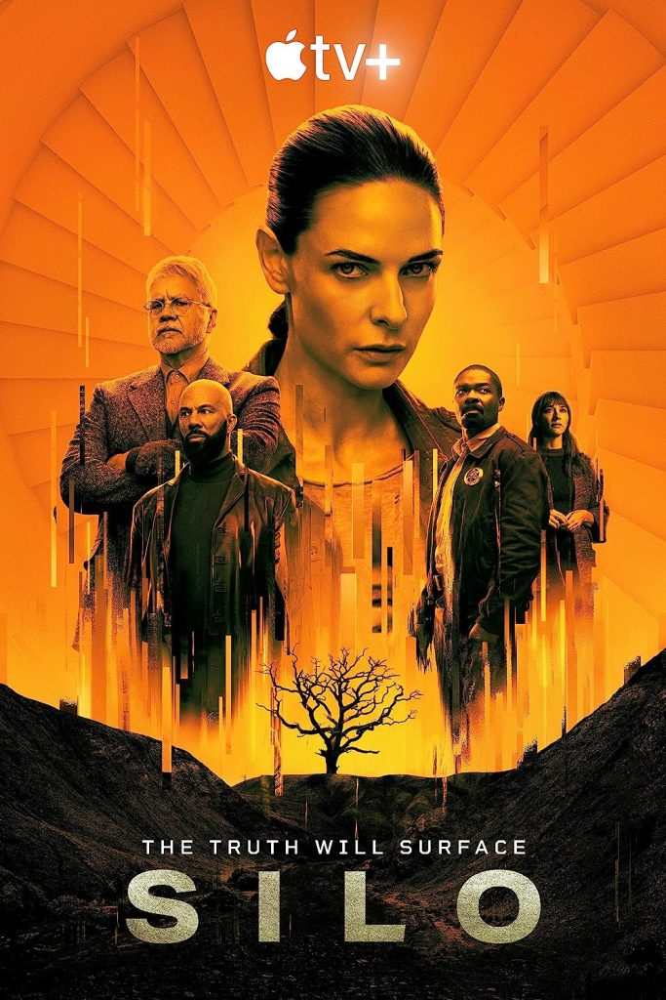

[🇵🇱 Przejdź do polskiej wersji tego wpisu / Go to polish version of this post](https://blog.tomaszdunia.pl/serialowo-3/)

The release date of this particular post is not coincidental. It was prompted by the conclusion of the first season of the series _Sil_o, available on _Apple TV+_. I haven't come across a specific post-apocalyptic title for some time, and _Silo_ is definitely worth recommending! So, this post will be dedicated to series with an apocalyptic theme.

## The Walking Dead

Let's start with a classic, the TV series TWD, which can be safely said to have sparked hype in this genre of shows. The popularity of the entire series reached astronomical levels; literally, everyone knows what The Walking Dead is. However, it's a series that, through artificial and unnecessary prolongation, became a long-winded story that gained a considerable fan base thanks to its phenomenal beginning, a few good subsequent seasons, but eventually lost its respect at a certain point when even the main character didn't want to continue playing in future seasons... In all honesty, I don't even know if this series has already ended and how many seasons/episodes it has. However, I've seen that (and probably not just one) spin-off of the series was created. For me, it practically ended with defeating Negan, let's say after the 8th season, after which I watched a few more episodes and called it quits. Unfortunately, it's a problem with many series that after every major antagonist, an even bigger one can be forced into the storyline and drag it out until the viewer eventually says, _Enough, I don't want to waste any more time on this_. The story of The Walking Dead ended for me as it ended, but it cannot be denied that TWD is a significant piece of good show.

## The 100

Nuclear war destroys the Earth, making life on it impossible. A group of survivors on the ships that managed to fly into Earth's orbit gather together to form a large station called the _Ark_, and they have been living there for almost 100 years, waiting for the moment when survival on the planet becomes possible. The rules on the _Ark_ are simple - for every crime, adults (over 18 years old) are sentenced to death by being expelled from the colony, and minors are imprisoned. After almost 100 years of such life, the _Ark_ begins to fall apart, and above all, the life support systems start to malfunction. The survivors decide to send a hundred juvenile prisoners to the surface to determine if there is still contamination there. Upon landing, it turns out that not only is the Earth ready to be inhabited again, but it's just the beginning of the problems. It must be admitted that these are solid foundations for creating an interesting story, and that's exactly what this series is. It is true that it is quite long and sometimes has moments that make it boring, and it also has moments that are so outrageous that they surpass the boundaries of absurdity. Nevertheless, despite that, I enjoyed watching it.

## Snowpiercer

Another TV series based on a very interesting idea. This time, the apocalyptic scenario is an Earth covered in ice, with extremely low temperatures that make life on the surface, and even underground, impossible. The titular _Snowpiercer_ is a train owned by a wealthy businessman, created for the purpose of allowing a handful of people to survive by constantly circling the Earth. Naturally, only the wealthy and/or people with specific skills were able to obtain tickets for this train, as they would be needed for the survival of the human species. However, reality turned out to be quite different, as a large group of ordinary people managed to force their way onto the train. Once the train set off, they were confined to the rear cars and isolated from the rest. These cars became known as the _Tail_. It's hard to say much more without spoilers, and I don't want to spoil anything for those who haven't had a chance to watch this series yet. I can say, however, that it is a suspenseful show that evokes strong sympathy for the positive characters and equally strong antipathy towards the villains, who are well-developed and have their own motives, often causing conflicting emotions in the viewer.

## The Last of Us

When writing about post-apocalyptic themes in TV series, it would be impossible to overlook this year's hit - _The Last of Us_. The title is known from an even more popular video game series originating from the console market, specifically _Sony Playstation_. When the first rumors of this TV adaptation started circulating, many players and fans of the series began lamenting that it would be another game whose honor would be tarnished by a poor screen adaptation. It's no wonder they felt that way, as good game adaptations can literally be counted on one hand. However, after the premiere, it turned out that _HBO_ once again rose to the occasion and released a truly remarkable TV series. So far, we have only gone through the first season, which was clearly filmed on a limited budget, as if the creators were somewhat apprehensive about a negative reception and didn't want to waste a lot of money in case it didn't succeed. Nevertheless, this title has won a significant number of fans, both among people who played the game and those who had absolutely no prior contact with it. I belong to the latter group because I've never been a console gamer. You know... back when I had the time and desire to play (nowadays I prefer to spend my time on other things), I was part of the _#PCMasterRace_ 😎 After this lengthy introduction, a few words about the story. The first few minutes of the TV series introduce us to the story, giving it context. The Earth's temperature is steadily rising, favoring the growth of a fungus that is highly aggressive and, under the right conditions, spreads rapidly, attacking the human nervous system and transforming people into... yes, I know that most fans (especially gamers) would scoff at me if I simply wrote _zombies_, because according to them, "they're not zombies, they're clickers!" The main characters are two: Joel, who tragically loses his daughter on the day the epidemic begins, and Ellie, a teenager. Here, I'll pause because I wondered if what I wanted to write about her would be a spoiler, but I came to the conclusion that firstly, the game is almost 10 years old, and secondly, the TV series gained such notoriety that if someone considers it a spoiler, they must be living under a rock if they haven't stumbled upon it before. It's about Ellie being immune to the effects of the fungus that decimated humanity. The rest you'll have to find out from the TV series or the game.

## Silo

Finally, the icing on the cake is the TV series that inspired this post. Everything above, along with this and the following sentence, was written before the final episode, which will be aired from my perspective next Friday, but at the time of publishing this post, it will be last Friday. So far, I'm captivated by the world created by the authors of this show, and I'll write more about it after watching the final episode... Well, now I've watched the last episode of the first season. Fortunately, the creators didn't disappoint, so I can write a few more words about this series with a clear conscience because it's really worth it. I promise no spoilers! Let's start with the fact that the titular Silo is an underground bunker consisting of 144 levels, which can only be accessed through spiral stairs located in the center. About 10,000 people live in the silo, who are generations living in confinement, and their knowledge of the past ends about 140 years ago at a point in history called the rebellion. It is unknown what the rebellion was about, who participated in it, or even what caused it. The only thing known is that the result of the rebellion was the creation of the _Pact_, which is sort of a set of laws that currently govern the entire silo. One of the rights granted to every resident is the possibility of leaving the silo, but the second condition is the impossibility of returning. This process is called _cleaning_, which can be understood in various ways, but in general, it comes from the fact that a person goes out in a special suit and receives a special cloth to wipe the camera lens, which is the only tool showing what is outside. Moreover, all objects related to the times before the rebellion are called relics and are forbidden. A significant part of them was destroyed immediately after the rebellion and in the following years, and the few that survived can be bought on the black market or found in the storage spaces of the residents, where they are passed down from generation to generation. These relics may be the key to finding answers to the questions that arise during the cleaning preparation ceremony - _We don't know why we are here. We don't know who built the Silo. We don't know why everything outside the Silo is the way it is. We don't know when it will be safe to go outside. We only know that today is not that day._  
Can we be sure? I'll leave you with that question 😏
