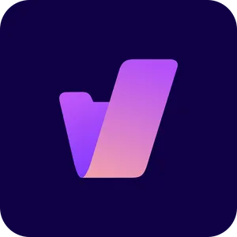

[🇵🇱 Przejdź do polskiej wersji tego wpisu / Go to polish version of this post](https://blog.tomaszdunia.pl/outernet-social-media/)

Have you ever wondered how to translate the word _Internet_? It seems to me that there is no definitive and correct origin of this name. For me, it doesn't matter what words it consists of. To me, the Internet is simply a network of connected (interconnected network of) computers. This definition was much easier to defend when the World Wide Web was just created. Back then, it was indeed a few computers connected together. Now, it's an uncountable number of various devices, and we cannot limit it to just computers. Nowadays, even refrigerators and washing machines have access to the Internet, not to mention phones, televisions, and game consoles. However, the worst part of it all is that a significant portion of the Internet is now concentrated on servers and controlled by huge companies that exploit their users' privacy.

The idea of the Internet was truly ambitious, which unfortunately turned out to be utopian quite quickly. We see the effects of this today. The Internet has become a double-edged sword. On the one hand, it is an infinite source of knowledge and allows for instant communication regardless of geographical location. It cannot be denied that the Internet can be compared to human achievements such as mastering fire or inventing the wheel. Did I exaggerate? Perhaps, but try to do anything these days without Internet access. All the basic aspects of life are dependent on it. On the other hand, it has been masterfully and ruthlessly taken over by big corporations, turning it into an infinitely vast market where everything can be sold on a gigantic scale, and people can be tracked, analyzed, and profiled to influence them in such a calculating way that they are not even aware of being manipulated.

Can we still talk about any privacy these days? In my opinion, it's currently an illusion. Privacy has become a currency we pay for access to the Internet, specifically for its content and tools. We must be aware that no profit-oriented company provides anything for free. There's always a catch, and most of the time, it involves sacrificing our privacy and confidentiality of our data. All of this is written in beautiful and at the same time, most complicated words in terms of service and privacy policies that nobody reads. Can we fight against this? Yes! Sometimes we have to make certain compromises and give up comfort or even access to certain services, but in my opinion, it's a game worth playing.

With this post, I'm starting a new series called _Outernet_. This name came to my mind when, just like in the first paragraph of this post, I was analyzing the origin of the word _Internet_. However, this time, I deviated a bit from what I wrote above and expanded the name _Internet_ as an internal network dominated by corporations. _Outernet_, on the other hand, is like the outskirts of that internal network, a no man's land. _Outernet_ is a place where no algorithms track us, where we can create our own space and connect with people who, like us, care about their privacy. Let's start with social media. Below, I'll try to indicate and discuss a few interesting places worth visiting, evaluating, and considering abandoning mainstream social media on their behalf.

## Mastodon as an alternative to Twitter (X?)

I've mentioned _[Mastodon](https://joinmastodon.org/)_ many times on this blog. It's currently my favorite place on the Internet, and it fits perfectly with the _Outernet_ ideology. For those who haven't had the opportunity to read about it, I recommend my [post where I talk about what _Mastodon_ and the entire _Fediverse_](https://blog.tomaszdunia.pl/mastodon-eng/) are. In short, _Mastodon_ has a similar form to _Twitter_, but it is free from any algorithms that recommend some content and bombard us with it, while hiding other, often more valuable content, making it difficult to find. There are no intrusive ads, and inappropriate content can be easily filtered out by muting or completely banning it, not only on the level of a single account but also for entire instances that we consider unsuitable. I recommend starting your journey in this world by registering on one of the following instances, which I recommend:

- 🇵🇱 [101010.pl](https://101010.pl)

- 🇵🇱 [pol.social](https://pol.social)

- 🇵🇱 [wspanialy.eu](https://wspanialy.eu)

- 🇬🇧 [mstdn.social](https://mstdn.social)

- 🇬🇧 [infosec.exchange](https://infosec.exchange)

- 🇬🇧 [fosstodon.or](https://fosstodon.org)

Once you decide that _Mastodon_ is the place for you, you can always become independent and run your own instance. I wrote about it a bit [here](https://blog.tomaszdunia.pl/wlasna-instancja-mastodona-eng/).

From my chronicle duty, I must also mention that in _Fediverse_, there are other projects similar to _Mastodon_ - _[Misskey](https://misskey-hub.net)_, _[Pleroma](https://pleroma.social/)_, _[Calckey](https://i.calckey.cloud/)_.

## Pixelfed as an alternative to Instagram

_Instagram_ is currently probably the most recognizable social network worldwide. Unfortunately, it is in the hands of the corporation _Meta_ (or, as some prefer, _Facebook_, as the rebranding hasn't reached me yet). Aren't you tired of constantly scrolling the timeline, watching influencers push you products you don't need, being bombarded with subliminal advertisements influencing your purchase decisions, or watching materials showing how perfect celebrities' lives are, which, in reality, are just masks and have nothing to do with how things really are? If you're just a normal person who occasionally takes cool photos or graphics and wants to share them, as well as view the creations of similar people, I recommend checking out _[Pixelfed](https://pixelfed.org/)_.

Instances recommended by me:

- 🇬🇧 [pixelfed.social](https://pixelfed.social)

- 🇬🇧 [metapixl.com](https://metapixl.com)

## Lemmy as an alternative to Reddit

Recently, there has been a lot of negative buzz surrounding _Reddit_. It's all because of the strange policy changes made by its owner, who started acting similarly to what _Elon Musk_ did with _Twitter_. The increase in the price of using the _API_, or rather making it unusable through this change, led to the downfall of a much-loved _iOS_ app called _[Apollo](https://apolloapp.io/)_. However, this is not the end of the story, as over the years of _Reddit's_ existence, its _API_ has been widely used to create many other useful tools that almost ceased to exist after the recent changes. Moreover, for some time now, _Reddit_ has increasingly become a money-making machine, introducing the Premium plan, coins, and other gimmicks like skins for weapons in _CS:GO_. In fact, _Reddit_ is preparing to become a publicly traded company, which never bodes well for making user-centric decisions, as the focus shifts to satisfying shareholders.

Coming to the rescue is another service within the _Fediverse_ - _[Lemmy](https://join-lemmy.org/)_. It's hard to find a more faithful copy of _Reddit_ that doesn't have all of its drawbacks. The only problem may be that it's not yet as popular. It's also worth mentioning how significant the knowledge base has become over the years on _Reddit_, and it's a bit of a shame to abandon it. _Reddit_ is the last place on the Internet that I find difficult to abandon so easily in favor of _Outernet_ solutions. However, I can't be called a _power-user_ either, as I only use _Reddit_ to occasionally check what's happening in the world. I mostly limit myself to browsing the _Popular_ tab and checking a few selected _subreddits_ related to my interests.

Instances of _Lemmy_ recommended by me:

- 🇵🇱 [szmer.info](https://szmer.info)

- 🇬🇧 [lemmy.world](https://lemmy.world)

When discussing alternatives to _Reddit_, it is impossible not to mention the _[kbin](https://kbin.pub)_ project, which is similar to _Lemmy_ but has a slightly different approach. I also recommend checking out these _kbin_ instances:

- 🇵🇱 [karab.in](https://karab.in)

- 🇬🇧 [kbin.social](https://kbin.social)

## Friendica as an alternative to Facebook

I can't say much about _[Friendica](https://friendi.ca/)_ because I simply don't use it. It is a federated alternative to _Facebook_, which I personally don't find any use for, so I don't use it and don't plan on using its counterpart.

However, this is just my opinion, so I recommend everyone to try it out for themselves, and I can suggest the following instances:

- 🇵🇱 [soc.citizen4.eu](https://soc.citizen4.eu)

- 🇬🇧/🇩🇪 [libranet.de](https://libranet.de)

## PeerTube as an alternative to YouTube

Are you an online content creator? Do you produce video content? Are you tired of _YouTube_ and looking for an alternative that will give you more control? _[PeerTube](https://joinpeertube.org)_ is the solution for you! In this case, it's hard for me to point out a specific instance to start with, as it depends on the topics that interest you. You can find a list of recommended instances sorted by topics [here](https://joinpeertube.org/instances). If you take your content creation seriously, I highly recommend creating your own instance to host your videos.

## Blogging on Outernet

Do you enjoy writing? There are solutions that allow your creativity to interact (federate) with the _Fediverse_ solutions. One of them is the platform _[WriteFreely](https://writefreely.org/)_, which I wrote about in one of my previous posts [here](https://blog.tomaszdunia.pl/writefreely-polska-eng/). In short, it enables you to create a blog in a very simple form, and they say that beauty lies in simplicity. Here are some recommended instances:

- 🇵🇱 [writefreely.pl](https://writefreely.pl)

- 🇬🇧 [write.as](https://write.as)

An alternative solution is to run a regular blog based on _[WordPress](https://wordpress.org/)_ and install the [_ActivityPub_](https://wordpress.org/plugins/activitypub/) plugin, which allows you to connect the content published on _WP_ with the _Fediverse_.

## Summary

As you can see, apart from well-known social media platforms, there is still a completely separate world - the _Outernet_, where you can connect with people without giving up your online privacy to big corporations. All you need is basically the _Fediverse_ along with all the platforms that are part of it. Right now, in the _Fediverse_, there are many valuable individuals worth following and interacting with, and this is just the beginning, as solutions like _Mastodon_, despite existing for some time, are only now gaining popularity.
