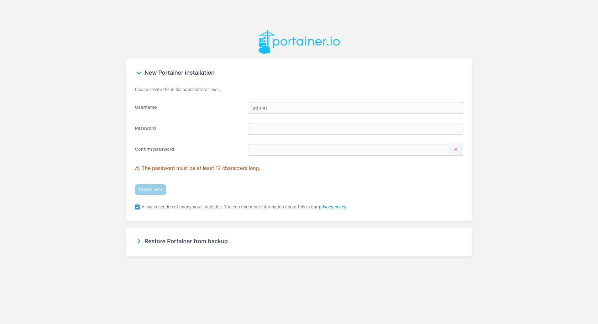
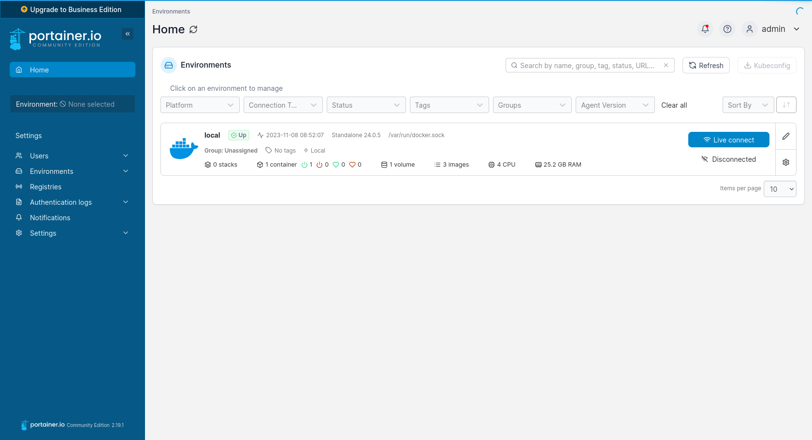
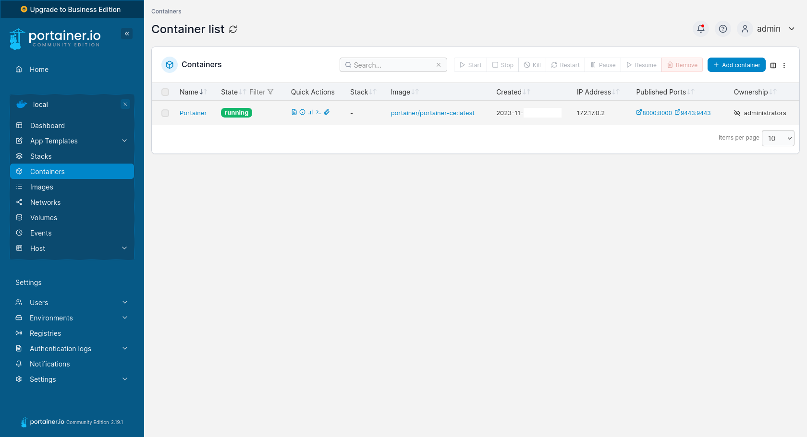
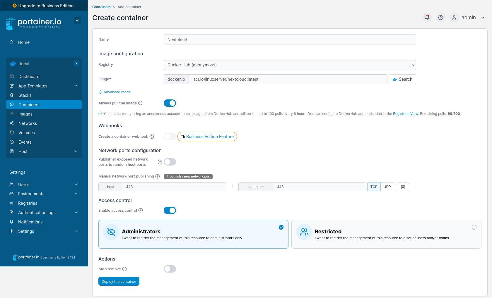
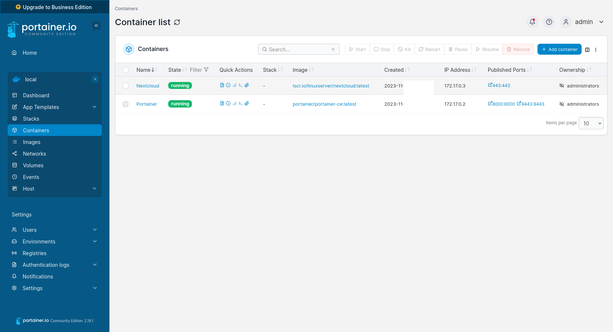
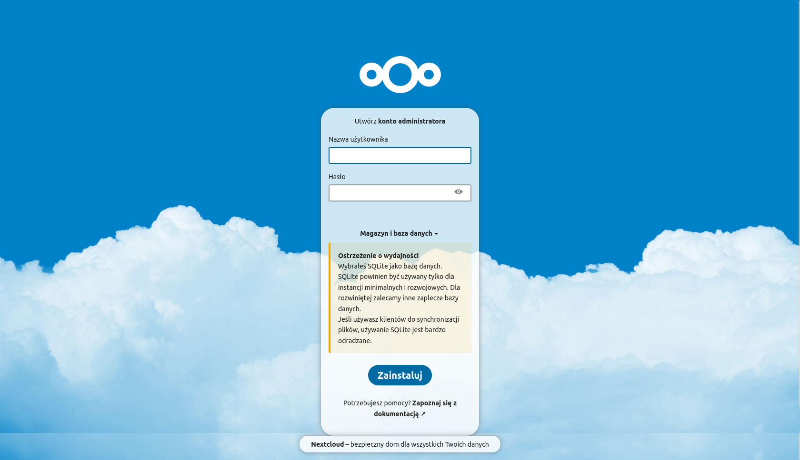
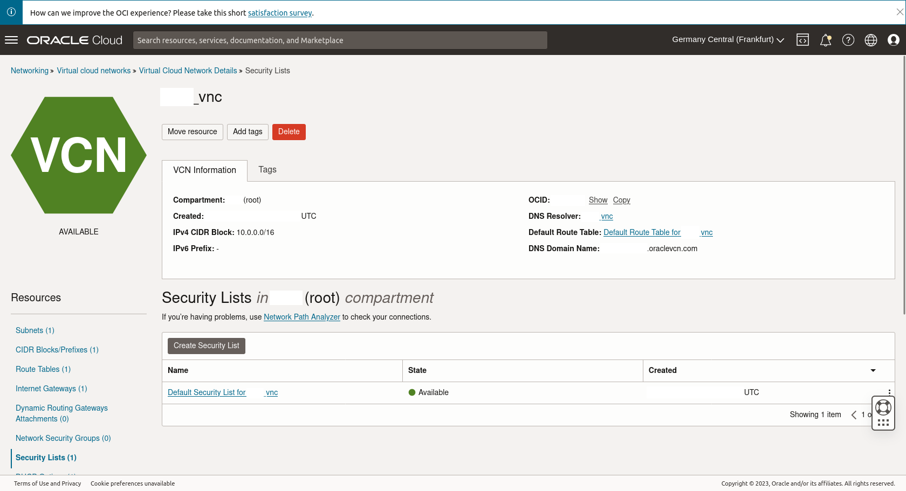
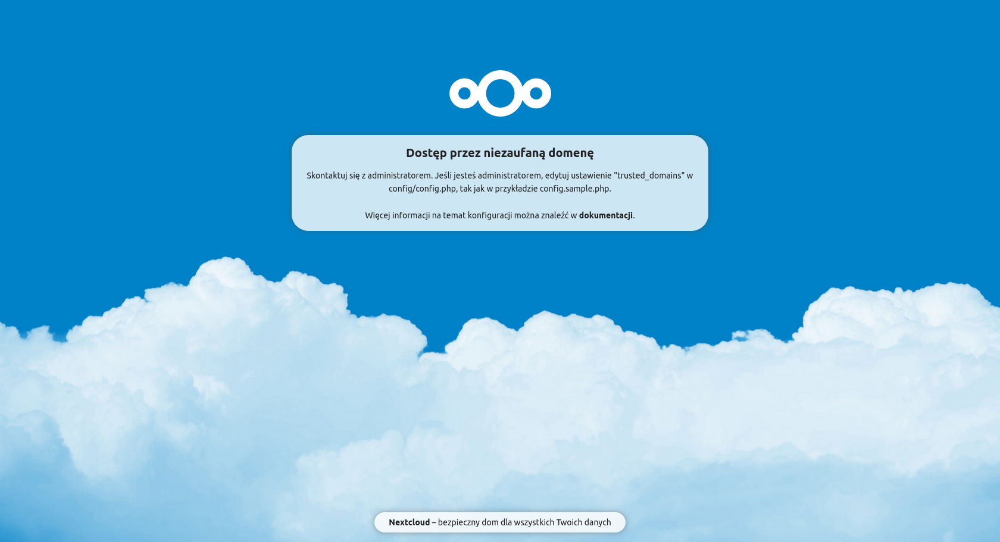

[🇬🇧 Go to english version of this post / Przejdź do angielskiej wersji tego wpisu](https://blog.tomaszdunia.pl/portainer-eng/)

Wszystkim Czytelnikom tego bloga _Docker_ powinien być znany, bo dość obszernie opisałem go w [tym wpisie](https://blog.tomaszdunia.pl/docker/). Dzisiaj jednak pójdę o krok dalej i przedstawię narzędzie o nazwie _[Portainer](https://www.portainer.io/)_, które jest swego rodzaju interfejsem graficznym sprawiającym, że zarządzanie kontenerami _Docker_ jest przyjemniejsze i bardziej intuicyjne. Co ciekawe _Portainer_ uruchamia się jako kontener - [one ring container to rule them all](https://blog.tomaszdunia.pl/wp-content/uploads/2023/11/one-ring-to-rule-them-all.jpg)!

## Instalacja środowiska Docker - wersja skrócona

Tak jak pisałem wyżej, Docker został przeze mnie omówiony szczegółowo w [tym wpisie](https://blog.tomaszdunia.pl/docker/), jednakże tutaj jedynie z kronikarskiego obowiązku w skrócie przypomnę jak się to robi poprzez wypisanie potrzebnych komend.

```bash
sudo apt install docker.io -y
sudo groupadd docker
sudo usermod -aG docker $USER
```

## Jak uruchomić Portainer

Tak jak już mówiłem, _Portainer'a_ uruchamia się jako zwykły kontener, dlatego zacznijmy od zrobienia wolumenu dla niego przeznaczonego. Nazwiemy go _portainer\_data_.

```bash
docker volume create portainer_data
```

Skorzystamy z obrazu w wersji _CE_ (_Community Edition_ - z ang. edycja społecznościowa) dostępnego na [_Docker Hub_](https://hub.docker.com/r/portainer/portainer). Dla ułatwienia przygotowałem gotową komendę, która prawidłowo uruchomi odpowiednio skonfigurowany kontener z działającym _Portainer’em_.

```bash
docker run -d \
-p 8000:8000 \
-p 9443:9443 \
-v /var/run/docker.sock:/var/run/docker.sock \
-v portainer_data:/data \
--name Portainer \
--restart unless-stopped \
portainer/portainer-ce:latest
```

Przejdźmy w skrócie linijka po linijce w celu opisania co tak naprawdę wykonujemy tym poleceniem. Zaczynamy od zwykłej komendy służącej do uruchomienia kontenera w trybie _detached mode_, stąd flaga _\-d_, który w dużym uproszczeniu polega na uruchomieniu kontenera w tle i utrzymaniu jego działania. Dalej spinamy (przekierowujemy ruch) porty _8000_ (_HTTP_) oraz _9443_ (_HTTPS_) pomiędzy kontenerem i maszyną, na której jest uruchomiony. Pod tymi portami znajdować się będzie panel dostępowy do _Portainer’a_. Należy pamiętać, że jeżeli chcemy mieć dostęp z zewnątrz, tj. z Internetu, tudzież w jakikolwiek inny sposób spoza sieci lokalnej lub nawet maszyny, na której jest uruchomiony, to musimy odpowiednio odblokować porty zarówno na serwerze (np. w _iptables_) jak i routerze i/lub innej infrastrukturze, w której on działa (patrzę tutaj w kierunku _Virtual Cloud Networks_ od _Oracle_). Przechodząc dalej, definiujemy dwa wolumeny. Pierwszym z nich podmontowujemy plik _docker.sock_, dzięki czemu damy _Portainer'owi_ możliwość sterowania pracą całego środowiska _Docker_, w którym operuje i ma zarządzać. Drugi to zwykłe miejsce na pliki _Portainer'a_. Ostatnie trzy linijki to standardowe - nadanie nazwy kontenerowi, określenie polityki ponownego uruchamiania (w tym przypadku _uruchamiaj aż zostanie ręcznie zatrzymany_) oraz określenie jaki obraz ma zostać użyty.

Chęć wykonania tak skonstruowanego polecenia potwierdzamy _ENTER'em_ i po uruchomieniu kontenera możemy przejść do przeglądarki, w której pasek adresu wpisujemy:

> https://localhost:9443

Naszym oczom ukaże się bardzo prosty instalator, w którym wystarczy ustawić jedynie nazwę i hasło dla administratora. Na następnej stronie wybieramy przycisk _Get Started_ jako, że chcemy, aby _Portainer_ używał środowiska znajdującego się na maszynie lokalnej, na której jest uruchomiony. Finalnie zostaniemy przeniesieni do listy dostępnych środowisk, na której będzie jedynie jedno o nazwie _local_ (z ang. lokalne). Aby rozpocząć zarządzanie tym środowiskiem należy po prawej stronie nacisnąć niebieski przycisk _Live connect_. Poskutkuje to tym, że po lewej stronie zamiast _Environment: None selected_ pojawią się nam zakładki z opcjami do zarządzania.


    

    

    

## Jak uruchomić przykładowy kontener

Samo uruchomienie _Portainer’a_ to dopiero początek zabawy i czułbym się źle, gdybym w tym momencie zakończył wpis. Dlatego pokażę jeszcze jak odpalić przykładowy kontener. Jako reprezentanta wybrałem _[Nextcloud](https://nextcloud.com/)_, o którym pisałem już w [tym wpisie](https://blog.tomaszdunia.pl/nextcloud/).

Po wybraniu _Environment - local_ wybieramy po lewej stronie zakładkę _Containers_. To tutaj będziemy tworzyć i mieć wylistowane wszystko kontenery. Jak widać w tym momencie jedynym kontenerem znajdującym się na liście jest sam _Portainer_. Zanim podejmiemy próbę rozszerzenia tej listy o kolejny kontener musimy najpierw przejść do zakładki _Volumes_, gdzie utworzymy dwa wolumeny niezbędne do prawidłowej pracy _Nextcloud_.


    

    

Korzystając z niebieskiego przycisku _Add volume_, znajdującego się w prawym górnym rogu, tworzymy wolumeny _nextcloud\_config_ i _nextcloud\_data_. W kreatorze wolumenu wystarczy wpisać nazwę w pole _Name_ i potwierdzić przyciskiem _Create new volume_.


    

    

    

Na liście _Volumes_ pojawią się dwa wolumeny oznaczone znacznikami _Unused_ (z ang. nie użyte), a ich punkty montowania na serwerze to _/var/lib/docker/volumes/(...)/\_data_. Teraz, gdy już mamy przygotowane miejsce dla kontenera _Nextcloud_ możemy przystąpić do jego tworzenia. Wróćmy zatem do zakładki _Containers_ i skorzystajmy z niebieskiego przycisku _Add container_, zlokalizowanego w prawym górnym rogu. Zostanie otwarte okno kreatora, w którego pierwszej sekcji na górze wypełniamy pola:

- _Name_ - _Nextcloud_

- _Image_ - _lscr.io/linuxserver/nextcloud:latest_

- _Manual network port publishing_ (po naciśnięciu przycisku _publish a new network port_)_:_
    - _host_ - _443_
    
    - _container_ - _443_



Przechodzimy do sekcji dolnej, w której musimy przejść przez kilka zakładek. Pierwszą, do której należy zajrzeć jest _Volumes_, gdzie do kontenera podepniemy te wolumeny, które utworzyliśmy wcześniej. W tym celu dwukrotnie (bo będziemy konfigurować dwa wolumeny) naciskamy przycisk _map additional volume_ i mapujemy w następujący sposób:

| **container** |  | **volume** |
| --- | --- | --- |
| /config | \=> | nextcloud\_config - local |
| /data | \=> | nextcloud\_data - local |


Istotne tutaj jest, aby zaznaczone były pola _Volume_ (a nie _Bind_) oraz _Writable_ (a nie _Read-only_). Następna zakładka, do której przechodzimy jest _Env_, co jest skrótem od _Environment variables_ (z ang. zmienne środowiskowe). Dla _Nextcloud_ musimy tutaj ustawić trzy zmienne, więc naciskamy trzykrotnie przycisk _Add an environment variable_ i wpisujemy następujące wartości:

- _PUID_ - _1000_

- _PGID_ - _1000_

- _TZ_ - _Europe/Warsaw_


Ostatnia zakładka, która nas w tym momencie interesuje to _Restart policy_, w której wybieramy opcję _Unless stopped_.


Teraz pozostaje nam tylko wrócić do górnej sekcji, na której końcu znajduje się niebieski przycisk _Deploy the container_. To spowoduje pobranie obrazu i uruchomienie odpowiednio skonfigurowanego kontenera _Nextcloud_. Co można zaobserwować na liście kontenerów.



Kontener działa, więc możemy przejść do przeglądarki, żeby dostać się do świeżo uruchomionego _Nextcloud_. Odpaliliśmy go na porcie _443_, a więc domyślnym porcie do komunikacji _HTTPS_ co znaczy, że w pasek adresu w przeglądarce wystarczy wpisać następującą frazę:

> https://localhost

W pierwszej kolejności zobaczymy instalator, w którym ustawiamy nazwę i hasło dla administratora oraz możemy skonfigurować bazę danych, jednakże w tym przypadku zostawiam to w formie domyślnej, która wykorzystuje _SQLite_, bo to jedynie rozwiązanie demonstracyjne. Ostatnie co nam pozostaje to nacisnąć przycisk _Zainstaluj_.



## Dostęp do Nextcloud z zewnątrz

Miał być to wpis o narzędziu _Portainer_, ale pozwolę sobie przy okazji rozszerzyć jeszcze nieco temat _Nextcloud_. We wcześniejszym akapicie opisałem jak uruchomić _Nextcloud_ i dostać się do niego z poziomu sieci lokalnej. A co w przypadku, gdy chcemy dostać się do niego z zewnątrz?

Jeżeli korzystamy z [_VPS_ od _Oracle_](https://blog.tomaszdunia.pl/oracle-free-tier/) to pierwszym krokiem powinno być odblokowanie ruchu z poziomu infrastruktury _Oracle_ dla portu _443_. Robi się to w _Networking_ -> _Virtual cloud networks_ -> wybierz _VNC_ swojego _VPS'a_ -> _Security Lists_ -> wejdź do listy odpowiedniej dla swojego _VPS'a_. Należy dodać _Ingress Rule_ w sposób analogiczny jak na poniższym zrzucie ekranu.


    

    

Sytuacja wygląda podobnie w przypadku serwera domowego i routera, którego porty należy otworzyć jako że jest on główną bramą w sieci domowej.

Następnie trzeba połączyć się z serwerem po _SSH_ i wejść w buty użytkownika root:

```bash
sudo su
```

Otworzyć do edycji _iptables_:

```bash
nano /etc/iptables/rules.v4
```

Odnaleźć linijkę:

```bash
(...)
-A INPUT -p tcp -m state --state NEW -m tcp --dport 22 -j ACCEPT
(...)
```

I zaraz po niej, w kolejnym wierszu, wkleić:

```bash
-A INPUT -p tcp -m state --state NEW -m tcp --dport 443 -j ACCEPT
```

Ruch sieciowy został prawidłowo otwarty, więc strona powinna być osiągalna po wprowadzeniu adresu:

> https://\[Adres IP Serwera\]

Jednakże najprawdopodobniej zobaczymy coś takiego...



Rozwiązanie tego problemu jest stosunkowo proste, ale znalezienie go już nie do końca, bo trzeba trochę poszukać w dokumentacji. Mogli to zrobić zdecydowanie bardziej intuicyjnie... Na szczęście macie mnie, czyli gościa, który odwalił już całą robotę i za chwile przedstawi gotowe i zwięzłe rozwiązanie. Otwieramy w edytorze tekstowym plik _config.php_, o którym mowa w komunikacie, ciekawa jest jego lokalizacja, prawda?

```bash
nano /var/lib/docker/volumes/nextcloud_config/_data/www/nextcloud/config/config.php
```

Odnajdujemy w nim sekcję _trusted\_domains_ i wypełniamy ją analogicznie do tego:

```bash
(...)
'trusted_domains' =>
    array (
      0 => 'localhost',
      1 => '[VPS IP]',
  ),
(...)
```

Oczywiście zamiast _\[VPS IP\]_ należy podać adres _IP_ swojego serwera. Po tych wszystkich działaniach można odświeżyć stronę w przeglądarce po czym dostęp powinien być już możliwy.
