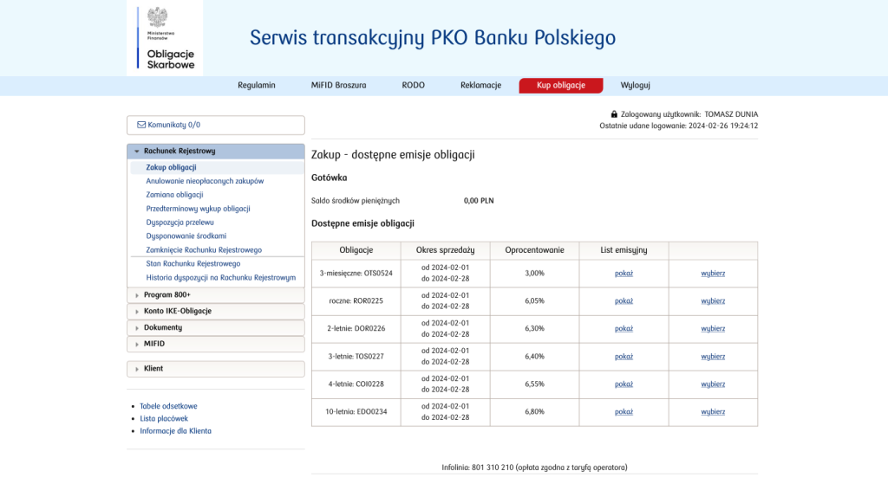
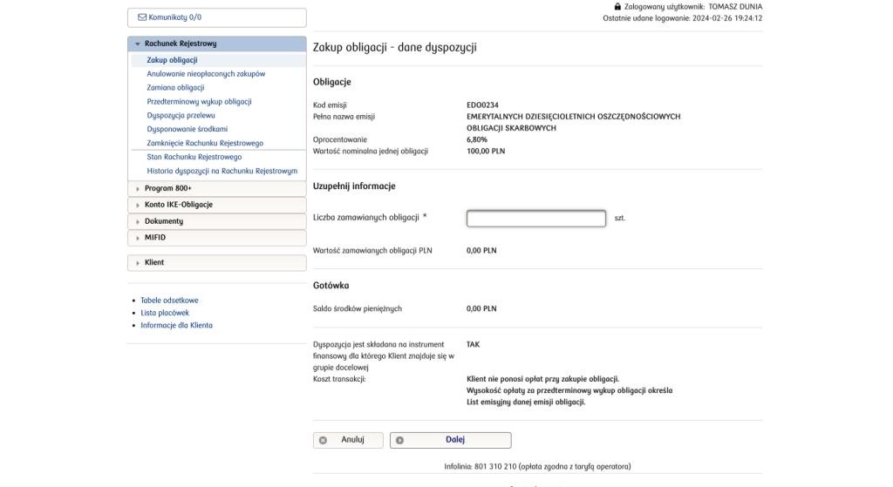
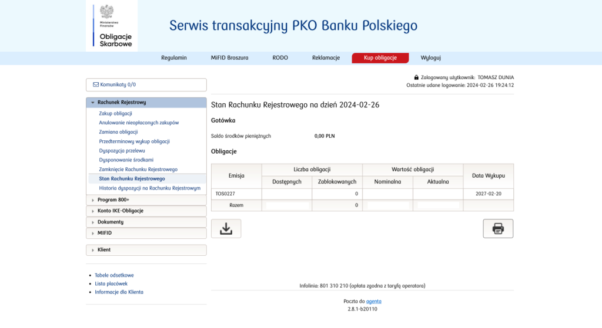
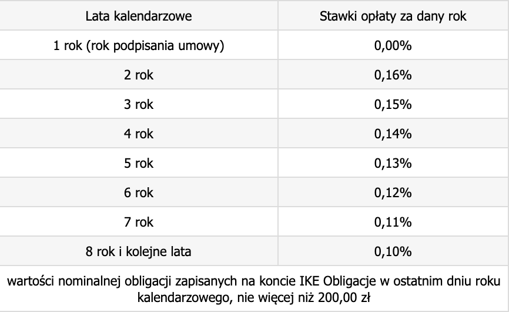

Obligacje to według mnie **dobry filar** dla każdego portfela inwestycyjnego. Wiele osób jednak się ze mną nie zgodzi, bo obligacje to nie zupa pomidorowa, nie wszyscy muszą je lubić. Dla mnie **obligacje skarbowe**, bo na tym typie będę się tutaj głównie skupiał, są **solidną podstawą** wszystkich moim portfeli, bo może i **nie oferują szalonych zysków**, ale **przebijają one przeważnie inflację** będąc przy tym **względnie bezpieczną formą** inwestowania. W tym wpisie spróbuję przybliżyć temat obligacji w sposób, który powinien być zrozumiały dla każdego, nawet jeżeli nigdy nie miał styczności z inwestowaniem w tego typu aktywa.

## Nota prawna

Koniecznie się zapoznaj! - rozwiń aby zobaczyć zawartość

Opinie i informacje zawarte na tym blogu nie stanowią porady inwestycyjnej, a w szczególności "rekomendacji" w rozumieniu przepisów Rozporządzenia Ministra Finansów z dnia 19 października 2005 r. w sprawie informacji stanowiących rekomendacje dotyczące instrumentów finansowych, lub ich emitentów (Dz. U. z 2005 r. Nr 206, poz. 1715).

Celem tego typu wpisów jest opisanie moich przemyślenia na temat inwestowania i dzielenie się tym jak ja to robię i jaka jest moja strategia. Każdy ma inną sytuację finansową i inne skłonności do podejmowania ryzyka, a co za tym idzie inaczej zniesie poniesione straty, ale także uzyskane zyski. Dla niektórych często to drugie jest gorsze, bo jednorazowy złoty strzał (przypadek) może skłonić do zainwestowania jeszcze większej sumy pieniędzy, a nawet zadłużenia się w celu zwiększenia skali inwestycji, co przy mniejszym szczęściu niż za pierwszym razem może doprowadzić do bankructwa i popadnięcia w poważne kłopoty. Dlatego należy inwestować tylko posiadając odpowiednią do tego wiedzę i zrozumienie zagadnienia. Jeżeli nie rozumiesz tematu w pełni to nie inwestuj w dane aktywa do momentu zrozumienia zasady ich działania lub w ogóle przerzuć się na bardziej bezpieczne formy pomnażania swoich zaoszczędzonych pieniędzy.

## Czy w ogóle jest obligacja

Pozwolę sobie przytoczyć definicję obligacji z _[Wikipedii](https://pl.wikipedia.org/wiki/Obligacja)_:

> **Obligacja** - papier wartościowy emitowany w serii, w którym emitent stwierdza, że jest dłużnikiem obligatariusza i zobowiązuje się wobec niego do spełnienia określonego świadczenia. Obligacja należy do kategorii dłużnych instrumentów finansowych. W przeciwieństwie do akcji, obligacje nie dają posiadaczowi żadnych uprawnień względem emitenta typu współwłasność, dywidenda czy też uczestnictwo w walnych zgromadzeniach. Emisja obligacji jest jednym ze sposobów pozyskiwania kapitału przez przedsiębiorstwo _(lub Skarb Państwa, przyp. aut.)_.

Teraz przełóżmy sobie to na trochę bardziej przyziemną formę. W obligacjach chodzi o to, że są **dwie strony**. Pierwszą z nich jest **_Emitent_ (_Dłużnik_)**, czyli ten który **potrzebuje pożyczyć pieniądze** na jakiś cel, tj. po prostu zaciągnąć kredyt. Druga strona to _**Obligatariusz**_, czyli ten który **ma pieniądze i za rekompensatę odpowiedniej wielkości może je pożyczyć**. Ta rekompensata przybierać może różną formę, ale ogólnie chodzi o ustalenie oprocentowania w skali roku, na podstawie którego od pożyczonej kwoty naliczane będą **odsetki**. Formy naliczania odsetek mogą być różne, tj. mogą one być kapitalizowane, czyli obliczane, np. miesięcznie lub rocznie, a także być przekazywane _Obligatariuszowi_ co miesiąc, rok lub dopiero przy wykupie obligacji. **Wykup obligacji** to kolejna rzecz jaka musi zostać ustalona pomiędzy stronami. Jest to moment, w którym _Dłużnik_ zwróci pełną pożyczoną sumę pieniędzy z odsetkami o ile nie były wypłacane sukcesywnie wcześniej.

Dalej brzmi zawile? Z obligacjami jest trochę jak z braniem kredytu w banku tylko role są zamienione. Bankiem (_Obligatariuszem_) jesteś Ty, a kredytobiorcą (_Dłużnikiem/Emitentem_) jest _Skarb Państwa Polskiego_. _Skarb Państwa_ co miesiąc emituje pewną ilość **_papierów dłużnych_** (obligacji), z których wypełni dziurę w budżecie, bo np. bez tego zbrakłoby mu na świadczenia typu _800plus_. Ty jako majętny obywatel **łaskawie udzielasz pożyczki Państwu** i oczekujesz po pierwsze **procentu od pożyczonej sumy** oraz **zwrotu całości pożyczonej sumy** w terminie ustalonym podczas zakupu.

## Typy obligacji

Obligacje można podzielić na typy na podstawie tego **kto jest _Emitentem_**:

1. **skarbowe - potocznie mówi się na nie _rządowe_, bo są emitowane przez _Skarb Państwa_,**

3. komunalne - emitowane przez jednostki samorządów terytorialnych, tj. gminy, powiaty, województwa itp.,

5. korporacyjne - emitentem są (prywatne) przedsiębiorstwa.

W zakresie moich portfeli inwestycyjnych ograniczam się jedynie do obligacji skarbowych. Komunalnych raczej nie tykam, a już na pewno **nie pcham się w inwestowanie w obligacje korporacyjne**, bo takie obligacje niewiele różnią się od inwestowania w akcje, szczególnie jeżeli chodzi o poziom ryzyka, a od tego mam inne części portfeli.

Obligacje można dzielić ze względu na wiele innych kryteriów, ale mi wydaje się, że podział przedstawiony powyżej ma najwięcej sensu, bo skupia się na tym co najbardziej istotne, czyli to kto jest _Emitentem_, a co za tym idzie kto jest gwarantem wykupu tychże obligacji. Od tego aspektu zależy w głównej mierze ryzyko jakie podejmiemy poprzez inwestowanie w ten sposób.

## Poziom ryzyka

Rozmawiając o inwestowaniu nie można nigdy pominąć jednego z **najważniejszych aspektów jakim jest ryzyko inwestycyjne**. Przeciętny człowiek słysząc termin _obligacje_ myśli od razu o obligacjach skarbowych, które są uważane za jedne z **najbezpieczniejszych form inwestowania**, jednakże nawet one zdecydowanie **nie są całkowicie wolne od ryzyka**. W przypadku wszystkich obligacji głównym ryzykiem jest to, że _Emitent_ **nie zwróci nam zainwestowanych pieniędzy** i nie ma tutaj znaczenia jaki będzie tego powód. Może być to bankructwo _Emitenta_ tuż przed terminem wykupu, albo po prostu może on stwierdzić, że nie zwróci nam tych pieniędzy i ucieknie do kraju bez ekstradycji. Prawdopodobieństwo wystąpienia takiej sytuacji zależy w głównej mierze od typu obligacji w jaką zainwestowaliśmy.

W przypadku **obligacji skarbowych** gwarantem jest _Skarb Państwa_, więc żeby nie zostały one wykupione musiałoby dojść do **gospodarczego upadku _Państwa Polskiego_** lub np. jakiejś **drastycznej zmiany władzy**, czego następstwem byłoby unieważnienie przez nowy rząd wszystkich do tej pory wyemitowanych obligacji. Nie jest to niemożliwe, ale jednak mało prawdopodobne. Polecam doczytać o _przedwojennych obligacjach skarbowych_.

Podobnie sytuacja wygląda w aspekcie **obligacji komunalnych**, jednakże tutaj zmiana władz samorządowych jest już znacznie łatwiejsza i mamy tutaj do czynienia z działaniem na mniejszą skalę. Jako ciekawostkę podam przykład. Pracuję w branży autobusowej (konstruuję autobusy), w której sprzedaż realizowana jest przeważnie na podstawie przetargów ogłaszanych przez miasta. Proces przetargowy, jego rozstrzygnięcie i późniejsze ustalenia, np. takich rzeczy jak kolor i wzór wykładziny podłogowej, chwilę trwają i mówię tutaj nawet o okresie wynoszącym od 6 do nawet 12 miesięcy. Spotkałem się z taką sytuację, że w tym okresie zmieniła się lokalna władza, tj. prezydent/burmistrz, a wraz z nim przyszedł nowy prezes przedsiębiorstwa komunikacyjnego, które było jednostką kupującą pojazdy. Co zrobił nowy prezes? Uznał, że wzór i kolor wykładziny należy zmienić, bo został on wybrany przez poprzedniego prezesa i nijak nie wpisuje się w jego gust. Wszystko gotowe do produkcji, materiały ustalone specjalnie wcześniej, żeby możliwy był ich planowy zakup i dostarczenie w idealnym momencie procesu produkcyjnego. Cóż, klient nasz pan, nie było wyjścia. Dążę do tego, że podobnie może być z obligacjami komunalnymi. Jestem w stanie wyobrazić sobie sytuację, w której nowy prezydent/burmistrz decyduje, że decyzja jego poprzednika o sfinansowaniu, oczywiście na bazie emisji obligacji, placu zabaw przy ulicy A była błędna i wyrzuca ten projekt do kosza wraz ze wszystkimi zobowiązaniami z nim związanymi. Oczywiście wtedy można dochodzić swoich praw sądownie, pozywając daną gminę, ale czy naprawdę chce Ci się marnować na to swój cenny czasu i potencjalne odsetki jakie mogłyby zostać w tym czasie wygenerowane przy użyciu tych zamrożonych pieniędzy? Trochę podkoloryzowałem i zaszalałem z kreśleniem czarnych scenariuszy, bo ryzyko przy obligacjach komunalnych nie jest strasznie wysokie, aczkolwiek jest na pewno wyższe niż przy obligacjach skarbowych.

Zdecydowanie najgorszą, tj. najbardziej ryzykowną, opcją jest inwestowanie w **obligacje korporacyjne**, gdzie gwarantem jest przedsiębiorstwo, które w każdym momencie może zbankrutować lub w inny (nawet niecelowy) sposób nie być w stanie wykupić obligacji. Nie będę tutaj tracił czasu na ten typ obligacji, bo i tak w przyszłości nie zamierzam z niego korzystać.

## Listy emisyjne - istotne aspekty

**List emisyjny** to oficjalny dokument _Ministra Finansów_ określający szczegółowe warunki emisji danego rodzaju obligacji. Podczas jego czytania należy zwrócić uwagę na:

- **typ oprocentowania** - mamy podział na:
    - stałe - oprocentowanie ustalone w momencie emisji obligacji i jest takie samo przez cały okres jej trwania aż do wykupu,
    
    - zmienne - w tym przypadku ustalone jest tylko oprocentowanie dla pierwszego miesiąca, a w kolejnych wyliczane jest że stopy referencyjnej _NBP_ i marży,
    
    - indeksowane inflacją - przeważnie stałe oprocentowanie w pierwszym roku, a później wyliczone z wysokości inflacji i marży,

- **oprocentowanie wstępne** - przy zmiennym oprocentowaniu jest to wysokość oprocentowania jaka będzie obowiązywać dla pierwszego okresu rozliczeniowego, który może wynosić miesiąc lub rok, w zależności od rodzaju obligacji, jest ona ustalona i podana w treści listu emisyjnego,

- **oprocentowanie docelowe** - dla oprocentowania typu stałego jest znane od samego początku i obowiązuje aż do wykupu obligacji, natomiast dla typu zmiennego jest to oprocentowanie, które obowiązuje po pierwszym okresie rozliczeniowym i jest obliczane na podstawie _[stopy referencyjnej NBP](https://nbp.pl/polityka-pieniezna/decyzje-rpp/podstawowe-stopy-procentowe-nbp/)_ i marży lub na podstawie [inflacji](https://stat.gov.pl/wykres/1.html) i marży w zależności od rodzaju obligacji,

- **termin wykupu** - po jakim czasie odzyskamy zainwestowane pieniądze, w obecnej sytuacji może to być od 3 miesięcy do nawet 12 lat,

- **kapitalizacja odsetek** - jest przeważnie roczna lub miesięczna, a chodzi o to po jakim czasie odsetki są kumulowane i wypłacane,

- **sposób wypłaty odsetek** - mogą one być automatycznie dopisywane do zainwestowanej kwoty i dalej obracane w celu generowania z nich dalszych odsetek (procent składany) lub po prostu wypłacane _Obligatariuszowi_,

- **możliwość wcześniejszego wykupu** - w tym momencie nie ma obligacji bez takiej możliwości, ale w większości obligacji wcześniejsza wypłata wiąże się z koniecznością poniesienia stosownej opłaty,

- **koszt wcześniejszego wykupu** - opłata jaką ponosi się od każdej obligacji, na którą złożyliśmy dyspozycję wcześniejszego wykupu, wszystkie obligacje maja wartość 100 zł i od tej kwoty odejmowana jest właśnie ta kwota za wykup przedwczesny, która wynosi obecnie do 2 zł (w zależności od rodzaju obligacji) od każdej takiej 100-złotowej obligacji,

- **czas wypłaty przy wykupie przedwczesnym** - przeważnie jest to 5 dni roboczych od dnia złożenia dyspozycji,

- **cena zamiany** - cena (przeważnie naprawdę nieznacznie niższa) jaką trzeba zapłacić za nową obligację w przypadku, gdy stara dobiegła końca, a chcemy dalej kontynuować oszczędzanie i wykupić analogiczną obligację z nowej emisji, przeważnie mówimy tu o kwocie 99.90 zł zamiast 100 zł, więc naprawdę jest to niewielka _promocja_,

- **dodatkowe wymogi dotyczące tego kto może kupować obligacje** - istnieją obligacje _ROS_ (6-letnia) i _ROD_ (12-letnia), które są dostępne tylko dla beneficjentów programu _800plus_ (a wcześniej _500plus_) i to jedynie do wysokości świadczeń jakie zostały otrzymane, czyli jeżeli z _800plus_ ktoś otrzymał 1600 zł (pobiera świadczenie jedynie od 2 miesięcy) to może kupić 16 sztuk takich obligacji po 100 zł każda.

## Aktualnie dostępne obligacje skarbowe w Polsce

Zacznę od wskazania gdzie można szukać aktualnych informacji na temat dostępnych obligacji skarbowych, czyli stronie _Ministerstwa Finansów [ObligacjeSkarbowe.pl](https://www.obligacjeskarbowe.pl/)_. Chodzi o to, że to co przedstawię poniżej może być nieaktualne już za miesiąc, gdy zostaną ogłoszone nowe listy emisyjne i zmieni się oprocentowanie poszczególnych typów obligacji. Na moment pisania tego wpisu (końcówka lutego 2024) oferta w zakresie obligacji skarbowych wygląda następująco:

Obligacje skarbowe stałoprocentowe:

<figure>

| Nazwa obligacji | **O**szczędnościowe **T**rzymiesięczne **S**tałoprocentowe | **T**rzyletnie **O**szczędnościowe **S**tałoprocentowe |
| --- | --- | --- |
| Symbol   (skrót + miesiąc i rok wykupu) | **OTS**0524 | **TOS**0227 |
| Termin wykupu | 3-miesięczne | 3-letnie |
| Typ oprocentowania | stałe | stałe |
| Oprocentowanie wstępne | 3.00% (cały okres) | 6.40% (cały okres) |
| Oprocentowanie docelowe | \- | \- |
| Kapitalizacja odsetek | brak | roczna |
| Sposób wypłaty odsetek | przy wykupie | przy wykupie |
| Możliwość wcześniejszego wykupu | Tak | Tak |
| Koszt wcześniejszego wykupu | 0 zł | 0.70 zł od każdej 100-złotowej obligacji |
| Czas wypłaty przy wykupie przedwczesnym | 5 dni roboczych po dniu złożenia dyspozycji | 5 dni roboczych po dniu złożenia dyspozycji |
| Cena zamiany | 100 zł | 99.90 zł |

<figcaption>

Uwaga: obligacji OTS nie można nabywać w ramach _IKE-Obligacje_.

</figcaption>

</figure>

Obligacje skarbowe zmiennoprocentowe:

| Nazwa obligacji | **R**oczne **O**szczędnościowe **R**eferencyjne | **D**wuletnie **O**szczędnościowe **R**eferencyjne |
| --- | --- | --- |
| Symbol   (skrót + miesiąc i rok wykupu) | **ROR**0225 | **DOR**0226 |
| Termin wykupu | roczne | 2-letnie |
| Typ oprocentowania | zmienne | zmienne |
| Oprocentowanie wstępne | 6.05% (1. miesiąc) | 6.30% (1. miesiąc) |
| Oprocentowanie docelowe | stopa referencyjna NBP+0.00% | stopa referencyjna NBP+0.50% |
| Kapitalizacja odsetek | brak | brak |
| Sposób wypłaty odsetek | co miesiąc | co miesiąc |
| Możliwość wcześniejszego wykupu | Tak | Tak |
| Koszt wcześniejszego wykupu | 0.50 zł od każdej 100-złotowej obligacji | 0.70 zł od każdej 100-złotowej obligacji |
| Czas wypłaty przy wykupie przedwczesnym | 5 dni roboczych po dniu złożenia dyspozycji | 5 dni roboczych po dniu złożenia dyspozycji |
| Cena zamiany | 99.90 zł | 99.90 zł |

Obligacje skarbowe indeksowane inflacją:

| Nazwa obligacji | **C**zteroletnie **O**szczędnościowe **I**ndeksowane | **E**merytalne **D**ziesięcioletnie **O**szczędnościowe |
| --- | --- | --- |
| Symbol   (skrót + miesiąc i rok wykupu) | **COI**0228 | **EDO**0234 |
| Termin wykupu | 4-letnie | 10-letnie |
| Typ oprocentowania | zmienne, indeksowane inflacją | zmienne, indeksowane inflacją |
| Oprocentowanie wstępne | 6.55% (1. rok) | 6.80% (1. rok) |
| Oprocentowanie docelowe | inflacja+1.25% | inflacja+1.50% |
| Kapitalizacja odsetek | brak | roczna |
| Sposób wypłaty odsetek | co rok | przy wykupie |
| Możliwość wcześniejszego wykupu | Tak | Tak |
| Koszt wcześniejszego wykupu | 0.70 zł od każdej 100-złotowej obligacji | 2.00 zł od każdej 100-złotowej obligacji |
| Czas wypłaty przy wykupie przedwczesnym | 5 dni roboczych po dniu złożenia dyspozycji | 5 dni roboczych po dniu złożenia dyspozycji |
| Cena zamiany | 99.90 zł | 99.90 zł |

Obligacje skarbowe indeksowane inflacją dla beneficjentów programu _800plus_:

<figure>

| Nazwa obligacji | **R**odzinne **O**szczędnościowe **S**ześcioletnie | **R**odzinne **O**szczędnościowe **D**wunastoletnie |
| --- | --- | --- |
| Symbol   (skrót + miesiąc i rok wykupu) | **ROS**0230 | **ROD**0236 |
| Termin wykupu | 6-letnie | 12-letnie |
| Typ oprocentowania | zmienne, indeksowane inflacją | zmienne, indeksowane inflacją |
| Oprocentowanie wstępne | 6.75% (1. rok) | 7.05% (1. rok) |
| Oprocentowanie docelowe | inflacja+1.75% | inflacja+2.00% |
| Kapitalizacja odsetek | roczna | roczna |
| Sposób wypłaty odsetek | przy wykupie | przy wykupie |
| Możliwość wcześniejszego wykupu | Tak | Tak |
| Koszt wcześniejszego wykupu | 0.70 zł od każdej 100-złotowej obligacji | 2.00 zł od każdej 100-złotowej obligacji |
| Czas wypłaty przy wykupie przedwczesnym | 5 dni roboczych po dniu złożenia dyspozycji | 5 dni roboczych po dniu złożenia dyspozycji |
| Cena zamiany | \- | \- |

<figcaption>

Uwaga: nie można ich nabywać w ramach _IKE-Obligacje_.

</figcaption>

</figure>

Powyżej przedstawiłem listę wszystkich dostępnych obligacji skarbowych na luty 2024. Jeżeli miałbym szybko skomentować dostępne opcje to:

- **OTS** (3-miesięczne / 3.00%) się totalnie **nie opłacają**, bo nawet byle lokata daje teraz lepsze wyniki.

- **TOS** (3-letnie / 6.40%) wydają mi się **teraz bardziej opłacalne niż kiedykolwiek**, bo inflacja ma obecnie tendencję mocno spadkową i to dosłownie pikującą w dół, więc można zakładać, że wkrótce spadnie oprocentowanie zarówno lokat, jak i obligacji zmiennoprocentowych oraz indeksowanych inflacją, dlatego zakup tych obligacji na 3 lata i zablokowanie sobie oprocentowania na poziomie 6.4% może mieć teraz sporo sensu. Oczywiście może być tak, że inflacja odbije zaraz po zaliczeniu mocnego spadku i wtedy wystrzeli jeszcze wyżej niż była, ale wtedy można po prostu zlecić wcześniejszy wykup i wymienić te obligacje na inne (np. indeksowane inflacją).

- **ROR** (roczne / 6.05% / NBP+0%) i **DOR** (2-letnie / 6.3% / NBP+0.5%) chyba **nigdy się nie opłacają**, bo bazują na stopie referencyjnej NBP, która przeważnie jest mało atrakcyjna, i bardzo mizernej lub w ogóle zerowej marży. Oczywiście nie jestem doświadczonym finansistą i mogę nie dostrzegać zalet tego typu obligacji, więc jeżeli ktoś ma jakąś ciekawą strategię, która uwzględnia ich użycie to bardzo chętniej o niej przeczytam.

- **COI** (4-letnie / 6.55% / inflacja+1.25%) są **dobrą opcją na ulokowanie środków na w miarę krótki okres** (4 lata lub ewentualnie mniej, bo w każdej chwili można złożyć dyspozycję wcześniejszego wykupu, nie ponosząc wysokich strat). Są **dobrym zastępstwem dla lokat bankowych**, bo na pewno przyniosą lepsze zyski. Na plus, że są też zależne od inflacji, choć trzeba pamiętać, że marża 1.25% nie pozwoli nam przebić inflacji po uwzględnieniu podatku Belki.

- **EDO** (10-letnie / 6.8% / inflacja+1.5%) to **najsensowniejsza opcja na ulokowanie środków w szerszym horyzoncie czasowym**, szczególnie gdy opakuje się je w parasol antypodatkowy jak np. _IKE_, który ochroni zyski przed podatkiem Belki. Obligacje te podążają za inflacją, oferują ponad nią rozsądną marżę 1.5% i bazują na procencie składanym, czyli wypracowane odsetki są kapitalizowane raz w roku i dopisywane do kapitału nominalnego, z którego wyliczane są kolejne, jeszcze większe odsetki. Moje portfele inwestycyjne bazują głównie na tym typie obligacji.

- **ROS** (6-letnie / 6.75% / inflacja+1.75%) i **ROD** (12-letnie / 7.05% / inflacja+2%) to takie _EDO_ na sterydach, czyli **szalenie atrakcyjne obligacje, jednakże mają haczyk** jakim jest dostępność tylko dla beneficjentów programu _800plus_ i tylko do kwoty wsparcia jaką do tej pory otrzymali. Polega to na tym, że jeżeli od zaledwie dwóch miesięcy pobieramy świadczenie _800plus_ to możemy zainwestować w te obligacje jedynie 1 600 zł (2x800). Dodatkowym minusem jest to, że świadczenie może być zgłoszone tylko przez jednego rodzica i tylko ten rodzic będzie mógł inwestować w obligacje _ROS_ i/lub _ROD_. Ten typ obligacji nie może być również kupowany poprzez _IKE-Obligacje_, a więc nie możemy uniknąć w ten sposób podatku dochodowego (Belki).

## Sposób nabywania obligacji

Obligacje skarbowe można nabywać za pomocą wielu domów maklerskich w różnych bankach, jednakże **jedynym sposobem na ominięcie dodatkowych opłat**, związanych z prowadzeniem rachunku maklerskiego, jest robienie tego poprzez _Biuro Maklerskie PKO BP_. Podstawowy rachunek maklerski, który jest niezbędny do uzyskania dostępu do serwisu transakcyjnego służący do zarządzania swoimi obligacjami, **nie kosztuje nic**. Niestety, aby otworzyć dla siebie taki rachunek **konieczna jest wizyta w którymś z oddziałów lub biurze maklerskim _PKO BP_**. Zamiast iść tam z marszu proponuję wcześniej umówić się na wizytę poprzez stronę internetową wybierając odpowiadający termin, co pozwoli uniknąć oczekiwania w kolejkach do okienka. W banku będą pewnie namawiać na założenie _Konta za Zero_, które jest tak naprawdę za darmo tylko gdy wykona się miesięcznie 5 transakcji bezgotówkowych lub całkowicie zrezygnuje z karty fizycznej. W praktyce to **konto nie jest do niczego potrzebne**, więc proponuję się nie pchać w dodatkowe, zbędne produkty towarzyszące. Oczywiście przedstawiciel banku będzie mówił, że posiadanie takiego konta ułatwia sprawę, bo można je sobie spiąć z rachunkiem maklerskim, ale to samo można zrobić z dowolnym innym kontem w innym banku. Chodzi o to, że trzeba wskazać konto, na które mają trafić pieniądze po wykupie obligacji. Na początku coś trzeba podać, ale później można to zmienić i wskazać, że po zakończeniu obligacji pieniądze mają pozostać na rachunku maklerskim, zamiast być wysyłane na zewnętrzne konto. Można to zrealizować w serwisie transakcyjnym wybierając opcję _Środki pieniężne pozostają na Rachunku Rejestrowym_ w zakładce _Rachunek Rejestrowy -> Dysponowanie środkami_. Przy okazji wizyty w _PKO BP_ polecam też **rozważyć założenie sobie _IKE-Obligacje_**, co jest chyba najlepszą formą oszczędzania dla ludzi, którzy nie mają czasu, nie chce im się dokształcać, czytać na temat innych form inwestowania i po prostu chcą odkładać i pomnażać z niskim ryzykiem te oszczędności z myślą o emeryturze. Warto pamiętać, że w przyszłości takie _IKE_ można normalnie przenieść, gdzie tylko będzie się chciało, więc lepiej już teraz zacząć od tego najprostszego kroku, a w przyszłości po prostu zobaczyć gdzie nas poniesie.

Tak wygląda serwis transakcyjny do zakupu obligacji w ramach _Rachunku Rejestrowego_:

- 
    
- 
    
- 
    
- 
    

Procedura zakupu obligacji skarbowych wygląda tak:

1. Przelewamy oszczędności na numer konta podpisany jako _Rachunek rejestrowy (WN)_ w zakładce _Rachunek Rejestrowy -> Dyspozycja przelewu_.

3. Czekamy aż pieniądze zostaną zaksięgowane na rachunku.

5. Przechodzimy do zakładki _Rachunek Rejestrowy -> Zakup obligacji_, gdzie znajdziemy informacje jakie jest dostępne saldo i listę dostępnych emisji obligacji.

7. Wybieramy tą która nas interesuje i naciskami _Wybierz_.

9. Zostajemy przeniesieni do formularza zakupu, w którym musimy podać tylko ilość i zatwierdzić zakup. Każda obligacja kosztuje 100 zł i nie można kupić ułamka, więc maksymalna ilość na jaką możemy sobie pozwolić to aktualna wartość salda podzielona przez 100 i zaokrąglona do całości w dół.

11. Zlecenie zakupu zostało wysłane, ale na faktyczny zakup i aktualizację ewidencji musimy trochę poczekać.

13. Pomyślnie kupione obligacje pojawią się w zakładce _Rachunek Rejestrowy -> Stan Rachunku Rejestrowego_.

A tak wygląda część dotycząca _IKE-Obligacje_:

- 
    
- 
    

Procedura zakupu obligacji skarbowych w kontekście konta _IKE-Obligacje_ wygląda tak:

1. Z _IKE-Obligacje_ jest o tyle inaczej, że już podczas otwierania konta w banku musimy zadeklarować w jakie obligacje zamierzamy inwestować i w jakiej proporcji. Może to być przykładowo 80% w _EDO_ i 20% w _COI_. Wtedy po wykonaniu przelewu środków o przykładowej wartości 1000 zł i zaksięgowaniu go na koncie _IKE-Obligacje_ określone obligacje zostaną automatycznie kupione zgodnie ze zdefiniowaną proporcją, czyli 8 sztuk obligacje _EDO_ i 2 sztuki obligacji _COI_. _DNOS_ (skr. _Dyspozycja Nabywania Obligacji Skarbowych_) można zmienić jedynie w oddziale banku lub poprzez infolinię, a zmiana przez internet jest niemożliwa (chyba, że o czymś nie wiem i zaraz mnie ktoś oświeci), co według mnie w XXI wieku jest czymś niedopuszczalnym...

3. Przelewamy oszczędności na numer konta podpisany _Numer rachunku IKE_ w zakładce _Konto IKE-Obligacje -> Dane Konta IKE-Obligacje_.

5. Czekamy na zaksięgowanie wpłaty.

7. Po zaksięgowaniu saldo zostanie zaktualizowane.

9. Po upływie jednego dnia roboczego od zaksięgowania wpłaty zostaną zakupione obligacje zgodnie z _DNOS_, co można zaobserwować w zakładce _Konto IKE-Obligacje -> Stan Konta IKE-Obligacje_.

Warto też wspomnieć, że **_IKE-Obligacje_ nie jest produktem bezpłatnym**, więc w zakładce _Konto IKE-Obligacje -> Dane Konta IKE-Obligacje_ znajduje się jeszcze drugi numer konta podpisany _Numer rachunku do opłat_, na które należy uiszczać opłaty za prowadzenie. Prowizje są podane w poniższej tabeli. Trzeba powiedzieć, że **jest to jeden z najtańszych produktów w zakresie _IKE_**.

## Obligacje skarbowe w moich portfelach

W poprzednim wpisie dotyczącym inwestowania - [_Skarbonka Tomka: portfel inwestycyjny_](https://blog.tomaszdunia.pl/skarbonka-tomka-portfel-inwestycyjny/) - wspomniałem o tym jak wyglądają moje portfele inwestycyjne, tj. jakie aktywa w nich posiadam i w jakich konkretnie proporcjach. Jak już wcześniej wspomniałem obligacje skarbowe są głównym filarem moich wszystkich portfeli inwestycyjnych. Odpowiadają za stabilizację i niewielki, ale systematyczny zysk. W ujęciu modelowym w moich portfelach mam następujące obligacje:

1. _**Poduszka Bezpieczeństwa**_ - 100% obligacji skarbowych, które ulokowane są pod antypodatkowym parasolem w postaci _IKE-Obligacje_ mojej żony, bo to fundusze awaryjne i jeżeli nie wystąpi żadna awaria to po prostu moja żona będzie mogła po 60. roku życia wyciągnąć je z _IKE_ bez płacenia podatku Belki i używać, natomiast jeżeli jednak ta awaria wystąpi to wypłacę te pieniądze z uwzględnieniem podatku Belki, tak jakby to wyglądało przy trzymaniu ich poza _IKE_, i będę stratny tylko na opłacie za prowadzenie konta _IKE-Obligacje_. Ten portfel zasililiśmy raz kwotą 23 400 zł (roczny limit _IKE_ na rok 2024) i teraz tylko pozwalamy mu pracować (walczyć z inflacją). Na przełomie roku, gdy żonie zresetuje się limit _IKE_ to dorzucimy do tego portfela kwotę brakującą do pełnych 30 000 zł. W zakresie tego portfela kupujemy wyłącznie obligacje _EDO_ (10-letnie).

3. _**Portfel 10-letni**_ - przypomnijmy, że zakłada on uzbieranie jak największej sumy w czasie 10 lat i wycofanie jej po tym okresie w celu dokonania nadpłaty kredytu hipotecznego, w tym portfelu obligacje skarbowe modelowo stanową 70% i są ulokowane normalnie na _Rachunku Rejestrowym_ w następującym składzie:
    - obligacje _TOS_ (3-letnie) - teraz wydają się atrakcyjne pod kątem oprocentowania, bo inflacja ma tendencję spadkową, więc kupuję je dopóki ich oprocentowanie nie spadło poniżej 6%, jeżeli jednak okaże się, że inflacja odbije to po prostu wymienię je na _ROD/ROS/EDO/COI_,
    
    - obligacje _ROD_ (12-letnie) - wykorzystuję tutaj fakt, że jesteśmy beneficjentami programu _800plus_ (a wcześniej _500plus_); na razie jeszcze jestem daleko od momentu, w którym będę zamykał ten portfel w celu dokonania nadpłaty kredytu, więc dalej będę dokupował ten typ obligacji, pomimo świadomości, że im później je kupię tym wcześniej będę musiał zlecić ich wykup względem terminu ich oryginalnego zakończenia; istotne jest, że muszę te obligacje trzymać na _Rachunku Rejestrowym_ żony, bo to ona złożyła wniosek o _800plus_,
    
    - obligacje _ROS_ (6-letnie) - tutaj też korzystamy z benefitu wynikającego z _800plus_; w pewnym momencie nie będzie mi się już opłacało kupować obligacji _ROD_ i zlecać ich wcześniejszego wykupu, bo kwota za przedwczesny wykup w wysokości 2 zł za jedną 100-złotową obligację zacznie przekraczać zysk wynikający z różnicy oprocentowania względem _ROS_ (2% dla _ROD_ vs 1.75% dla _ROS_ ponad inflację), zacznę wtedy kupować _ROS_, które są obligacjami o krótszym terminie wykupu i mniejszej opłacie za wcześniejszy wykup (0.70 zł od jednej jednostki).
    
    - obligacje _EDO_ (10-letnie) - będę je kupował jako ekwiwalent _ROD_ jeżeli przekroczę dozwolony limit,
    
    - obligacje _COI_ (4-letnie) - będę je kupował jako ekwiwalent _ROS_ jeżeli przekroczę dozwolony limit.

5. _**Portfel Emerytalny**_ - w tym portfelu podchodzę nieco bardziej agresywnie, więc w obligacjach trzymam modelowo maksymalnie tylko 50% sumy aktywów. Są to środki z definicji (a nawet nazwy portfela) przeznaczone na emeryturę, więc część tych obligacji trzymam na koncie _IKE-Obligacje_ tak jak w przypadku _Poduszki Bezpieczeństwa_. W _DNOS_ mam ustalone, że 100% wpłat na rachunek _IKE_ ma być przeznaczonych na zakup obligacji _EDO_, a jak zdecyduję, że chcę kupić jakiś inny typ (tak jak teraz kupuję _TOS_, bo wydają mi się obiecujące ze względu na zachowanie inflacji) to kupuję je poza _IKE_ w ramach normalnego _Rachunku Rejestrowego_. Reasumując, wygląda to tak:
    - obligacje _EDO_ (10-letnie) - trzymane w _IKE-Obligacje_,
    
    - inne obligacje - kupowane w ramach _Rachunku Rejestrowego_ poza _IKE_.

## Kilka słów na zakończenie

Właśnie, w ramach korekty, przeczytałem jeszcze raz wszystko co napisałem powyżej i doszedłem do wniosku, że wyszedł mi z tego niezły blok tekstu, pomimo tego, że starałem się przekazać te informacje w pigułce. Mam nadzieję, że nikogo nie przestraszy ta objętość. Jeżeli miałbym podsumować w jednym zdaniu temat obligacji to powiedziałbym, że to bardzo przyjemna forma inwestowania, która jest prosta w obsłudze, przynosi może nie oszałamiające, ale za to stabilne zyski i przede wszystkim nie jest czasochłonna, przez co nadaje się jako dobry start dla każdego kto z marszu chce zacząć pomnażać swoje oszczędności, ale rozszerzenie swojej wiedzy w zakresie inwestowania odkłada na później. Pod względem ryzyka umieściłbym obligacje skarbowe na równi z lokatami, a na pewno przynoszą one większe zyski, więc mam nadzieję, że po wchłonięciu wiedzy, którą staram się przekazać tym wpisem, już rozumiesz dlaczego jest to lepsza forma lokowania swoich ciężko zarobionych i odłożonych pieniędzy.
