[🇬🇧->🇵🇱 Przejdź do polskiej wersji tego wpisu / Go to polish version of this post](https://blog.tomaszdunia.pl/shelly-smart-oswietlenie/)

The frequency of posts on this blog is simply shameful. However, I have some really solid arguments to defend myself. The first one is my 2 (and a half!) year-old daughter, and just under six months ago, a second little one joined the family. As you might guess, dear Reader, things are pretty crazy at home. And while we're on the topic of home, I'm currently in the process of finishing a newly built property, which is also occupying a lot of my mind. On top of that, of course, work, and I still have those pitiful 2-3 hours left for sleep, but I consider that time wasted. Alright, I've complained enough, now it's time for the real stuff, because it would be a shame to waste time now that I've decided to sit down and write something.

Despite the lack of time, I have a ton of ideas for new posts swirling around in my head. Particularly, finishing the house has provided me with many interesting topics. Recently, one of the things I did myself was the entire electrical installation, and most importantly, the smart lighting. I decided to use modules from _[Shelly](https://www.shelly.com/)_. This post will be about that. I'll try to break it down into a digestible nugget and explain how to do it yourself. We'll also need to touch a bit on the basics of home electrical installation.

## Home electrical installation

> First and foremost, WARNING – improper handling of electricity can be fatal or cause serious harm to your health! Therefore, if you do not feel confident working with electricity, simply do not do it and leave it to professionals. Also, always remember to work on an installation that is disconnected from the power grid (e.g., via a circuit breaker) and always check whether there is current flowing through the wires you are about to touch.

Let’s start with the fact that in modern home installations, the most commonly used wiring is the concealed **YDYp type wire**, which is mounted on the walls and covered with plaster. It seems to me that for some time, they’ve moved away from the practice of cutting grooves, i.e. creating recesses in the wall for the electrical wire. The abbreviation YDYp means:

- **Y** - the wire has an outer sheath made of PVC,

- **D** - the conductors are single-core copper wires,

- **Y** - the individual conductors are insulated with PVC,

- **p** - the conductors are arranged flat, side by side.

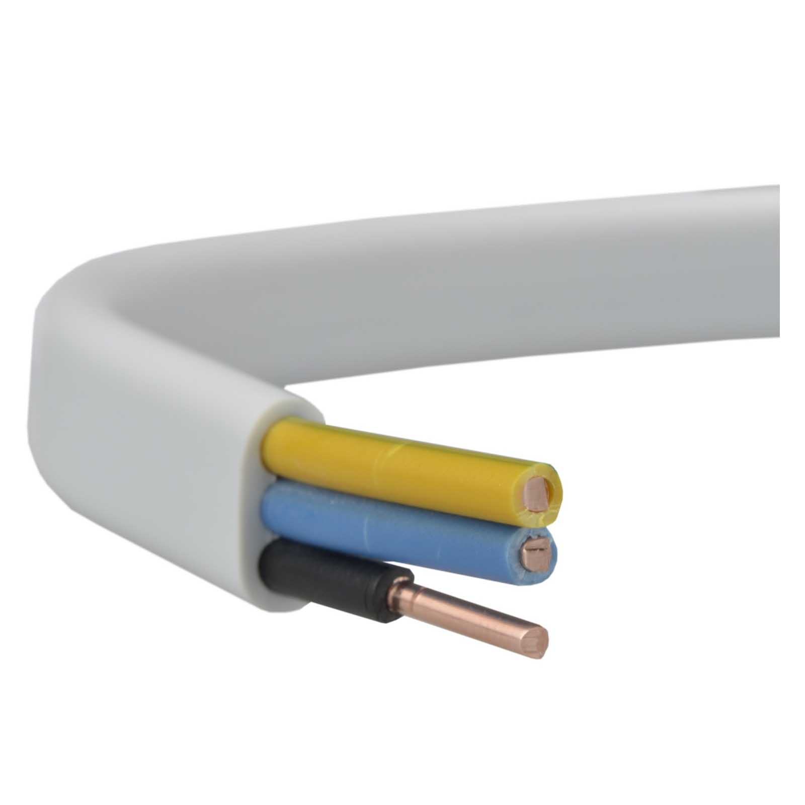

As for the specific sizes, in domestic applications, we mainly use:

1. **3x2.5 YDYp** - a cable with **three** conductors of **2.5mm2** cross-section (phase L - brown; neutral N - blue; protective/grounding PE - yellow-green) - used for **sockets**,

3. **5x2.5 YDYp** - a cable with **five** conductors of **2.5mm2** cross-section (phases L1, L2, and L3 - brown, black, and gray; neutral N - blue; protective/grounding PE - yellow-green) - used in **three-phase installations**, e.g., for an induction cooktop or heat pump,

5. **3x1.5 YDYp** - a cable with **three** conductors of **1.5mm2** cross-section (phase L - brown; neutral N - blue; protective/grounding PE - yellow-green) - used for **lighting** where we have single lamps,

7. **4x1.5 YDYp** - a cable with **four** conductors of **1.5mm2** cross-section (phase L - brown and black; neutral N - gray or blue; protective/grounding PE - yellow-green) - used for **lighting** where we have double lamps.

Nowadays, it’s also standard practice to run wires from one junction box to another and make connections inside them, without using any intermediate junction boxes. The most common situation is one where, in a concealed junction box dedicated to a light switch, you have:

1. **power supply** - a 3x1.5 wire,

3. **cable going to the lamp** - here we have two possibilities, as it could be 3x1.5 for a single lamp or 4x1.5 for a double lamp,

5. **cable going to the next junction box**, where we need to pass on the power supply (3x1.5),

7. **cable going to the second switch**, in the case of a staircase switch, meaning when two switches are used to turn the light on and off, e.g., one at the bottom and one at the top of the stairs (3x1.5 or 4x1.5).

## Preparing the Installation

To work with wires, you basically only need one tool – a **wire stripper**, or as some prefer, pliers for removing insulation. I’m not a professional, and my plan was to do the installation only in my own home, so I decided not to overspend and opted for a market solution, specifically [Dexter pliers from _Leroy Merlin_](https://www.leroymerlin.pl/produkty/szczypce-do-usuwania-izolacji-200-mm-dexter-82887285.html).

They generally lasted with me until the end, but I can’t really recommend them for one reason. They don’t handle stripping the main (white) insulation layer from the 3x2.5 YDYp cables, so I had to use a utility knife and be careful not to damage the internal wires. After a few attempts, I got so skilled at using the utility knife that I could even strip wires faster than with the pliers, but overall, if I had to choose again, I’d buy something from a slightly higher price range after checking reviews and watching a few videos on _YouTube_ to confirm that the pliers can fully handle 3x2.5 wires. Currently, [Hoegert wire strippers](https://hoegert.com/produkt/automatyczny-sciagacz-izolacji-210-mm-0-05-10-0-mm2/) are highly recommended. I see that they’re nearly twice as expensive as the _Dexter_ ones, but the price of around 85-90 PLN (which I saw on a popular auction site) is not prohibitive. As for stripping the insulation from the individual wires, the _Dexter_ stripper was perfectly sufficient, and I had no issues with it.

Every stripper has an adjustable stopper, which easily sets the distance at which you’ll strip the insulation off the wire. I’m mentioning this because I want to give you some specific **settings** to save you the trouble of looking them up:

- For **_WAGO_** 221-41X connectors, the optimal setting is around **11mm or 1/2"**,

- For **_Shelly_** modules, you need to set it slightly lower, so that the bare wire doesn’t stick out too much. Based on experimentation, I found that about **9mm or 3/8"** (halfway between 1/4" and 1/2") is ideal.

I’ve provided the values in both millimeters and inches, as different pliers have different scales.

Now that we know how to prepare the wires for connection, it’s time to decide what will connect them. I opted for **_WAGO_** connectors, which are somewhat controversial. Looking at expert reviews, you’ll find as many positive comments as negative ones. The old school says to twist the wires, solder them, and apply heat shrink. This is certainly the most reliable and almost everlasting solution, as long as you know how to do it well. However, it’s very time-consuming and not very convenient. This is where _WAGO_ connectors kick in, allowing you to connect wires quickly, simply, and comfortably.

There are _WAGO_ 2273-20X push-in connectors, but I’m not a fan of them because their design involves a spring clip inside that clamps onto the wire. I have two issues with this. First, after each clamping, the wire is damaged, and second, these clips supposedly tend to bend over time and loosen, which causes a loss of contact. The lack of contact is dangerous because it leads to sparking and a rise in temperature, which can even cause a fire. They seem to be disposable connectors, but you can dismantle them by rotating the wire inside and pulling it out. However, as I said, you end up with a wire that’s heavily scratched. A major plus, though, is the price.

Because of the above, I opted for the slightly more expensive, but in my opinion, better-designed **221-41X connectors with levers**.

Here, the method of clamping the wire inside the connector is slightly different. Inside, there is a properly bent spring clip that is pressed by a lever. Not only does it clamp the wire, but it’s also designed to maintain a constant force, ensuring a proper connection. Don’t take my word as gospel, but in my opinion, this is a better solution. These _WAGO_ connectors come in **three sizes** - 2X (221-412), 3X (221-413), and 5X (221-415). This means you can connect two, three, or five wires at once.

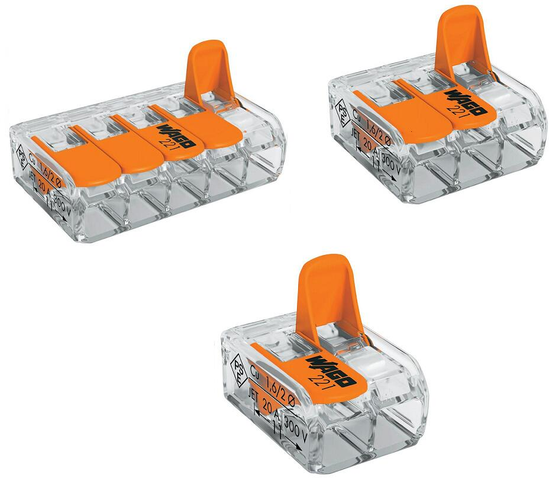

## Proper connection of lighting with regular switches

Now let’s move on to how to properly connect the lighting wires when you have **regular switches** (without any automation). There are basically two cases for lighting: single and double lamps.

Let’s start with the setup for a **single lamp**. I must admit, there are countless diagrams online, but I really struggled to find one that was neat and simple enough to satisfy my obsessive-compulsive tendencies. So, I just sat down and decided to create my own diagrams for this post.

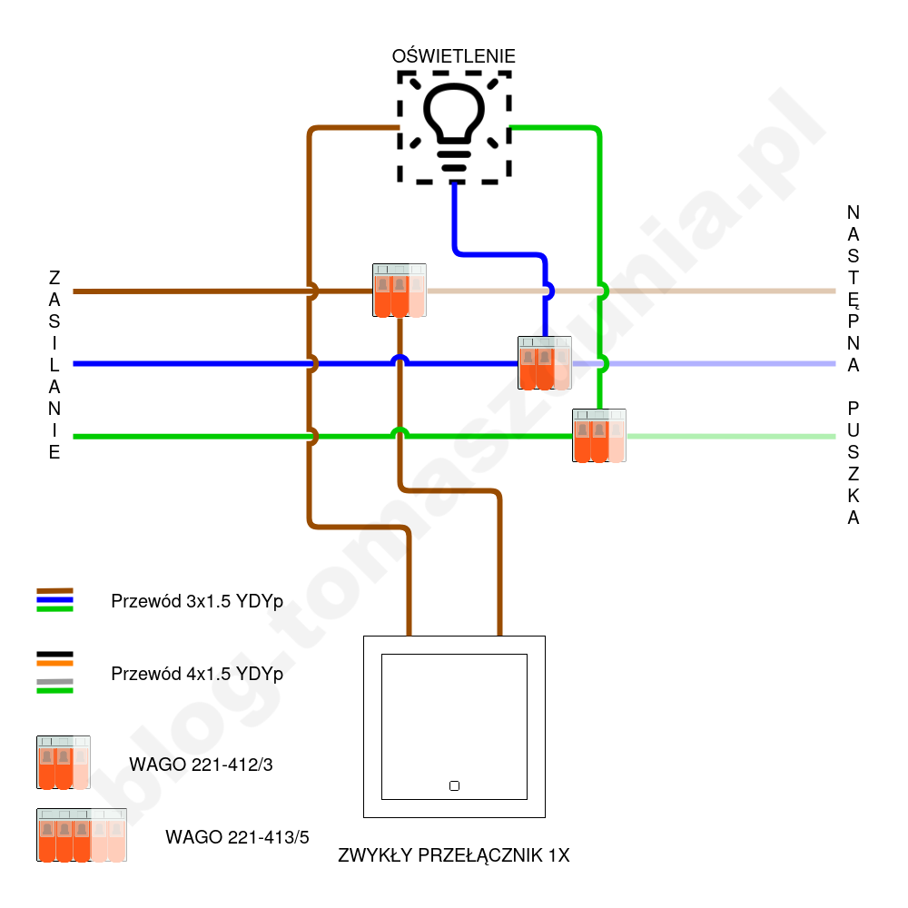

For those who aren’t fans of diagram-based explanations, here’s a brief written version of what’s shown in the image above. From the left side, the power supply enters the junction box, consisting of the live wire L, the neutral wire N, and the ground wire PE. When it comes to the live wire, we have three options. If the junction box is the last one in the circuit, it’s enough to connect the live wire directly to the switch or use a _WAGO_ 2X connector with an additional wire. However, if we need to pass the power supply to the next junction box, we use a _WAGO_ 3X connector, where the incoming live wire, the wire going to the switch, and the outgoing live wire for the next box are all connected. The neutral and ground wires follow the same logic, but instead of connecting to the switch, they go directly to the lamp. For these, we use _WAGO_ 2X or 3X connectors. The final step is to connect the brown wire going to the lamp to the switch. The switch itself is a very simple device that just either opens or closes the circuit carrying the live wire to the lamp.

Now, let’s move on to the setup with **two lamps** (or a double lamp) that are controlled by the same switch, which has two independent buttons.

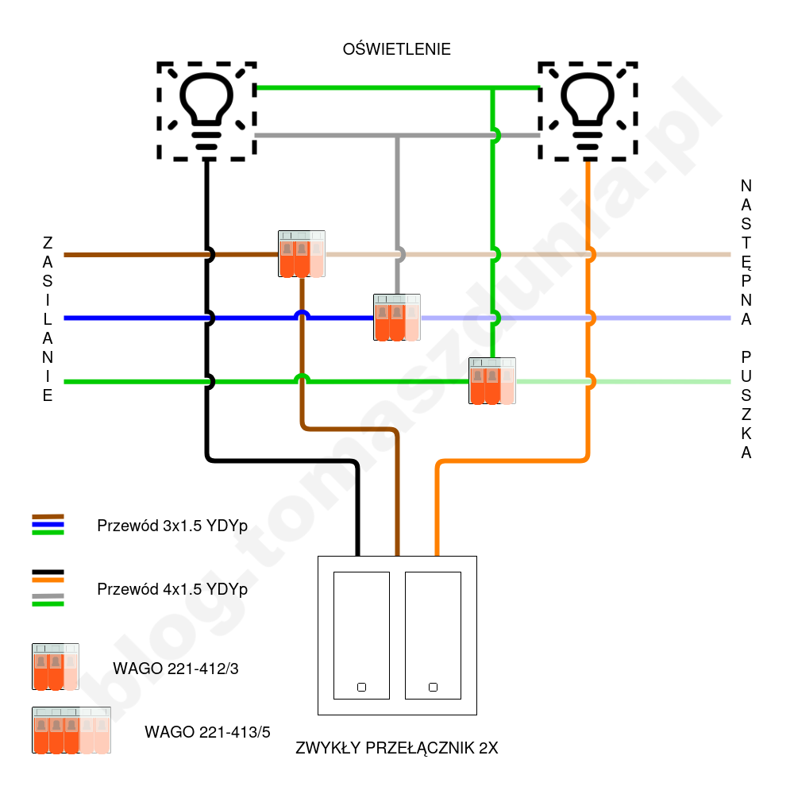

The main difference here is that the cable going to the lamp is a 4x1.5 YDYp cable, which includes two live wires (brown and black), a neutral wire (blue), and the ground (yellow-green). We also have a double switch, to which we connect three wires instead of two. Starting from the beginning, the live wire is connected exactly as before: _if the junction box is the last one in the circuit, simply connect the live wire directly to the switch or do it via a WAGO 2X connector with an additional wire. However, if we need to pass the power to the next junction box, we use a WAGO 3X connector, where the incoming live wire, the wire going to the switch, and the outgoing live wire for the next box will all be connected._ The neutral wires are connected in the same way as with the single lamp, but the only difference is that in the 4x1.5 cable, the neutral wire is typically gray instead of blue. The ground connection is exactly the same, and there are no changes in its color. So, in short, if this is the last junction box in the circuit, one WAGO 2X connector joins the incoming neutral wire from the power supply and the neutral wire going to the lamp, and the other WAGO 2X connector joins the incoming and outgoing ground wires. However, if it’s not the last box in the circuit, we use WAGO 3X connectors instead of 2X and add the neutral and ground wires going to the next junction box. Finally, the two live wires (brown and black) going to the lamp are connected directly to the switch.

## Shelly products which we will use

I should probably start by explaining what **_Shelly_** actually is. I won’t go into detail about the company itself, but rather focus on the products it offers, specifically those that will be needed for the topic discussed in this post. Let’s start with the **_1PM Gen3_** and **_2PM Gen3_** modules.

These are compact, smart **relays that enable remote control of devices** powered by 110-240 VAC or 24-30 VDC, as well as monitoring their energy consumption. Their dimensions are just 37x42x16 mm. They are designed to be connected and hidden in flush-mounted boxes behind sockets or light switches. With built-in Wi-Fi and Bluetooth modules, they are **easy to integrate with literally any smart home system**. The Gen3 version is currently the latest (though at the time of writing this post, there are already rumors of a Gen4 version), and it supports the **_Matter_** communication standard, which is a breakthrough in IoT because it aims to unify the previously fragmented market of various solutions that were not compatible with each other.

Another great product from _Shelly_ are the **_Wall Switches_**, which are **dedicated switches** specifically for the above relay modules. What’s important about them is that they are **monostable buttons**, meaning they change state only for a short time when pressed. After releasing, they automatically return to their original position. An example would be a doorbell switch. I mention this because a standard light switch is bistable, meaning it has two positions in which it can be set (light on or off).

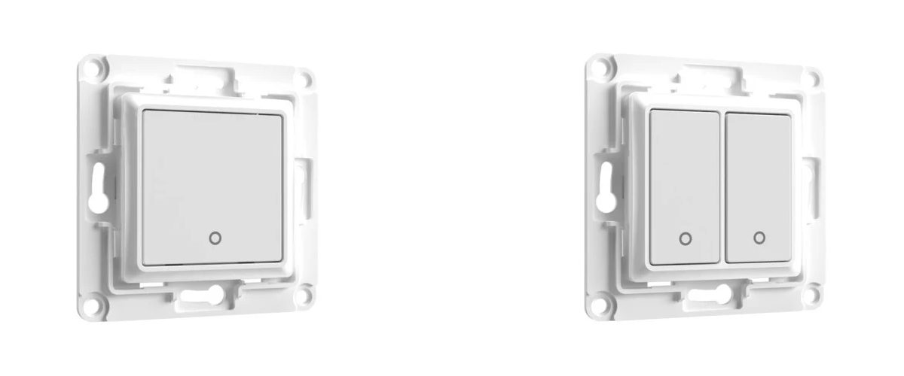

The advantage is that each such button comes with **dedicated brackets** for the corresponding _Shelly_ relay modules, which means **you get quite a lot of space inside the box**. Anyone who has ever installed something in a flush-mounted box knows how cramped it is and how hard it is to arrange those stiff wires. Fitting a _Shelly_ relay module and a regular switch with its own components (the "bottom") is usually quite a challenge. With the switch-module tandem mounted on a dedicated bracket, this problem is significantly minimized.

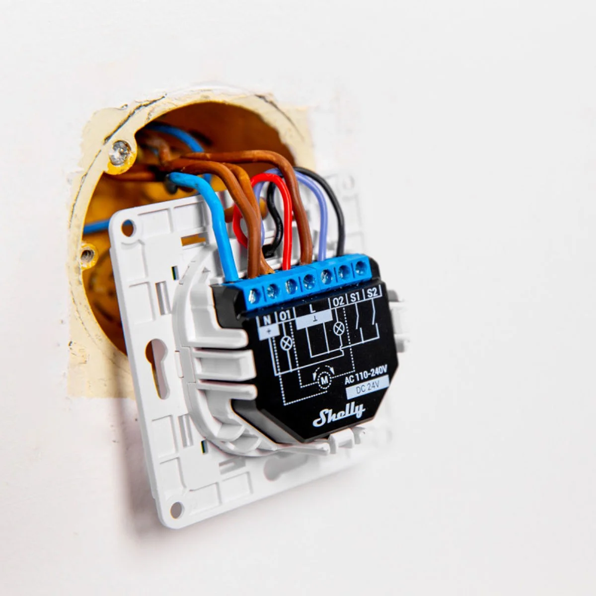

It’s also worth mentioning that the _Wall Switches_ are sold **without frames, so you need to buy them separately**. Of course, we have to use _Shelly_ frames because (I believe) only those fit the switches from this company, mainly due to the mounting mechanism. However, I should warn you that there are only single, double, and triple frames available. There are no larger ones, while standard switches and sockets can still come in quadruple frames, which are used in some installations. You can find the frames under the name **_Wall Frame_**. Another point worth mentioning is that the _Shelly_ frames have a glass finish, meaning the plate around the button is made of glass. I mention this because many people might not like it or find it to be an important factor.

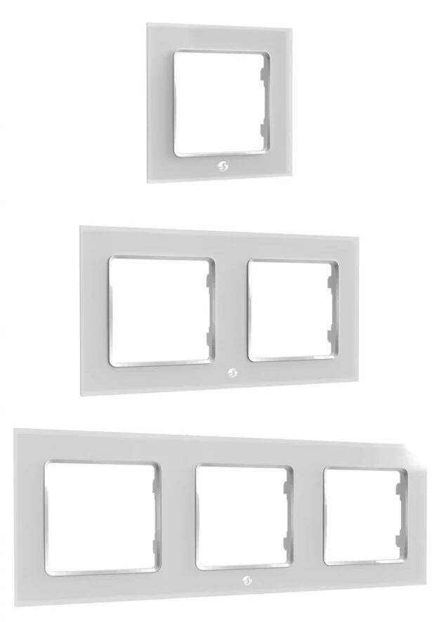

In my home, I’m only using _Shelly_ products for lighting, so I was looking for regular sockets and frames that would match the design as closely as possible. As a fun fact, I can reveal the results of my search. It turned out that the frames from the [_Flavia_ series from _Leroy Merlin_](https://www.leroymerlin.pl/produkty/ramka-pojedyncza-flavia-bialy-elektro-plast-87958185.html) fit the design of the _Shelly Wall Frame_ the best, in my opinion. I compared the dimensions, cross-section, and the shade of the glass.

## Implementing Shelly modules

Let’s return to the cables and wiring diagrams. First, let’s take a look at **single lighting, where we’ll use the _Shelly 1PM Gen3_ relay module**.

The _Shelly 1PM_ relay module has the following inputs/outputs:

- **O** - output supplying power (phase) to the lamp,

- **SW** - control input for the O output, where we apply the signal from the switch,

- **3 x L** - three bridged phase input/outputs,

- **2 x N** - two bridged neutral input/outputs.

To begin with, I’ll note that the wiring diagram I’ve shown above is not the only possible configuration. I connected my installation this way, and I’ll recommend this method. So, we connect it as follows:

- **O** - brown wire (phase) going to the lamp,

- **SW** - black wire from the _Shelly Wall Switch 1_ switch, which gets the impulse when we press the button,

- **L (1)** - incoming live wire to the box,

- **L (2)** - red wire (phase supply to the switch, which passes the impulse after pressing the button) from the _Shelly Wall Switch 1_,

- **L (3)** - outgoing live wire to the next box, if there is one; if not, it remains unused,

- **N (1)** - neutral wire going to the lamp,

- **N (2)** - neutral wire from the _WAGO_ terminal, where we connect the incoming and outgoing neutral wires to the next box; you can skip the _WAGO_ terminal if this is the last box in the circuit, because you can directly connect the incoming neutral wire to the _Shelly_ module.

I’ll also add that the wires for the L and N terminals can be connected in any order, as they are internally bridged as I mentioned earlier. The only important thing is that the live wires go to L and the neutral wires go to N.

The grounding is connected just like with a standard switch, meaning the protective ground wire coming to the box, the one going to the lamp, and optionally the one going to the next box (if applicable) are joined in the _WAGO_ terminal.

For **double lighting, we’ll use the _Shelly 2PM Gen3_ relay module** and connect it as follows.

The main differences, which are immediately apparent, are that we have two independent outputs for the lamps (O1 and O2) and two control inputs (S1 and S2). A downside is that both modules have the same number of terminals, so the 2PM module only has two phase terminals and one neutral terminal, which means more _WAGO_ connectors are needed because we can't bridge as many connections inside the relay module. From a cost perspective, it’s not a big problem, but more _WAGO_ connectors always lead to more challenges fitting everything inside the box.

The _Shelly 2PM_ relay module has the following inputs/outputs:

- **O1** - output supplying power (phase) to lamp 1,

- **2 x L** - two bridged phase input/outputs,

- **O2** - output supplying power (phase) to lamp 2,

- **S1** - control input for O1, where we apply the signal from the first switch button,

- **S2** - control input for O2, where we apply the signal from the second switch button,

- **N** - neutral terminal for the wire needed for the module's operation, without passing it further.

Now, knowing this, we connect the wires as follows:

- **O1** - black wire (phase) going to lamp 1,

- **L (1)** - phase from the _WAGO_ terminal, where we connect the incoming and outgoing phases to the next box; you can skip the _WAGO_ terminal if this is the last box in the circuit, as you can directly connect the incoming phase to the _Shelly_ module.

- **L (2)** - red wire (phase supply to the switch, which transmits the impulse after pressing the buttons) from the _Shelly Wall Switch 2_,

- **O2** - brown wire (phase) going to lamp 2,

- **S1** - black wire from the _Shelly Wall Switch 2_, which gets the impulse when we press the first button,

- **S2** - blue wire from the _Shelly Wall Switch 2_, which gets the impulse when we press the second button,

- **N** - neutral wire from the _WAGO_ terminal, where the incoming neutral wire to the box, going to the lamp (gray), and optionally going to the next box (if this box is not the last in the circuit) meet. This determines whether we need to use a 3X or 5X terminal block.

From all this, it follows that in terms of the phase, the _Shelly_ relay module replaces a regular switch in an analogous way. As for the neutral wires, we need to add one that goes to the _Shelly_ relay module. Grounding is connected just like with a regular switch, meaning the protective ground wire coming to the box, the one going to the lamp, and optionally the one going to the next box (if applicable) are joined in the _WAGO_ terminal.

## First Configuration

Once the relay module is correctly connected, simply turn on the power. Once it reaches the module, it will automatically power up. Based on the default configuration, it will start broadcasting an **open Wi-Fi network**. This is a standard solution in the world of smart home devices. Simply connect to this unsecured hotspot. Its SSID will contain the word "shelly," so it will be easy to identify. Once connected, **open a browser and enter [192.168.33.1](http://192168331)**. This is the default address for the **module's control panel**. I will show a few things you need or should do in the basic configuration.

Let's start with **setting the type of button** that is connected to the module. We do this in the _Home_ tab, under the _Switches and attached inputs_ section. You must click _Input (X)_. Then, in the _Input settings_ section, go to _Input/Output settings_. A dropdown menu will appear with the _Select input mode for Input (X)_ option, where we can choose:

- Switch - if we have a regular bistable switch,

- Button - if we have a monostable switch, such as the _Shelly Wall Switch_.

For the _Wall Switch_, I also recommend selecting the following options:

- _Set output type for Output (X)_ - _Momentary_, which will make each press toggle the output state (on/off),

- _Action on power on for Output (X)_ - _Restore last known state of output/relay_, which means that after the module is powered on (e.g., after a power outage), the last known state of the output will be restored. So, if the light was on before the power failure, it will be on again once the power is restored.

After setting these, make sure to click _Save settings_.

The next step is to **change the device name** to better identify it on your local network. The name can be anything, and it’s best to have your own naming system. Overall, I think anything will be better than the default string of characters. To do this, go to the _Settings_ tab, then under the _Device settings_ section, select _Device name_. Enter your name in the _Device name_ text box and save it by clicking _Save settings_.

I do not plan to use **Bluetooth communication**, at least not right now as I don't see any use for it, so for security reasons, I decided to disable it on all modules installed in my home. To do this, find the _Bluetooth_ icon in the top right corner and click it. Then, uncheck the box next to _Enable Bluetooth_ and click _Save settings_. Changing this setting will require the module to be rebooted, and you will be prompted to do so. You can trigger it using the _Reboot now_ shortcut at the end of the message.

Now it's time to **connect the module to the home network**. To do this, find the Wi-Fi icon in the top right corner and click it. Go to the _Wi-Fi 1 settings_ section, check the box next to _Enable_, find your network's SSID in the dropdown list, enter the password, and confirm by clicking _Save settings_. After a moment, you should see a message saying that the connection has been established. The message will also display the local IP address assigned to this specific module. It’s a good idea to write it down for later.

If the module has successfully connected to the home network, we can also switch to it using the computer on which we are performing this configuration. Now, to access the control panel again, you need to **enter the new local IP address of the module in the browser's address bar**. This address was provided during the connection process, or it can be found from the router, which is our DHCP server. If everything goes smoothly, we will be back in the same control panel. At this point, **we no longer need the _Shelly_ module to operate as an open hotspot, so for security reasons, we will simply disable it**. Again, go to the top right corner and select the first icon on the left, which looks something like ((o)). This is the _Access Point settings_. Move the slider to turn off the _Enable Access Point_ option. If someone doesn't want to completely disable the hotspot, I highly recommend at least setting a password, so it’s not an open network, as that would create an open gateway to our home network.

That’s basically it for the basic configuration. I have integrated my _Shelly_ modules with my home server _**Home Assistant**_ as well, but that's a topic for a separate post. Below, I’ve included a few screenshots that should visually complement the description above.

- 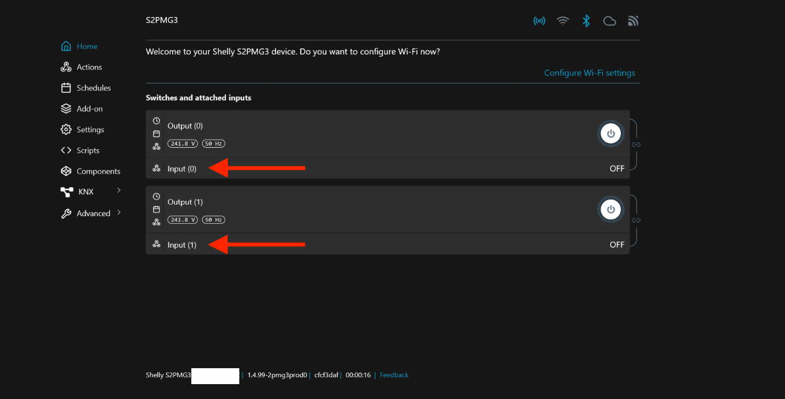
    
- 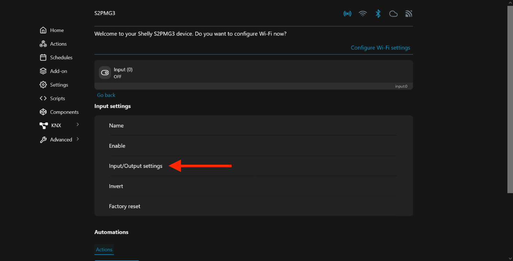
    
- 
    
- 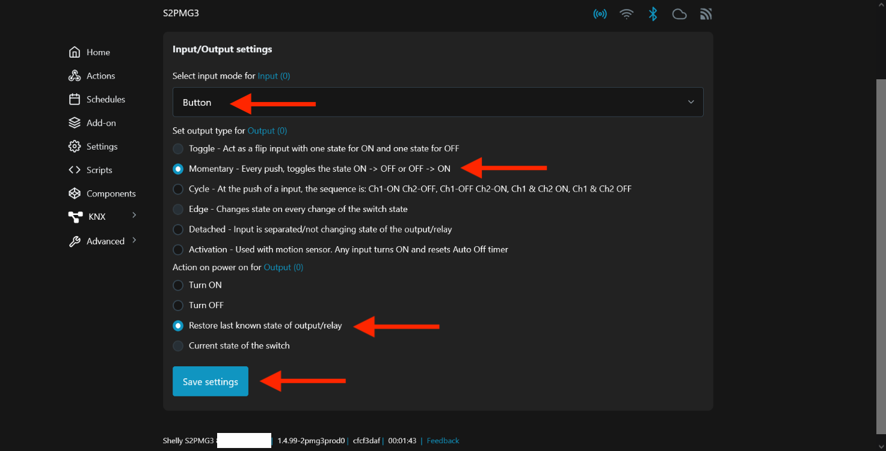
    
- 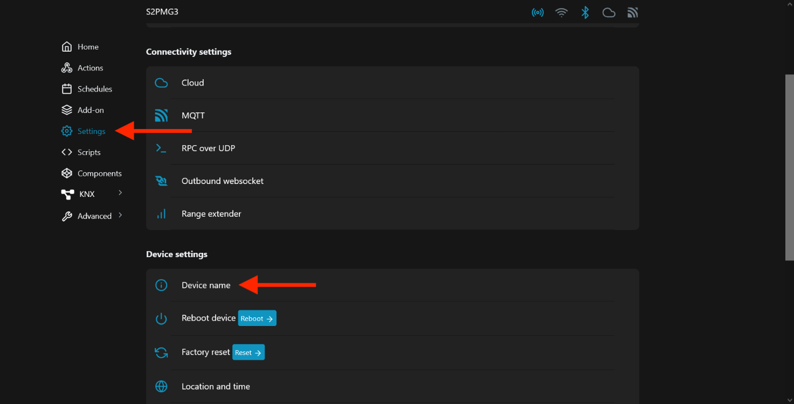
    
- 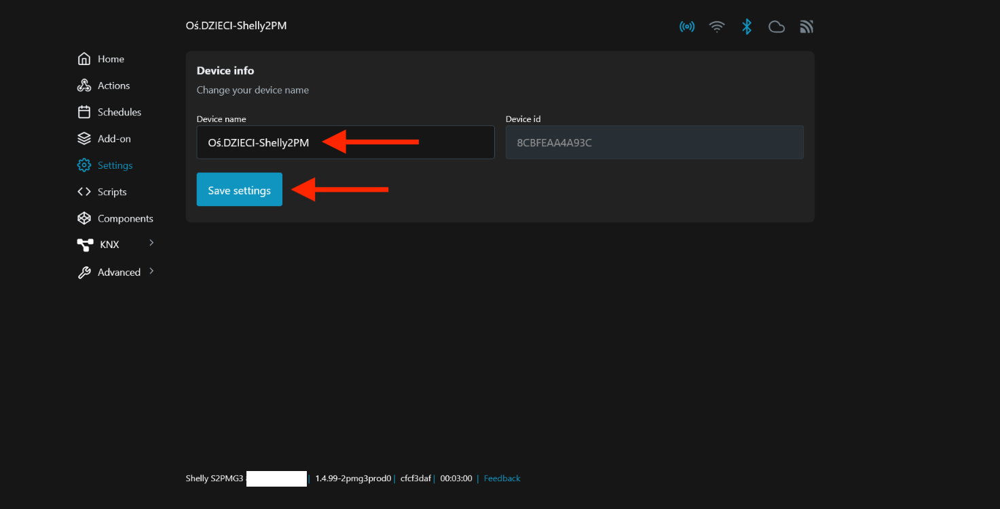
    
- 
    
- 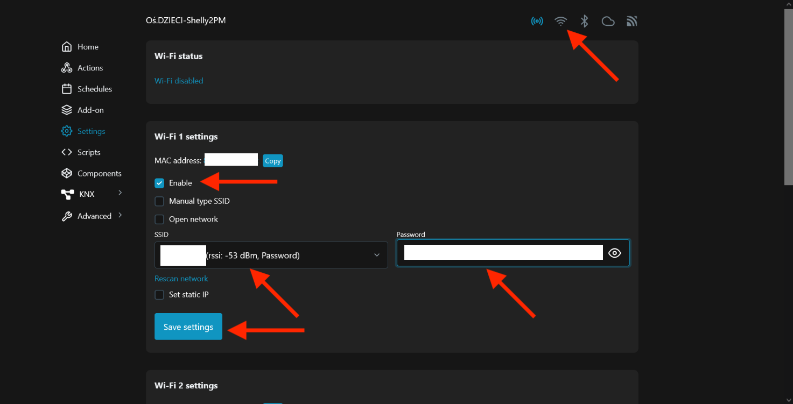
    
- 
    

## Well, how much does it cost?

Currently, the prices of _Shelly_ products are as follows:

- Relay module _1PM Gen3_ - about 90 PLN,

- Relay module _2PM Gen3_ - about 145 PLN,

- Button _Wall Switch 1_ - about 40 PLN,

- Button _Wall Switch 2_ - about 40 PLN,

- Frame _Wall Frame 1_ - about 25 PLN,

- Frame _Wall Frame 2_ - about 40 PLN,

- Frame _Wall Frame 3_ - about 55 PLN.

The _WAGO_ connectors cost about 1.50 PLN/unit for sizes 2X and 3X, and 2.50-3 PLN/unit for 5X.

Let’s now compare the prices for the most common setups:

|  | Standard market switches | Standard market switches + Shelly relay modules | Everything from _Shelly_ |
| --- | --- | --- | --- |
| Lighting with a single lamp | 18 PLN   (54 PLN with glass frame) | 108 PLN   (144 PLN with glass frame) | 155 PLN |
| Lighting with a double lamp | 20 PLN   (56 PLN with glass frame) | 165 PLN   (201 PLN with glass frame) | 210 PLN |

Well, what can I say... Compared to the standard solution, the one based on _Shelly_ is quite significantly more expensive. But in reality, this is the price for implementing a smart solution. Everyone has to ask themselves whether they want to get out of their warm bed in the evening to turn off the lights at home, or if they prefer to do two clicks on their phone. If you're as lazy as I am and believe that your comfort justifies this price difference, it means that the minutes you spent reading this post were not wasted :)
