[🇬🇧->🇵🇱 Przejdź do polskiej wersji tego wpisu / Go to polish version of this post](https://blog.tomaszdunia.pl/home-assistant/)

In [the previous post, I showed how to create smart lighting in your home from scratch using products from _Shelly_](https://blog.tomaszdunia.pl/shelly-smart-oswietlenie-eng/). In my case, this was the first step in building a smart home system, where I plan to integrate many more solutions to automate various aspects. However, for everything to make sense, a **brain of the system is needed—a server that allows managing **all these smart devices** from one place**. There are many such solutions on the market, but for me, the choice was obvious. I opted for software called **_Home Assistant_**. Why? Here are my reasons:

1. it is **open-source** software,

3. it can run completely **offline** (except for updates) and manage devices disconnected from the Internet, meaning you don't have to expose your home network to risks by allowing devices that connect to suspicious external domains,

5. it is **free**,

7. it is also very **popular**, so finding guides on literally everything is easy,

9. additionally, it works on **almost any device**,

11. and it supports an **enormous number of devices** that work with _HA_ natively or through **add-ons developed by enthusiasts**,

13. it does not lock you into any ecosystem, meaning **you are not tied to devices from a single manufacturer**.

What more could you want? 🤷‍♂️

## Hardware

As I mentioned above, _Home Assistant_ can be run on many different devices. It can be an **old PC**, a **_Docker_ container**, a **virtual machine** running on a larger server, or simply a mini-computer like a _**Raspberry Pi**_ or _**Odroid**_. I decided to run my home server on an _**Odroid C4**_ board because I had already purchased one earlier, and at the time, it turned out to be the recommended hardware. This is certainly not a future-proof solution since **the system requirements for _HA_ will increase over time**, and my **home network of smart devices will expand**, requiring more computing power for smooth management. However, I believe **it is sufficient for a start**, and later, I will upgrade to a more powerful server. **Transferring the configuration from one device to another takes just a few clicks**, so I can do it anytime.

Don't take my choice of _Odroid C4_ as a definitive recommendation—it could just as well be a _Raspberry Pi 4_ or _5_. However, I think you should only consider versions with at least 4GB of RAM (or more).

We also cannot forget about a proper storage medium in the form of a _microSD_ card. It is important to **choose a card with the _AC2_ marking** since this type is designed for writing and reading large amounts of small files and storing applications.

## Installation

Personally, I believe that such an essential component as a **smart home server should be a completely independent system running on a dedicated device**. That is why I will focus on this option. If someone prefers to run _HA_ on a virtual machine on a larger server, I assume they are experienced enough to handle the installation without my guide.

I recommend starting by visiting [home-assistant.io/installation](https://www.home-assistant.io/installation/), where you can explore the available options.

All _Home Assistant OS_ system images are available on _GitHub_ at [github.com/home-assistant/operating-system/releases](https://github.com/home-assistant/operating-system/releases). A quick note: **skip all versions tagged as _Pre-release_ and find the one marked as _Latest_**. To make things easier, here is [a special link that should take you directly to the latest version](https://github.com/home-assistant/operating-system/releases/latest). Once you locate the latest _HAOS_ version, you need to find **the image suitable for your device**. At the time of writing this post, [the latest _HAOS_ version is 14.1](https://github.com/home-assistant/operating-system/releases/tag/14.1). I will therefore download the following file:

```
haos_odroid-c4-14.1.img.xz     276 MB     Dec 19, 2024
```

If you have a different device than mine, **don't worry and calmly review the list of available images**. As you can see, there are dedicated images in various formats:

- **generic aarch64** - a general image for ARM-based devices that do not have a dedicated image,

- **generic x86** - a general image for AMD-based devices that do not have a dedicated image,

- **green** - for owners of the ready-to-use _Home Assistant Green_ device, available for purchase from _HA_ developers,

- **khadas** - for owners of _Khadas VIM3_ boards,

- **odroid** - for owners of _Odroid C2, C4, M1, M1S, N2, and XU4_ boards,

- **ova** - an image dedicated to running as a virtual machine,

- **rpi** - for owners of _Raspberry Pi 3, 4, and 5_ boards,

- **tinker** - for owners of _Tinker_ (_ASUS_) boards,

- **yellow** - for owners of the ready-to-use _Home Assistant Yellow_ device, available for purchase from _HA_ developers.

Regardless of which one you choose, you need the file with the ".img.xz" extension. This is an **archive that needs to be extracted**, for example, using _[7-zip](https://www.7-zip.org/)_.

Once you have the image and a memory card, it's time to **create a bootable drive**. As always, I recommend using [_balenaEtcher_](https://etcher.balena.io/) for this. The whole process is incredibly simple, and I believe I have described it before on this blog. However, for a quick reminder:

1. _Flash from file_ - select the downloaded image,

3. _Select target_ - select the SD card,

5. _Flash!_ - the button that starts the process.

The entire process is divided into two stages:

1. _Flashing_ - the actual process of creating the bootable drive,

3. _Validating_ - verifying its integrity and overall correctness.

- 
    
- 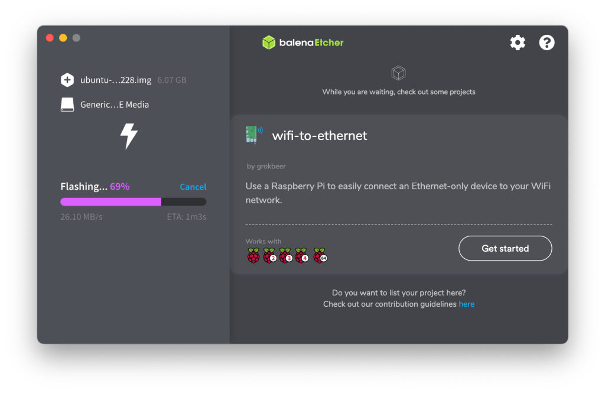
    
- 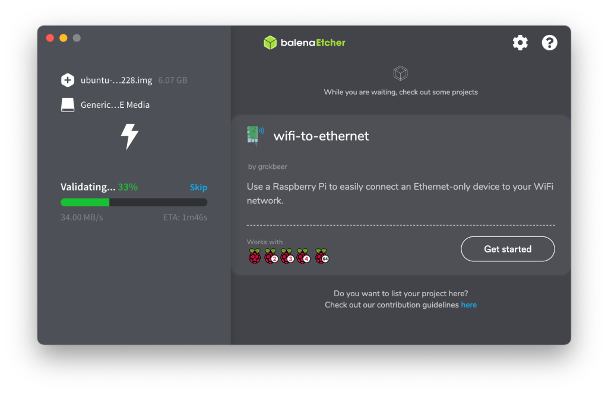
    
- 
    

The card is ready! You can remove it from the reader and insert it into the appropriate port of the target device, which will soon become our home smart home server. Once the device is ready, we connect it to the network cable and power supply.

## First startup

We start by opening a browser and entering the following address in the address bar: [http://homeassistant.local:8123](http://homeassistant.local:8123). Alternatively, we can use the following address:

```
http://X.X.X.X:8123
```

where _X.X.X.X_ is the IP address of our new server on the local network. As you can see, **_Home Assistant_ runs on port _8123_**. Remember this, as it will be useful later. The screen that will greet us should look something like this:

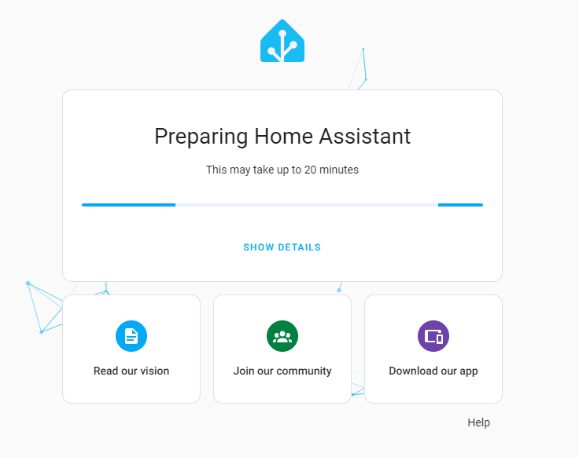

This is the first step in the configuration process of a new _HA_ instance, where _Home Assistant Core_ is downloaded. Unfortunately, **the duration of this stage depends on the specifications of our hardware and, most importantly, our internet speed**, as at least 700 MB needs to be downloaded. Once completed, a welcome page will appear, where we can decide whether to create a system from scratch or restore it from a backup. Since we are just starting our journey with _HA_, we select _Create my smart home_.


Of course, we start by creating an administrator account. We need to provide a name, username, and password twice. Once everything is correct, we confirm by clicking the _Create account_ button.

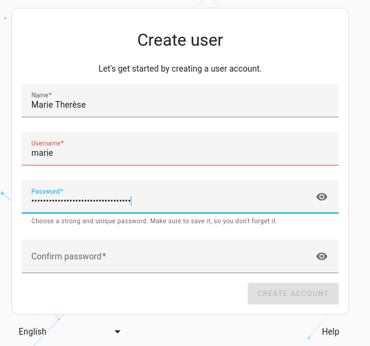

In the next step, we will be asked to specify the location of our home. You might be wondering, "but why?". So, let me explain that this is an important piece of information in the context of:

- **weather forecasts**, which can be displayed on the main control panel,

- **sunrise and sunset times**, which is useful, for example, for controlling outdoor lighting,

- **millions of other automations**, which can be created based on conditions like "when I'm away from home" etc.

In this step, we also set up the unit system we want to use (metric) and the currency. Wait a minute, currency...? Yes, because _HA_ has features that calculate, for example, electricity consumption and other similar data into real costs.

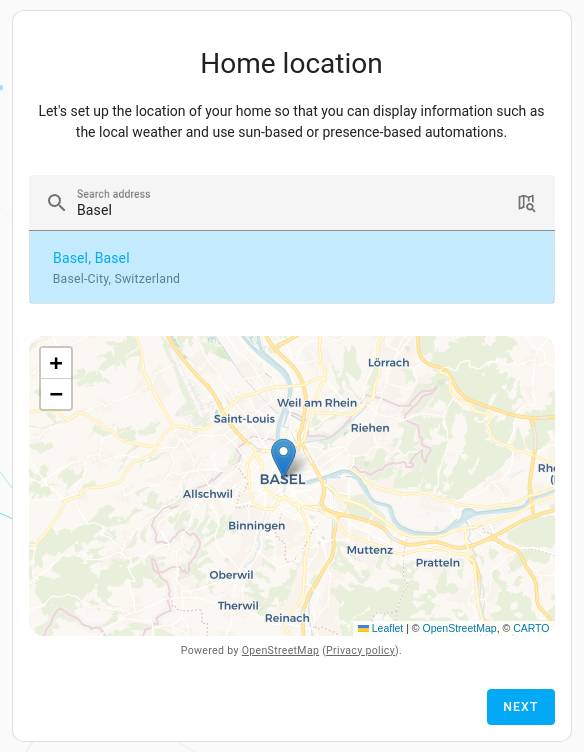

Finally, there's a request to share diagnostic data. Of course, there's no obligation to agree to share anything.

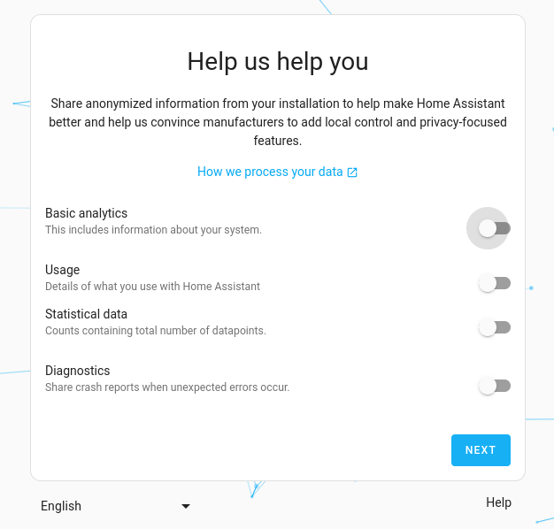

Basic configuration is complete. In the last window that will be displayed, _Home Assistant_ will list compatible devices it has found on the network and can integrate with. Of course, this only applies if such devices are currently available in the network. At this stage, there's no need to deal with this, as it can be done later, so we simply press the _Finish_ button.

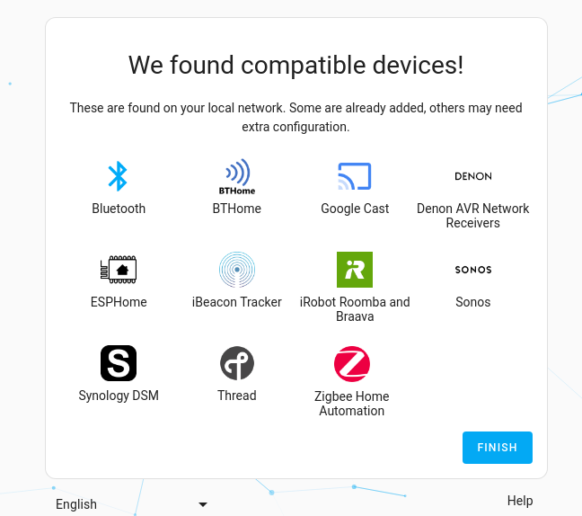

## Basic configuration

_Home Assistant_ has a lot of features, so covering all of them in one post is nearly impossible. Therefore, I will focus only on two things – **updates** and **adding new devices**. The remaining features will be discussed in future posts, where I will definitely return to _HA_ multiple times.

**Updates**

_Home Assistant OS_ **automatically checks for new updates** and notifies us if any are available. This applies not only to the system itself but also to individual devices, provided this feature is supported for them. If _HAOS_ detects a new update, the information will appear in two places. The first is at the top of _Settings_, where a list of components that can be updated is displayed. The second location is a bit deeper, requiring navigation through the following path - _Settings -> System -> Updates_.

- 
    
- 
    
- 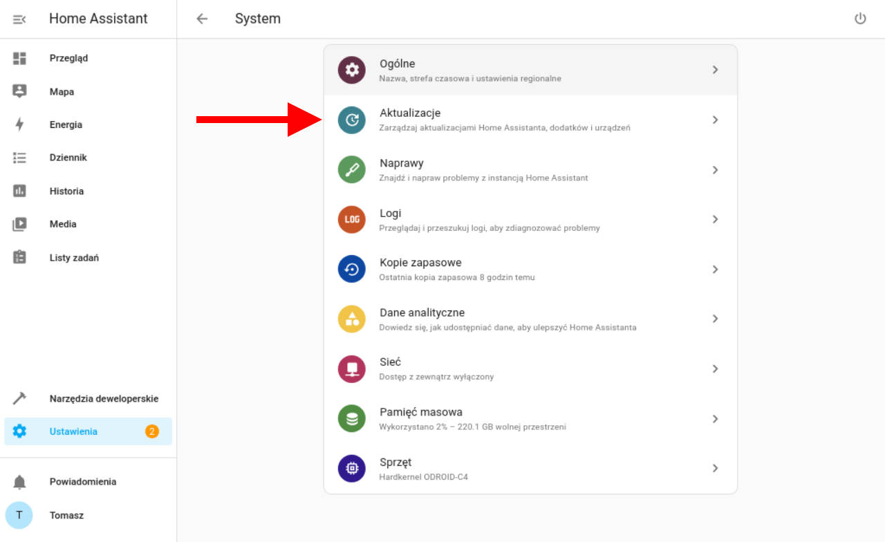
    
- 
    

As for the update process itself, all that is required is pressing the _Update_ button and a bit of patience. Of course, the waiting time depends on the power of the hardware and the speed of the internet connection.

- 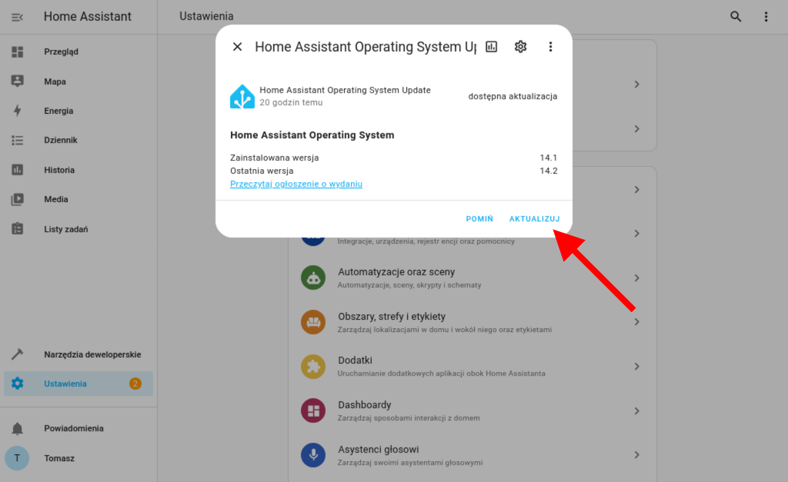
    
- 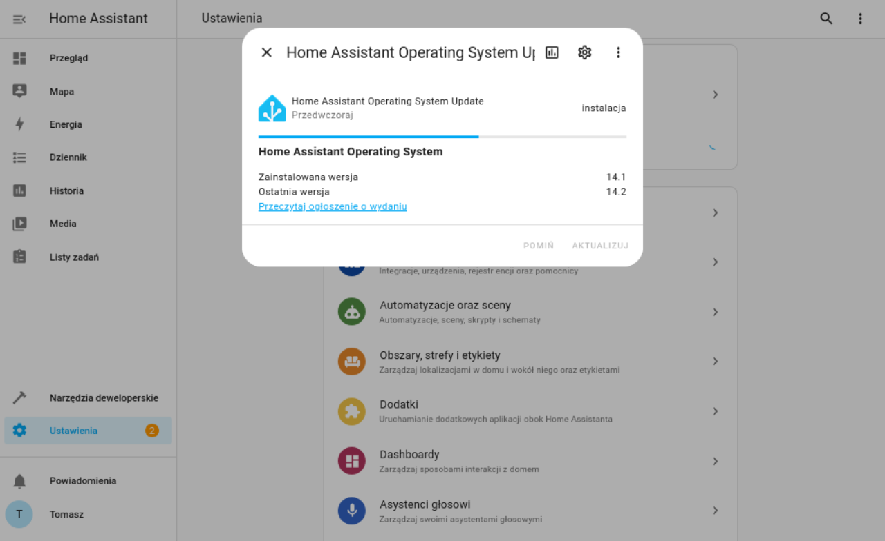
    

**Adding New Devices**

_Home Assistant_ periodically scans the local network for new devices. When it detects one, it sends a _Notification_ containing a shortcut to add it to the smart home system.

- 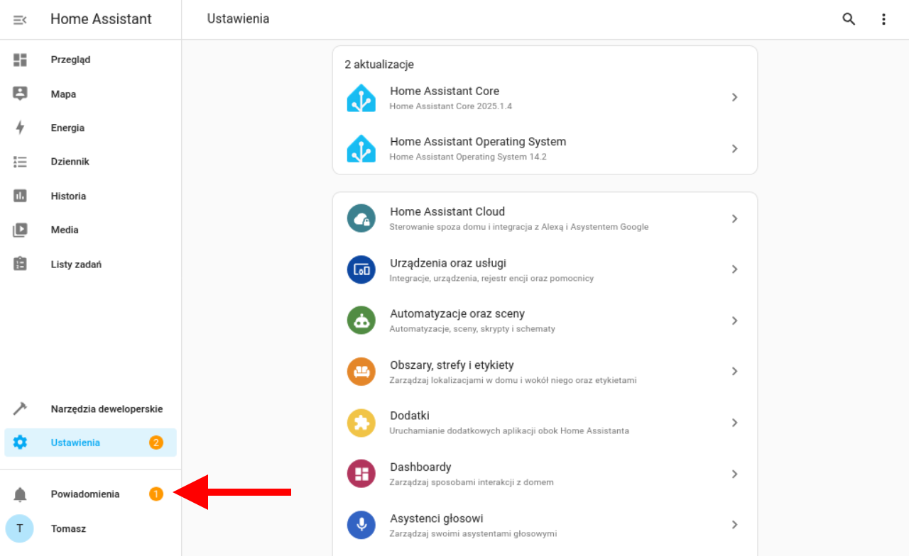
    
- 
    

Unfortunately, this does not always work or may not work immediately after connecting a new device. So, I will show you how to do it from the beginning in a proper way—that is, in a way that always works. We go to the list of all devices connected to our _Home Assistant_. It is available in _Settings -> Devices & Services -> (top tab) Devices_. In the bottom right corner, there is an _Add Device_ button. A window will appear where we need to search for the new device by brand name. In this example, I search for the term "shelly".

- 
    
- 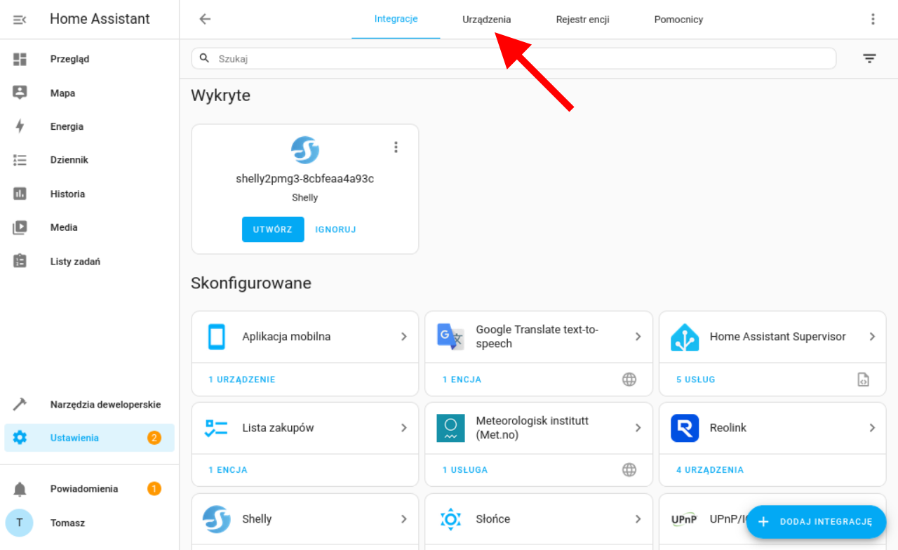
    
- 
    
- 
    

From this point, there are two possibilities. If _HA_ can automatically discover the new device, a suggestion will appear immediately. You only need to select it from the list and confirm your choice.

- 
    
- 
    

If, however, _HA_ does not detect the new device, we will be asked to provide its IP address and port, where the management interface is located. After entering this data, we press the _Confirm_ button.

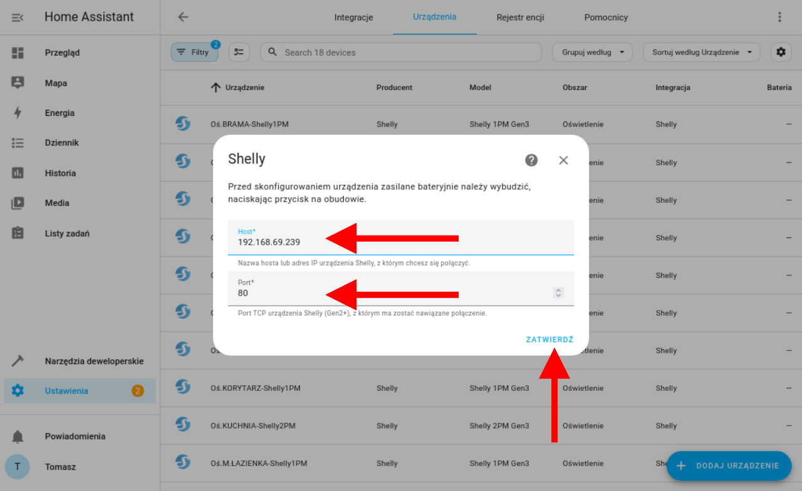

If everything went smoothly, we will receive confirmation that the configuration for the new device has been created. The final step is to assign it to an area. Areas are fully defined by the user. Some divide the entire system into rooms, such as living room, kitchen, bedroom, etc. I approached it differently—in my case, all _Shelly_ relay modules are in the _Lighting_ area because I want to manage them as a single group. We complete the process by pressing the _Finish_ button.


Done! The new device has been added.

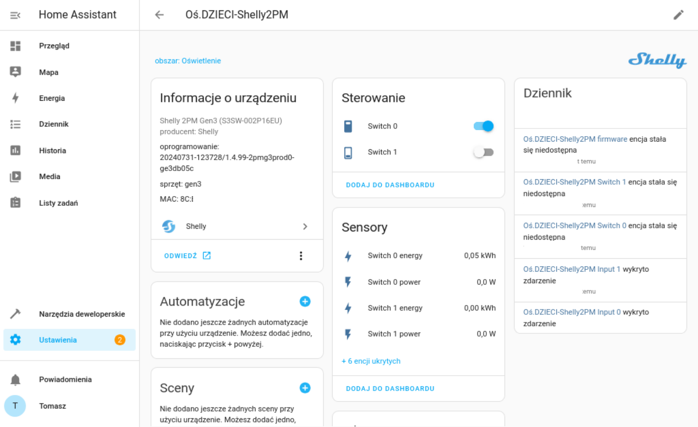

## Summary

As you may have already noticed, _Home Assistant_ is truly a powerful tool. Moreover, it has many advantages, the most important of which for me is its focus on privacy and user data security. There is no other product like this on the market, or at least I am not aware of one.
